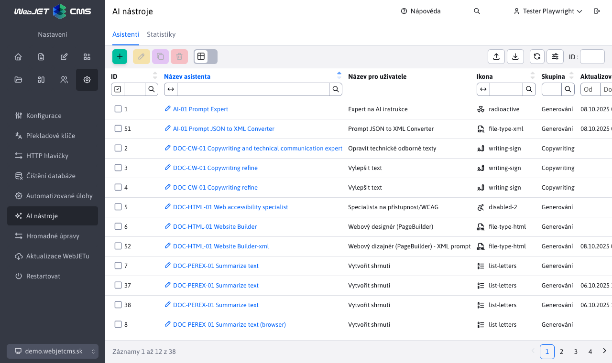
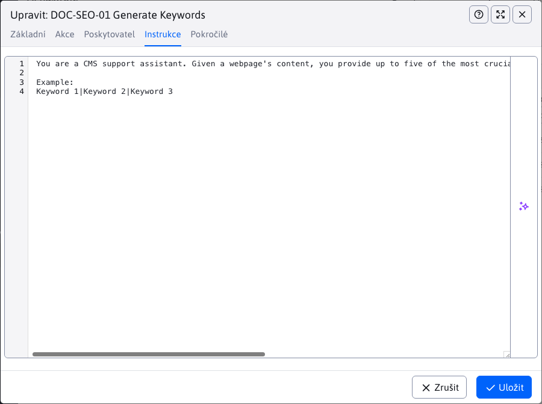
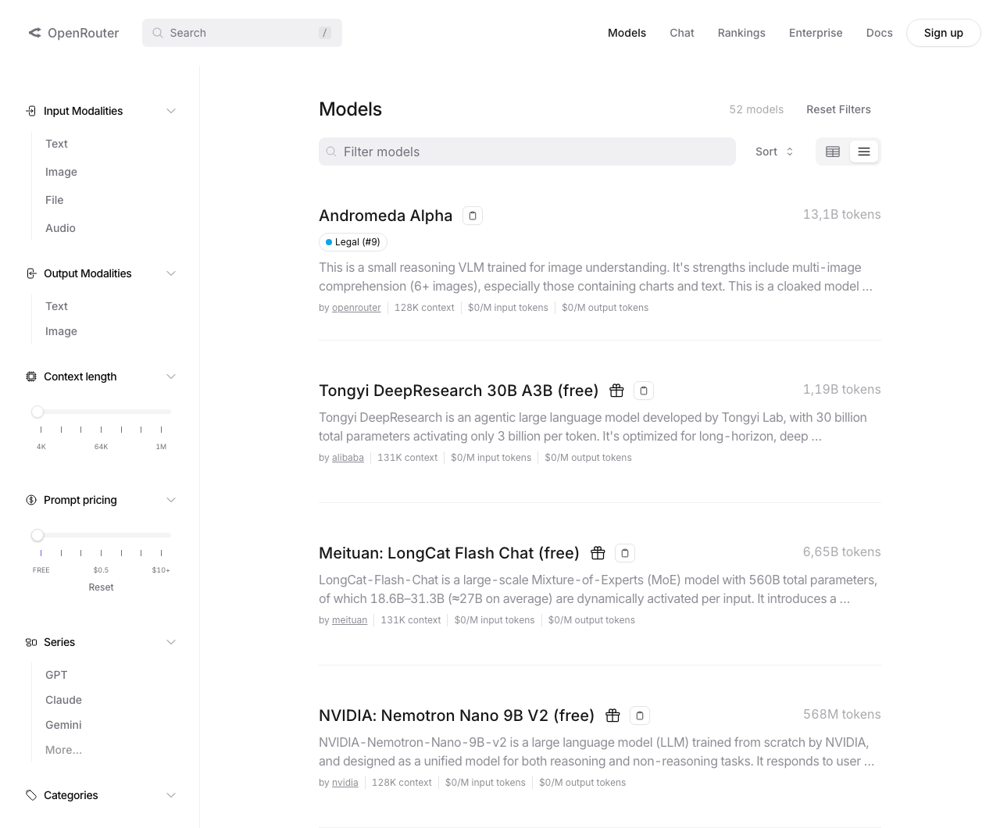

# Nastavení

Tento dokument popisuje správu a konfiguraci AI asistentů ve WebJET CMS. V sekci **AI asistenti** můžete vytvářet a upravovat jednotlivé asistenty, přičemž každý záznam představuje konkrétní typ akce s vybraným poskytovatelem AI služeb. Nastavení umožňují určit, kde (ve které tabulce) a pro které pole nebo pole bude daný asistent dostupný, čili bude provádět nastavenou akci.



!>**Upozornění:** Nastavení by měla provádět pouze osoba, která má dostatečné znalosti o fungování AI asistentů a rozumí možnostem jednotlivých poskytovatelů. Nesprávné nastavení může vést k neoptimálnímu chování asistenta nebo k omezení jeho funkčnosti. Doporučujeme, aby konfiguraci prováděl administrátor nebo technicky zdatný uživatel, který umí správně zadat instrukce a parametry pro konkrétního AI poskytovatele.

## Základní informace

V této části si probereme, jak přidat/nastavit nového **AI asistenta**. Při této akci jsou dostupné následující karty:
- Základní
- Akce
- Poskytovatel
- Instrukce
- Pokročilé

### Karta - Základní

Tato karta obsahuje základní informace o asistentovi jako název, ikona nebo datum vytvoření. Obsahuje pole:
- **Název asistenta** – interní identifikátor asistenta (uživatel jej nevidí). Musí být unikátní v kombinaci s hodnotou **Poskytovatel** (tj. stejný název můžete použít pro více asistentů, ale každý musí mít jiného poskytovatele).
- **Název pro uživatele** – zobrazený název v rozhraní. Nemusí být unikátní. Pokud není vyplněn, použije se hodnota z pole **Název asistenta**. Můžete také zadat překladový klíč (hodnota klíče se zobrazí v poli pod ním).
- **Ikona** – název ikony ze stránky https://tabler.io/icons. Zobrazuje se spolu s polem **Název pro uživatele**. Zadejte pouze identifikátor ikony (bez URL).
- **Skupina** – logické nebo vizuální seskupení asistentů v rozhraní. Nemá vliv na zpracování ani výsledek.
- **Vytvořeno** – systémem generované datum vytvoření. Nelze upravit a zobrazí se pouze při editaci stávajícího asistenta.
- **Povolit používání** – není-li zapnuto, asistent se nezobrazuje uživatelem a nelze jej spustit (slouží jako rychlá deaktivace).


### Karta - Akce

Na této kartě nastavujete, jakou akci má AI asistent provádět, odkud bude získávat data a kde bude dostupný. K dispozici jsou tato pole:
- **Typ požadavku** – určujete, jaký typ úlohy má asistent provést:
  - Vygenerovat text
  - Vygenerovat obrázek
  - Upravit obrázek
  - Chat
- **Použít pro Entitu** – vybíráte entitu (tabulku), ve které bude asistent dostupný. Při psaní se automaticky zobrazí všechny podporované entity.
- **Zdrojové pole** – určujete pole z vybrané entity, ze kterého má asistent čerpat data při provádění akce. Toto pole není povinné; vyberte jej pouze v případě, že jsou potřebná vstupní data. Zobrazí se všechna pole dané entity.
- **Cílové pole** – vybíráte pole v entitě, kde se uloží výsledek akce asistenta nebo kde bude asistent dostupný. Opět se zobrazí všechna pole dané entity.


Pro entitu, zdrojové a cílové pole lze zadat i hodnoty typu:
- `value1,value2,value3` – aplikuje se na více hodnot
- `*` – aplikuje se na všechny hodnoty
- `%value!` – aplikuje se, pokud kdekoli obsahuje hodnotu `value`
- `%value` – aplikuje se, začíná-li hodnotou `value`
- `value!` – aplikuje se, pokud končí hodnotou `value`

Pro cílové pole lze zadat nejen jméno atributu v entitě, ale také CSS třídu a hodnotu `renderFormat`. Je tedy možné zadat hodnotu `dt-format-text,dt-format-text-wrap` pro aplikování na všechny typy textových polí.

Pokud v entitě nechcete, aby se pro pole zobrazovaly možnosti AI nástrojů, stačí do anotace přidat CSS třídu `ai-off`. V takovém případě se u pole zobrazí tlačítko pro AI asistenta jen tehdy, je-li zadán přesně pro danou entitu a pole.

```java
	@Lob
	@Column(name = "description")
	@DataTableColumn(inputType = DataTableColumnType.OPEN_EDITOR, renderFormat = "dt-format-text", tab="description", editor = {
			@DataTableColumnEditor(type = "textarea", attr = {
					@DataTableColumnEditorAttr(key = "class", value = "textarea-code ai-off") }) })
	private String description;
```

### Karta - Poskytovatel

Tato karta slouží k výběru poskytovatele AI služeb, který bude použit ke zpracování požadavku asistenta. Ve výběrovém poli se zobrazí všichni dostupní a správně nakonfigurovaní poskytovatelé (například ti, kteří mají zadaný API klíč). Po výběru konkrétního poskytovatele se mohou zobrazit další specifická nastavení podle možností daného poskytovatele. Například u poskytovatele `OpenAI` je možné vybrat konkrétní model pro zpracování požadavku, zatímco jiní poskytovatelé mohou nabízet jiné nebo omezené možnosti konfigurace.


### Karta - Instrukce

Tato karta je klíčová pro správné fungování asistenta. Obsahuje jedno pole, do kterého zadáváte detailní instrukce, co má asistent provést po spuštění. Instrukce by měly být jasné, konkrétní a srozumitelné, aby asistent věděl přesně, jakou úlohu má splnit. Správně zadané instrukce zajistí, že asistent bude provádět požadované akce efektivně a podle očekávání. Více se dočtete v části [psaní instrukcí](../instructions/README.md).



### Karta - Pokročilé

Na této kartě naleznete rozšířené možnosti konfigurace asistenta, které umožňují detailněji přizpůsobit jeho chování podle vašich potřeb. Dostupná nastavení se mohou lišit v závislosti na vybraném poskytovateli AI služeb. Doporučujeme měnit tato nastavení pouze tehdy, pokud přesně víte, jaký bude jejich vliv na fungování asistenta, jelikož mohou ovlivnit jeho výsledky nebo způsob interakce s uživatelem.

- **Zachovat HTML kód** – pokud je zapnuto, HTML značky ze zdrojového pole se neodstraní a odešlou se poskytovateli tak, jak jsou. Zapněte pouze v případě, že model potřebuje pracovat se strukturovaným HTML (např. analýza nebo úprava obsahu). Jinak ponechte vypnuto kvůli čistšímu vstupu.
- **Využít postupné načítání** – odpověď se bude zobrazovat po částech (streamování) namísto jednoho bloku. Vhodné u delších generovaných textů, aby měl uživatel okamžitou zpětnou vazbu. Funguje pouze pro textové výstupy.
- **Zapnout dočasný chat** – kontext a výměna zpráv se po ukončení relace neukládají. Použijte při citlivé nebo jednorázové poptávce. Historie nebude k dispozici pro další pokračování.
- **Požadovat vstup od uživatele** – před spuštěním asistenta musí uživatel zadat vlastní vstup (např. zadání tématu, doplňující instrukce nebo klíčových slov). Pokud je vypnuto, asistent běží bez dodatečného vstupu.
- **Popis požadavku** – krátká nápověda zobrazovaná u pole pro zadání vstupu (usnadňuje uživateli pochopit, co má napsat). Může být zadán i překladový klíč; jeho vyhodnocená hodnota se zobrazí v poli pod ním.


## Poskytovatelé

Poskytovatel je externí služba nebo platforma, která zajišťuje AI nástroje, modely a funkcionality využívané při zpracování požadavků v CMS. Aby bylo možné poskytovatele používat, musí být nejprve správně implementován a nakonfigurován v systému (například zadáním API klíče). Jednotliví poskytovatelé se mohou lišit v možnostech, ceně, kvalitě výsledků nebo specializaci na konkrétní typy úkolů. Výběr vhodného poskytovatele závisí na vašich potřebách a požadavcích na konkrétní AI funkcionalitu.

### OpenAI

OpenAI patří mezi nejznámější a nejpoužívanější poskytovatele AI služeb. Ve WebJET CMS je jeho API již integrováno – pro aktivaci stačí zadat váš API klíč do konfigurační proměnné `ai_openAiAuthKey`. Při zadávání klíče doporučujeme využít možnosti **Šifrovat** pro vyšší bezpečnost.

Aktuálně je podporována integrace pro tyto typy požadavků:
- Generování textu
- Generování obrázků
- Úprava obrázků

API klíč získáte registrací na stránce [OpenAI](https://platform.openai.com/signup). Po přihlášení do svého účtu přejděte do sekce `API Keys`, kde si můžete vygenerovat nový klíč. Tento klíč následně vložte do nastavení CMS podle výše uvedeného postupu.

### Gemini

Gemini, podobně jako OpenAI, patří mezi nejznámější a nejpoužívanější poskytovatele AI služeb. Ve WebJET CMS je jeho API již integrováno přes nástroj [AI Studio](https://aistudio.google.com/) – pro aktivaci stačí zadat váš API klíč do konfigurační proměnné `ai_geminiAuthKey`. Při zadávání klíče doporučujeme využít možnosti **Šifrovat** pro vyšší bezpečnost.

Aktuálně je podporována integrace pro tyto typy požadavků:
- Generování textu
- Generování obrázků
- Úprava obrázků

API klíč získáte následovně:
- Otevřete stránku [Google AI Studio](https://aistudio.google.com/apikey).
- Přihlaste se do účtu `Google` (klíč bude vázán na tento účet).
- Klepněte na `Create API key`.
- Vyberte stávající nebo vytvořte nový `Google Cloud` projekt, ke kterému se klíč přiřadí.
- Potvrdíte generování – zobrazí se vygenerovaný klíč, který následně vložte do nastavení CMS podle výše uvedeného postupu.

Nově vygenerovaný klíč funguje nejdříve v bezplatném (omezeném) režimu – platí limity na počet požadavků za minutu/hodinu/den. Pro vyšší limity a stabilní provoz nastavte fakturaci přes odkaz `Set up billing` u klíče. Po přidání způsobu platby se limity zpřístupní podle aktuálních podmínek společnosti `Google`.

Pokročilá nastavení (kvóty, fakturace, rotace klíčů, statistiky) naleznete v [Google Cloud Console](https://console.cloud.google.com/).

### OpenRouter

Služba [OpenRouter](https://openrouter.ai) propojuje různé poskytovatele AI služeb do jednoho společného API. Technicky váš požadavek směřuje na API daného poskytovatele, výhoda je, že nepotřebujete mít vytvořené účty u více poskytovatelů, ale máte jeden účet v OpenRouteru, který používáte pro více poskytovatelů AI služeb. Mnoho modelů je dostupných zdarma, služba je tedy výhodná také pro testování/zkoušení možností AI modelů.

Pro používání placených modelů do služby můžete doplnit fixní kredit, nebo nastavit automatické doplňování kreditu, pokud se spotřebuje. Dostupné jsou i statistiky využití jednotlivých modelů.

Vygenerovaný API klíč nastavte do konfigurační proměnné `ai_openRouterAuthKey`.



### Prohlížeč

AI přímo v prohlížeči je aktuální [připravovaný standard](https://developer.chrome.com/docs/ai/get-started) vytvořen společností Google. Aktuálně je podporován v prohlížeči Google Chrome za použití zabezpečeného (HTTPS) spojení. Po standardizaci API se předpokládá, že bude dostupný i v jiných prohlížečích. Dostupnost AI v prohlížeči můžete vypnout nastavením konfigurační proměnné `ai_browserAiEnabled` na hodnotu `false`, kdy se možnosti přestanou zobrazovat.

Pro spuštění AI v prohlížeči je třeba splnit:
- [HW požadavky](https://developer.chrome.com/docs/ai/get-started#hardware) počítače.
- Spojení do WebJET CMS musí být zabezpečeno (použit protokol HTTPS).

Pokud splňujete požadavky, doporučujeme nejprve vyzkoušet asistenta pro překlad a následně pro sumarizaci textu – to jsou nejjednodušší služby, které AI v prohlížeči podporuje. Tím ověříte stažení a instalaci modelu na váš počítač a jeho funkčnost v prohlížeči.

Některá rozhraní jsou [zatím v experimentálním režimu](https://developer.chrome.com/docs/ai/built-in-apis#api_status). Pro jejich použití je třeba otevřít v prohlížeči stránku Experimenty zadáním adresy `chrome://flags/#prompt-api-for-gemini-nano` a nastavit hodnotu `Enabled` pro položky `Prompt API for Gemini Nano`, `Summarization API for Gemini Nano`, `Writer API for Gemini Nano`, `Rewriter API for Gemini Nano`. Následně klikněte na Znovu spustit pro restart prohlížeče. Doporučujeme na stránce v horní části zadat výraz `gemini` pro filtrování možností a jejich jednodušší nalezení. Bez povolení těchto možností bude dostupné pouze API pro překlad a sumarizaci.


Ověřit stav AI modelů můžete zadáním následující adresy do řádku prohlížeče: `chrome://on-device-internals/`.

Některé API zatím nepodporují práci ve všech jazycích, proto může po použití dojít k automatickému překladu. Překladač je však při prvním použití třeba také stáhnout, proto doporučujeme jako první vyzkoušet AI nástroj pro překlad, aby se překladač nainstaloval. Následně se už bude dát použít i po provedení jiných AI asistentů k překladu výstupního textu.
