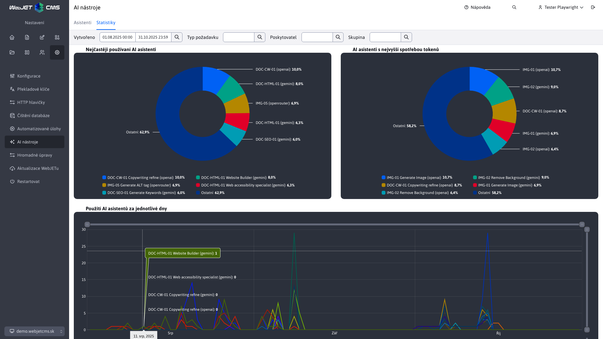
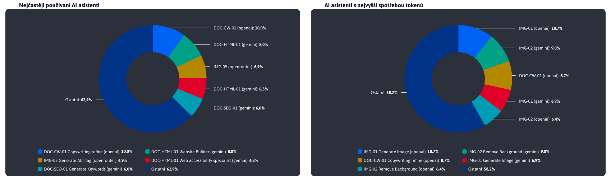
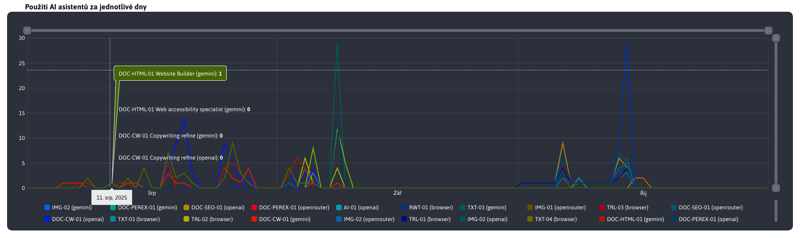
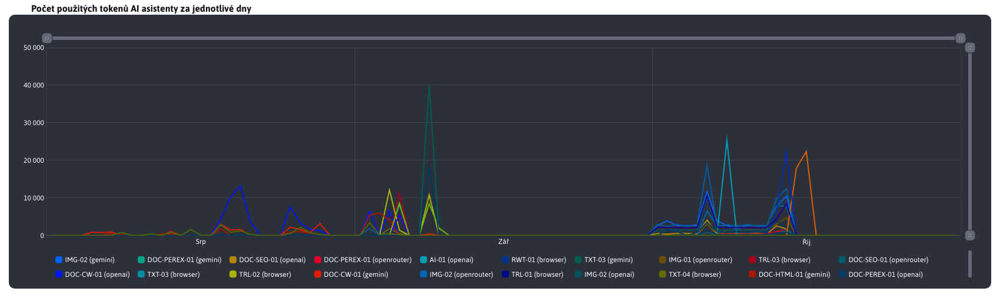
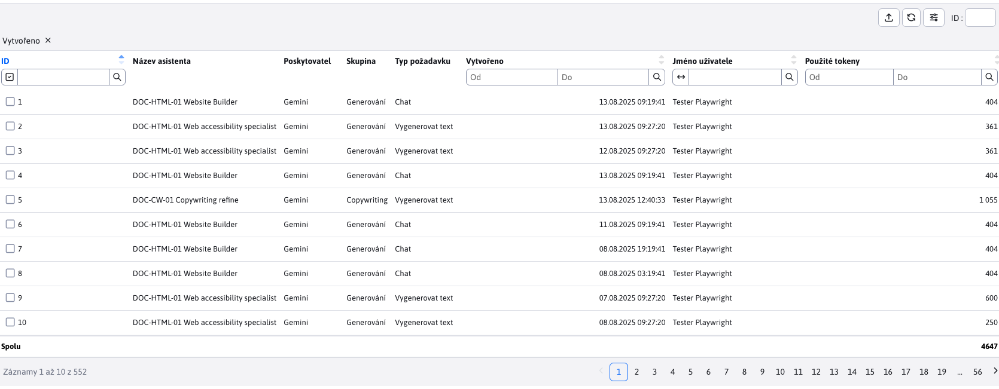
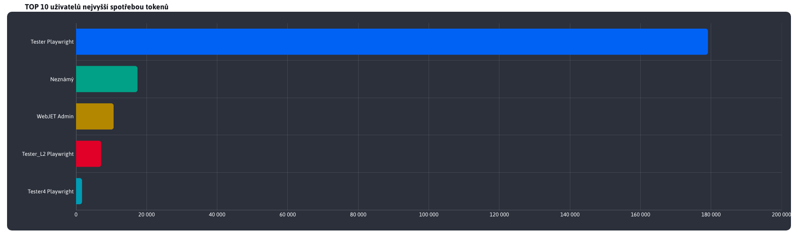
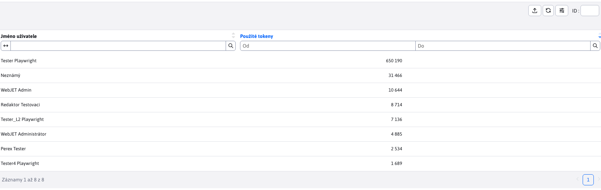

# Statistika

Sekce **Statistika** poskytuje přehled o využívání AI asistentů v systému. Najdete zde vizuální přehledy, které zobrazují nejčastěji používané asistenty, asistenty s nejvyšší spotřebou tokenů (tedy s největšími náklady), jakož i detailní informace o využití jednotlivých AI asistentů a jejich spotřebě tokenů v konkrétních dnech.

Údaje se zobrazují za období, které si zvolíte (výchozí rozsah je posledních 30 dní). Filtr v hlavičce umožňuje omezit zobrazení podle:
- **Typ požadavku** (např. Vygenerovat text, Vygenerovat obrázek, Chat)
- **Poskytovatel** (např. Prohlížeč, OpenAI, Gemini)
- **Skupina** (např. Generování, Analýza, Úprava)

Filtry můžete libovolně kombinovat, abyste se zaměřili na konkrétní část využívání. Všechny grafy i tabulka se po změně filtrů okamžitě aktualizují.

Více o parametrech naleznete v části [nastavení](../settings/README.md).

## Koláčové grafy

Koláčové grafy znázorňují rozdělení TOP 5 (včetně zbývajících jako kombinace) **Ostatní**) nejčastěji používaných AI asistentů a těch s nejvyšší spotřebou tokenů v rámci zvoleného období. Tyto vizualizace vám umožní rychle identifikovat nejpoužívanější asistenty a oblasti s největším čerpáním zdrojů.

## Použití AI asistentů za jednotlivé dny

Tento graf zobrazuje počet využití jednotlivých AI asistentů v konkrétních dnech během zvoleného období. Umožňuje sledovat trendy v používání asistentů a vyhodnotit, jak se jejich využití mění v čase.

## Počet použitých tokenů AI asistenty za jednotlivé dny

Tento graf zobrazuje, kolik tokenů (zdrojů) jednotliví AI asistenti spotřebovali během jednotlivých dní v daném období. Spotřeba tokenů nemusí přímo souviset s počtem využití – graf vám však pomůže odhalit asistenty s nadměrnou spotřebou a zvážit optimalizaci jejich instrukcí ke snížení nákladů.

## Tabulka 1

Sekce statistika dále nabízí také tabulku, kde je přehled všech volání asistentů za zvolené období. Obsahuje také sloupec uživatel, takže si umíte prohlédnout i to, kdo nejčastěji ak čemu používá AI asistenty.

## TOP 10 uživatelů nejvyšší spotřebou tokenů

Tento graf zobrazuje deseti uživatelů s nejvyšší spotřebou tokenů v rámci zvoleného období. Umožňuje identifikovat uživatele, kteří nejvíce přispívají k nákladům na využívání AI asistentů, a zvážit možnosti optimalizace jejich používání.

## Tabulka 2

Na závěr je k dispozici tabulka s přehledem všech uživatelů, kteří ve zvoleném období využili AI asistentů, spolu s celkovou spotřebou tokenů. Tato tabulka vám poskytuje detailní pohled na to, jak jednotliví uživatelé přispívají k celkovému využívání AI asistentů v systému.

