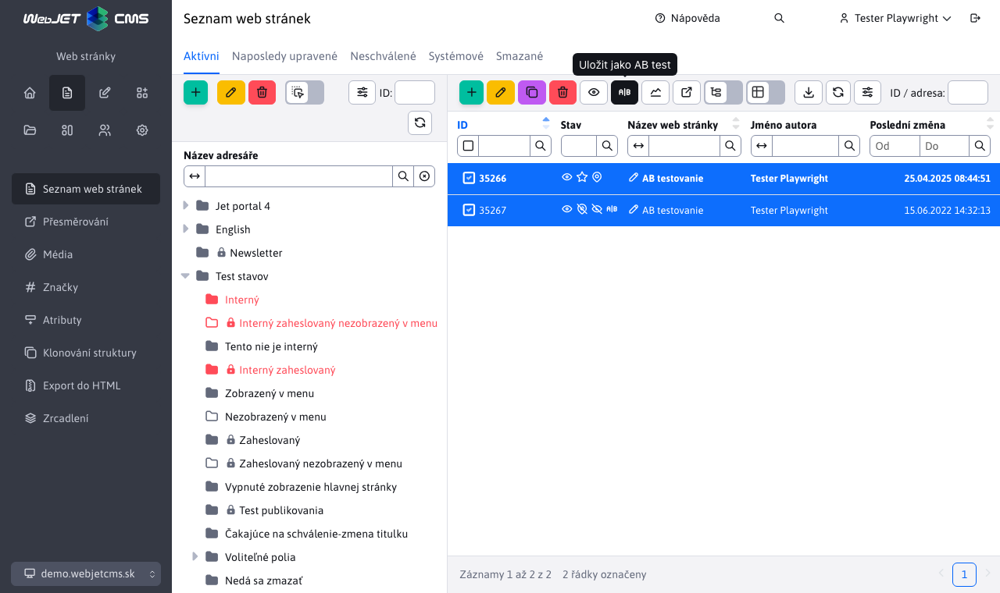

# AB testování

## Úvod

Aplikace AB testování vám umožňuje provést AB testování verze stránek. Je možné vytvořit B verzi stránky kliknutím na tlačítko Uložit jako AB test. Vytvoří se kopie stránky s upravenou URL adresou, ve které můžete testovat B verzi stránky. WebJET následně automaticky zajistí zobrazování A a B verze stránky na původní URL adrese v definovaném poměru. Návštěvník tedy stále vidí původní URL, ale místo A verze se mu automaticky zobrazí B verze stránky.

## Co je AB testování

- srovnání jedné zásadní změny
- měříme konverzi akce
- doporučený dostatečný vzorek minimálně 1000 návštěvníků/zobrazení
- `split` test = testování komplexní změny

**Výhody:**

- test je jednoduchý a rychlý
- určí nám důležité objekty
- je snadno měřitelný

**Nevýhody:**

- často může zklamat
- je třeba správně navrhnout co testujeme a co má být výsledek
- velkou změnu budeme po krocích testovat déle

## Jak připravit test

Připravte si hypotézu, která by měla zlepšit stav

- využijte statistiku (stránka s vysokým odchodem)
- brainstorming
- průzkum

**Co je vhodné testovat:**

- titulek (stránky, tlačítka)
  - výstižný vs popisný
  - orientovaný na vlastnost nebo benefit
- obrázky
  - usměvaví lidé vs foto produktu
  - barevnost, velikost
  - video
- text stránky
  - pod nadpisy, zvýraznění slov
  - odrážky vs odstavce
  - benefity vs funkce
- barevnost
  - tlačítek, odkazů, nadpisů
- formuláře
  - počet polí
  - povinné vs nepovinné
  - rozdělení na více kroků
- `CTA` prvky (prvky na které návštěvník kliká pro provedení akce)
  - text, barva, pozice, způsob provedení akce
- změna rozložení objektů
- použitelnost
  - co bude lepší?
- nezapomeňme na stránku po konverzi
  - získejme od návštěvníka více
  - sociální ikony, newsletter
  - bonusová nabídka

## Vytvoření testu

B verzi stránky vytvoříte označením originální verze stránky a kliknutím na ikonu <i class="ti ti-a-b" ></i> Uložit jako AB test. Následně se vám vytvoří kopie stránky, která ve sloupci Stav bude zobrazovat ikonu <i class="ti ti-a-b" ></i>. V B verzi můžete upravit text stránky, kterým budete testovat dopad změn.

Lze také testovat tzv. `split` testy. Návštěvníkovi se při prvním přístupu vygeneruje `cookie` která určuje jaká verze stránky se mu zobrazí. Pokud se vygeneruje B verze, tak i všechny následující stránky které mají B verzi se zobrazí v B verzi. Návštěvník tak může přecházet mezi více stránkami B verze.

V aplikaci AB testování lze nastavit poměr mezi A a B verzí, technické názvy URL `suffixu` a názvu cookie, platnost cookie a hlavně se AB testování zapíná a vypíná.

## Měření výsledků

- měříme stránku/akci po konverzi
- split test umožní B verze děkovné stránky
- před testem si ujasněme co a jak změříme
- i snížení konverze je úspěch testu

V aplikaci AB testování se v tabulce zobrazuje seznam stránek které mají B verzi s možností zobrazení grafu porovnání verzí. Pokud nemáte poměr AB verze 50:50 WebJET automaticky provede i poměrový přepočet návštěv jednotlivých verzí, aby se dala čísla porovnat.

