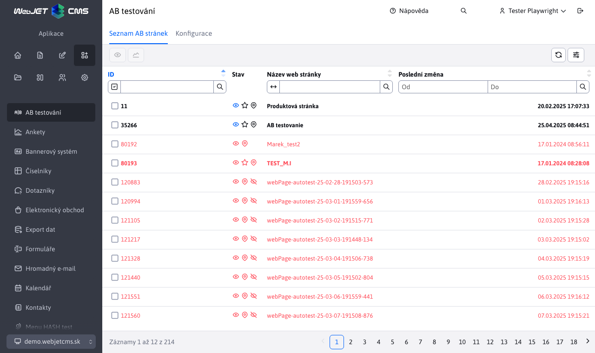
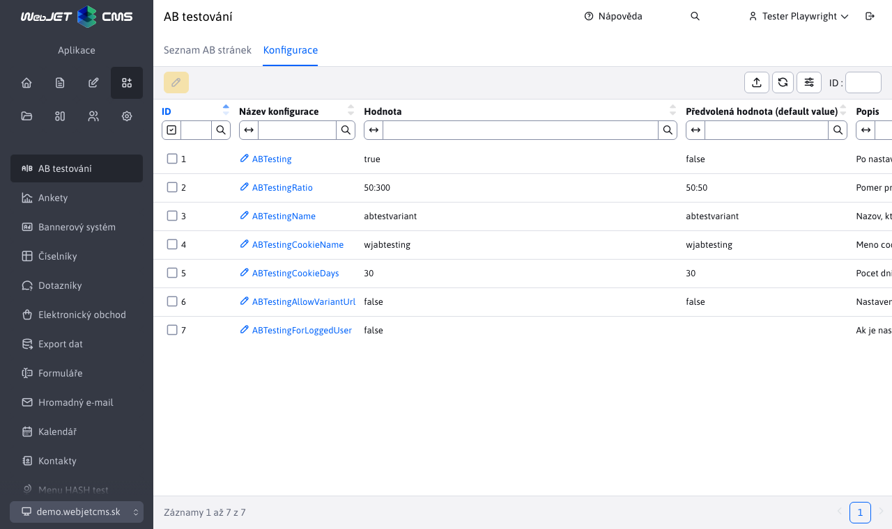

# AB Testování

Aplikace AB testování Vám poskytuje přehled o AB stránkách a správu příslušných konfiguračních proměnných:
- Seznam AB stránek
- Konfigurace

## Seznam AB stránek

Sekce Seznam AB stránek nabízí seznam stránek, které mají vytvořenou B variantu. Tyto stránky nelze jakkoli upravovat, přidávat či mazat.

K dispozici máte možnost zobrazení stránky i zobrazení Statistiky stránky pomocí tlačítek na nástrojové liště tabulky. Důležité ve statistice je měření výsledků procentuálním přepočtením podle poměru A/B verze:

## Konfigurace

Sekce Konfigurace Vám umožňuje přehled a úpravu příslušných konfiguračních proměnných pro AB testování.

Samotná úprava těchto konfigurační proměnných je okraji pouze pro úpravu hodnoty proměnné a šifrování, žádné jiné změny nebo akce nad proměnnými nejsou umožněny.

### Možné konfigurační proměnné

- `ABTesting` (výchozí `false`) - po nastavení na `true` se aktivuje AB testování web stránek.
- `ABTestingRatio` (výchozí `50:50`) - poměr při generování stránek mezi verzí A a B.
- `ABTestingName` (výchozí `abtestvariant`) - název, který se přidává do URL adresy B verze stránky k jejímu odlišení - používá se také k dohledání B verze stránky.
- `ABTestingCookieName` (výchozí `wjabtesting`) - jméno `cookie` použité pro zapamatování si verze testu při `split` testech - pokud se při zobrazení rozhodne pro B variantu, zapamatuje se v `cookie` s tímto názvem a podle toho se dále budou poskytovat B verze stránek.
- `ABTestingCookieDays` (výchozí `30`) - počet dní zapamatování si zvolené verze při AB testování - čas expirace cookie.
- `ABTestingAllowVariantUrl` (výchozí `false`) - nastavením na `true` povolí přímé zobrazení variantní URL adresy i ne-administrátorům, například. volání `/investicie/abtestvariantb.html`.
- `ABTestingForLoggedUser` (výchozí `false`) - nastavením na `true` se spustí režim, kdy nepřihlášenému návštěvníkovi je vždy zobrazena A varianta web stránky a přihlášenému je vždy zobrazena B varianta web stránky.
