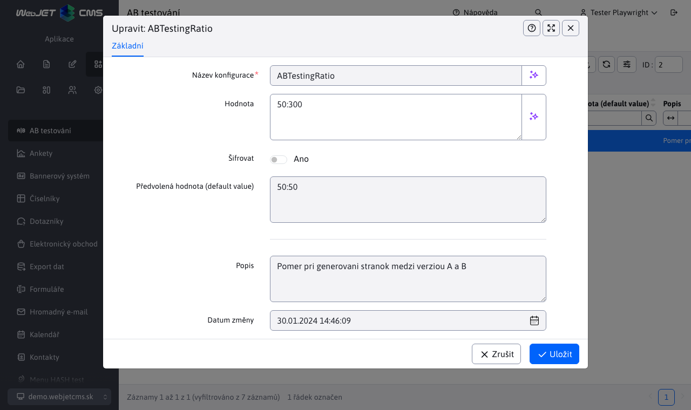

# Aplikace AB testování

Aplikace AB testování poskytuje přehled stránek AB a správu příslušných konfiguračních proměnných:
- Seznam AB stránek
- Konfigurace

## Seznam AB stránek

V části Seznam lokalit AB je uveden seznam lokalit, které mají vytvořenou variantu B. Tyto stránky nelze nijak upravovat, přidávat ani odstraňovat.

Pomocí tlačítek na panelu nástrojů tabulky máte možnost zobrazit stránku a také statistiky stránky. Důležité ve statistikách je měření výsledků podle procentuální konverze podle poměru verzí A/B:

## Konfigurace

V části Konfigurace můžete zkontrolovat a upravit příslušné konfigurační proměnné pro testování AB.

Vlastní úprava těchto konfiguračních proměnných je omezena na změnu hodnoty proměnné a šifrování, žádné jiné změny nebo akce nad proměnnými nejsou povoleny.

### Možné konfigurační proměnné

- `ABTesting` (výchozí nastavení `false`) - po nastavení na `true` Testování webových stránek AB je aktivováno
- `ABTestingRatio` (výchozí nastavení `50:50`) - poměr generování stránek mezi verzí A a B
- `ABTestingName` (výchozí nastavení `abtestvariant`) - název, který se přidává do adresy URL verze B stránky pro její odlišení - používá se také k dohledání verze B stránky.
- `ABTestingCookieName` (výchozí nastavení `wjabtesting`) - název `cookie` si pamatoval verzi testu, kdy `split` testy - pokud se displej rozhodne pro možnost B, je zapamatována v `cookie` s tímto názvem a podle toho budou dále poskytovány verze stránek B.
- `ABTestingCookieDays` (výchozí nastavení `30`) - počet dní, po které si má AB testování pamatovat zvolenou verzi - doba vypršení platnosti souboru cookie
- `ABTestingAllowVariantUrl` (výchozí nastavení `false`) - nastavením na `true` umožňuje přímé zobrazení adresy URL varianty neadministrátorům, např. voláním `/investicie/abtestvariantb.html`.
