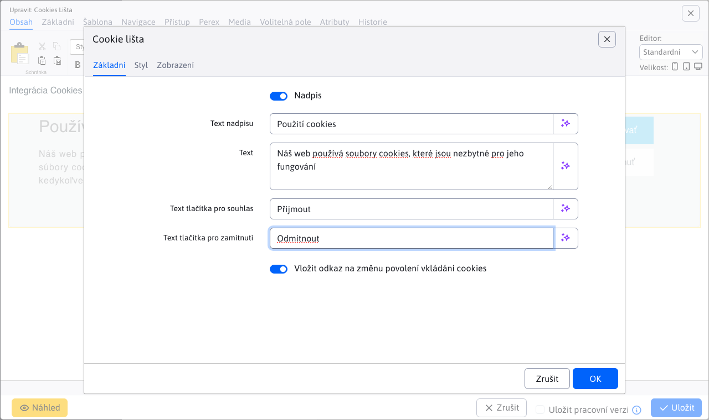
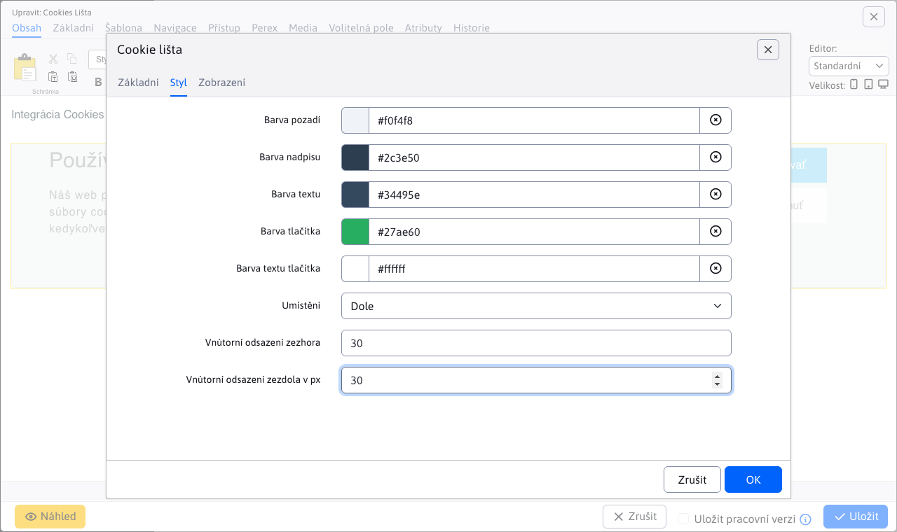

# Cookie bar

Přidejte na své stránky předdefinovaný panel souhlasu se soubory cookie, kde mohou návštěvníci potvrdit svůj souhlas s ukládáním souborů cookie do svého zařízení. Doporučujeme umístit tuto aplikaci do zápatí, aby se automaticky zobrazovala na každé stránce. Po udělení souhlasu se panel po dobu 30 dnů znovu nezobrazí.

Panel souborů cookie se nejčastěji používá na webových stránkách, které nepoužívají sledovací nebo marketingové nástroje a kde je jediným účelem souboru cookie poskytnout základní funkce webu. Na rozdíl od stránek [Souhlas se soubory cookie podle GDPR](/redactor/apps/gdpr/README) kde má uživatel možnost podrobně upravit nastavení souborů cookie (např. přijímat pouze nezbytné nebo marketingové soubory cookie), slouží lišta souborů cookie pouze k informování uživatele a neumožňuje aktivní kontrolu nad tím, jaké typy souborů cookie se ukládají.

## Nastavení aplikace

V této části lze nastavit:

### Základní karta:
- **Text názvu**: Zadejte text, který se zobrazí jako hlavní nadpis na kartě. Může to být například "Používání souborů cookie".
- **Text**: Popis informací, které chcete uživatelům zobrazit, například "Naše webové stránky používají soubory cookie".
- **Text tlačítka Přijmout**: Text pro tlačítko, na které uživatel klikne, aby přijal soubory cookie, například "Accept".
- **Text tlačítka Odmítnout**: Text pro tlačítko, na které uživatel klikne, aby odmítl soubory cookie, například "Odmítnout".
- **Vložení odkazu pro změnu oprávnění k používání souborů cookie**: Odkaz, který uživatelům umožní v budoucnu změnit rozhodnutí o souborech cookie.

### Karta Styl:
- **Barva pozadí**: Nastavení barvy pozadí oznámení.
- **Barva názvu**: Určete barvu záhlaví.
- **Barva textu**: Barva samotného textu.
- **Barva tlačítka**: Barva pozadí tlačítek.
- **Barva textu tlačítka**: Barva textu na tlačítkách.
- **Umístění**: Určete umístění oznámení, "Dolů" nebo "Nahoru".
- **Vnitřní odsazení od horního okraje v px**: Například `25px` nastavit správné odsazení od horní části prvku.
- **Vnitřní odsazení od spodního okraje v px**: Například `25px` pro vnitřní odsazení od spodní části oznámení.

## Zobrazení aplikace

