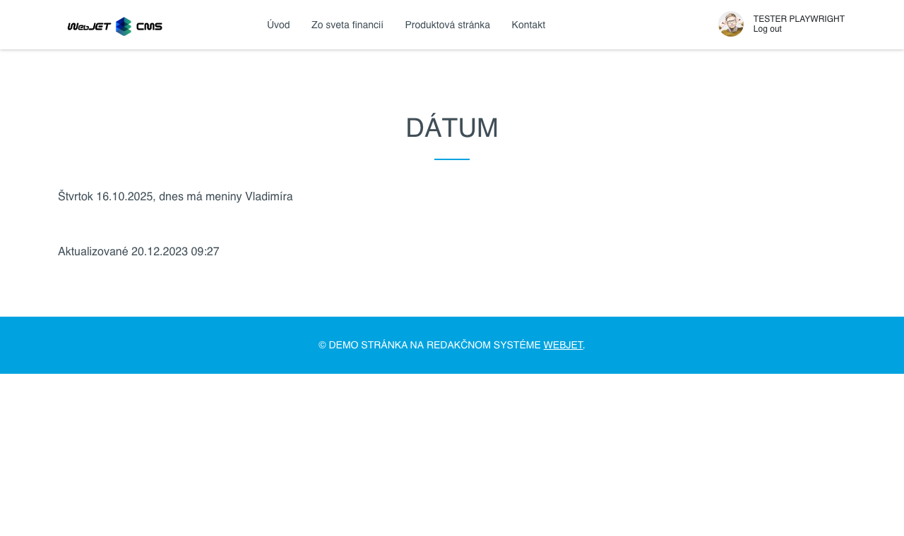

# Datum

Aplikace vloží aktuální datum, název data nebo datum poslední změny webové stránky.

## Nastavení aplikace

V této části lze nastavit:
- Formát žádosti, jak se zobrazuje
- U některých formátů můžete zvolit, zda se má zobrazit datum nebo čas.

## Zobrazení aplikace

