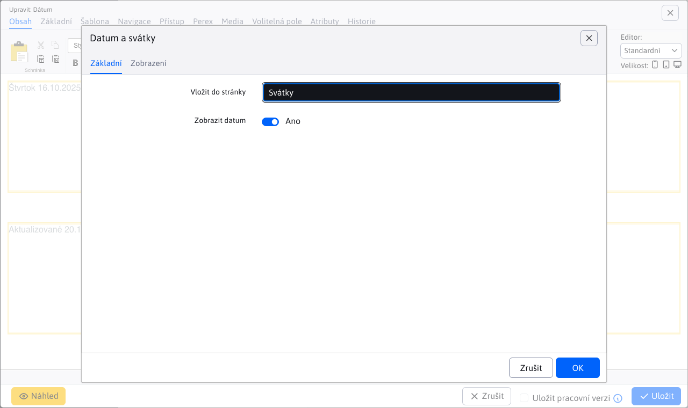

# Datum

Aplikace vloží do stránky aktuální datum, svátek příslušející k danému dni nebo datum poslední změny webstránky.

## Nastavení aplikace

V této části lze nastavit:
- Formát aplikace, jak se zobrazí
- U některých formátů lze vybrat, zda se zobrazí datum nebo čas

## Zobrazení aplikace

