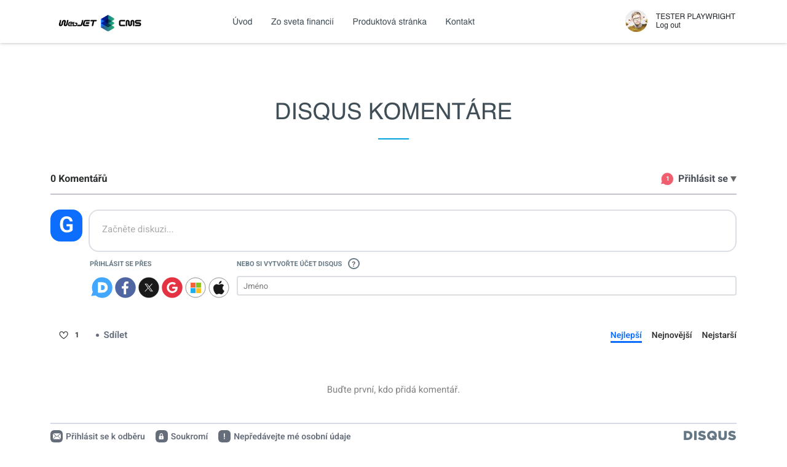

# Komentáře Disqus

Vložte komentáře Disqus na své webové stránky. Před přidáním na své stránky si zaregistrujte bezplatný účet na adrese https://www.disqus.com a nastavte si možnosti diskuse.

## Nastavení aplikace

Po vytvoření účtu si zaregistrujte web na adrese https://disqus.com/admin/create/ a vyberte si jedinečnou adresu URL služby Disqus (např. webjet.disqus.com) a zadejte ji do následujícího pole:
- Jedinečná adresa URL služby Disqus (zkrácený název webové stránky)

## Zobrazení aplikace

