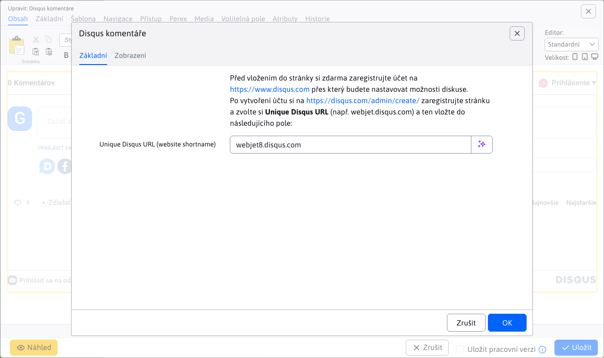

# Disqus komentáře

Vložte službu Disqus komentáře do vaší webstránky. Před vložením do stránky si zdarma zaregistrujte účet na https://www.disqus.com, přes který budete nastavovat možnosti diskuse.

## Nastavení aplikace

Po vytvoření účtu si na https://disqus.com/admin/create/ zaregistrujte stránku a zvolte si Unique Disqus URL (např. webjet.disqus.com) a ten vložte do následujícího pole:
- Unique Disqus URL (website shortname)

## Zobrazení aplikace

