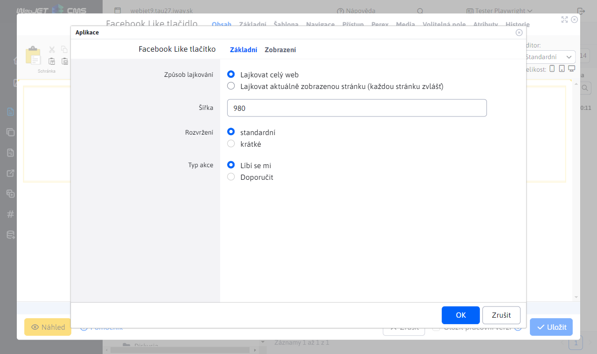
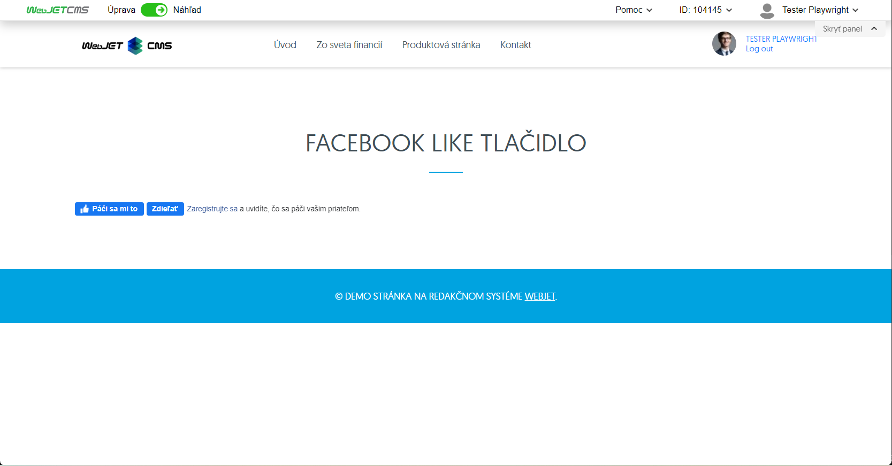

# Tlačítko To se mi líbí na Facebooku

Tlačítko "To se mi líbí/sdílet" na Facebooku umožňuje nastavit "To se mi líbí" nebo sdílet obsah stránky s přáteli návštěvníka stránky.

## Nastavení aplikace

- **Způsob oblíbenosti**: Zvolte preferovaný způsob oblíbenosti:
  - Stejně jako celý web
  - Stejně jako aktuálně zobrazená stránka (každá stránka zvlášť)
- **Šířka**: Zadejte šířku, která se má zobrazit, například `980`.
- **Rozložení**: Vyberte typ rozložení:
  - Standardní
  - Krátké
- **Typ akce**: Vyberte typ akce, kterou chcete provést:
  - Líbí se mi
  - Doporučit

## Zobrazení aplikace

