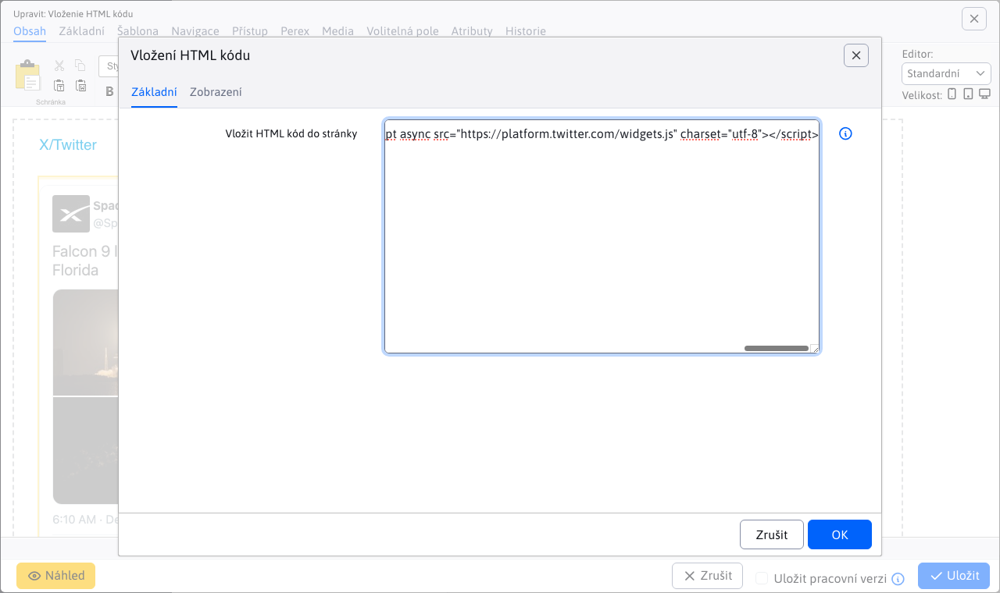
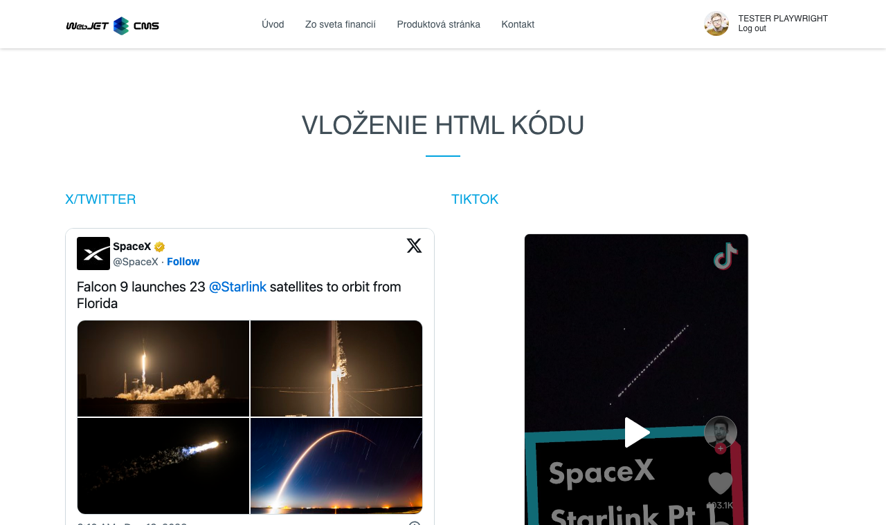

# Vložení kódu HTML

Přidejte na stránku externí kód HTML pro aplikace, které nejsou přímo podporovány, například video TikTok nebo příspěvek z X/Twitteru. Obohaťte svůj obsah o interaktivní prvky a zapojte návštěvníky.

## Nastavení aplikace

V nastavení můžete:
- Vložení kódu HTML do stránky

## Zobrazení aplikace

