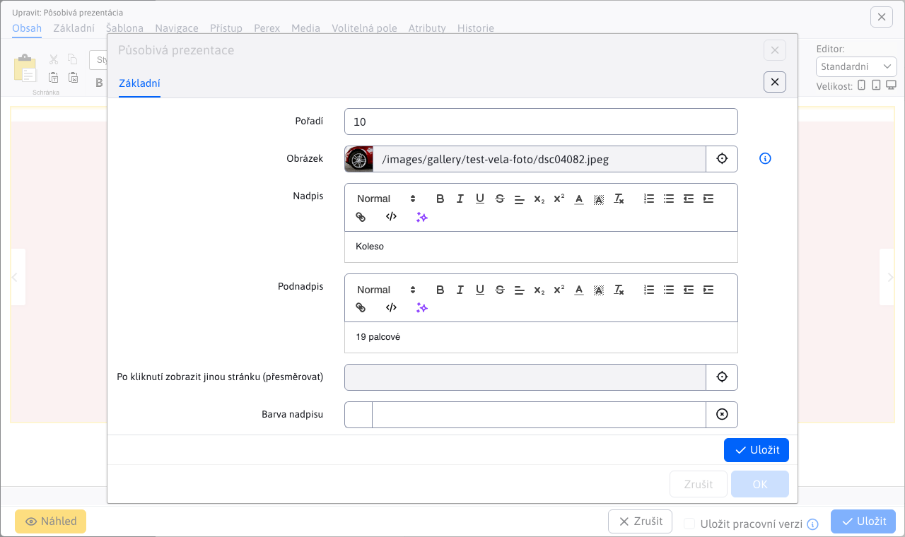
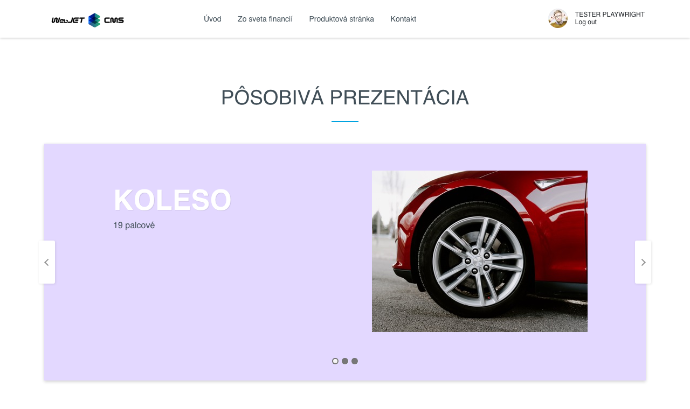

# Působivá prezentace

Animované zobrazení prezentace s 3D efektem přechodu mezi snímky. Každému snímku můžete definovat nadpis, podnadpis, barvu písma a pozadí, ilustrační fotografii.

## Nastavení aplikace

Karty nastavení **Styl a nastavení** a **Položky**.

### Styl a nastavení

V této části lze nastavit:
- Výška
- Šířka obrázku
- Výška obrázku

### Položky

V této části lze vidět a spravovat položky aplikace, takže klasické akce jako přidání/úprava/mazání...

Pro jednotlivé položky můžete nastavit tyto parametry:
- **Obrázek**, podporován je výběr obrázku pomocí průzkumníka, jakož i přímé zadání cesty obrázku
- **Nadpis**, nadpis obrázku (možné je i stylování textu)
- **Podnadpis**, podnadpis obrázku (možné je i stylování textu)
- **Po kliknutí zobrazit jinou stránku (přesměrovat)**, výběr stránky na kterou budete přesměrováni (podporováno je i přímé zadání cesty)
- **Barva nadpisu**
- **Barva podnadpisu**
- **Barva pozadí**

## Zobrazení aplikace

