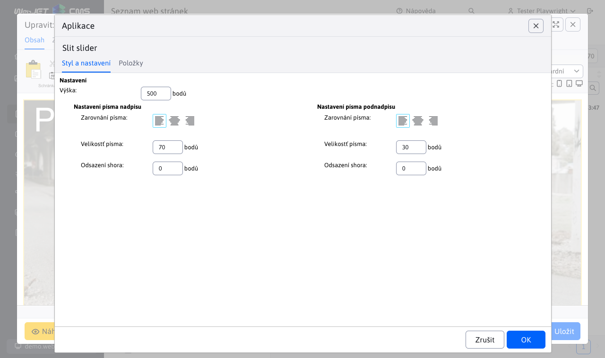

# Slit slider

Oživte svou stránku s úchvatným animovaným sliderem fotografií. Využijte efekt rozdělení a otevření fotografií, který přidává dynamiku a zaujetí. Každá fotografie může být doplněna nadpisem a textem, což umožňuje ještě větší personalizaci a interakci se zákazníky.

## Nastavení aplikace

### Styl a nastavení

V této části lze nastavit:
- Výška
- Nastavení písma nadpisu (Zarovnání písma, Velikost písma, Odsazení shora)
- Nastavení písma podnadpisu (Zarovnání písma, Velikost písma, Odsazení shora)

### Položky

V této části je přidat nebo odebrat položku: Při přidání lze vyplnit nadpis, podnadpis, přesměrování, barvu nadpisu, barvu podnadpisu, barvu pozadí a obrázek. U položek lze změnit pořadí přesunutím. Odebrání položky lze kliknutím na červený křížek.

## Zobrazení aplikace

