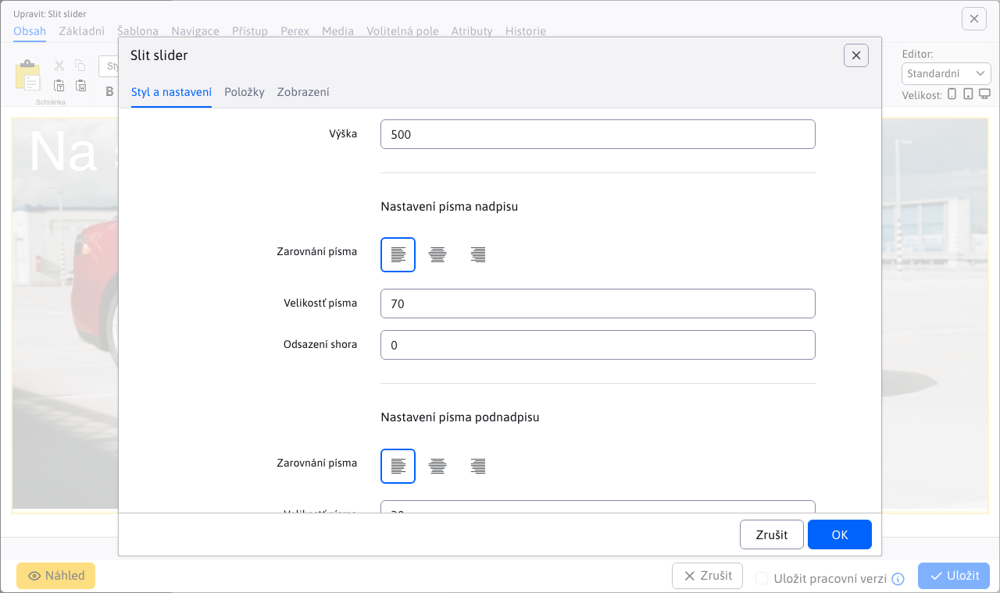
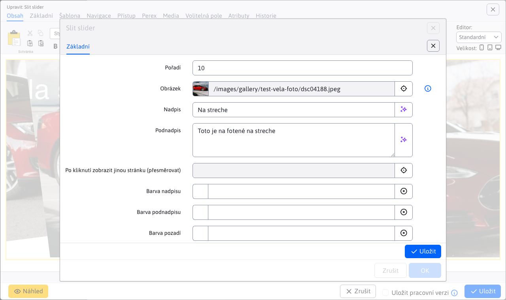
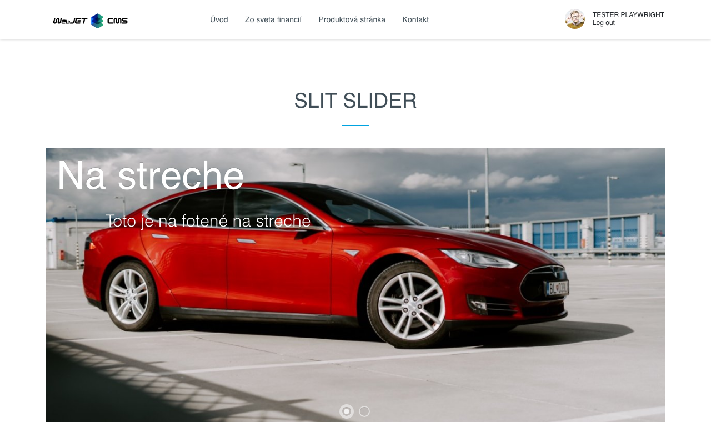

# Slit slider

Oživte svou stránku s úchvatným animovaným sliderem fotografií. Využijte efekt rozdělení a otevření fotografií, který přidává dynamiku a zaujetí. Každá fotografie může být doplněna nadpisem a textem, což umožňuje ještě větší personalizaci a interakci se zákazníky.

## Nastavení aplikace

### Styl a nastavení

V této části lze nastavit:
- **Výška**
- **Nastavení písma nadpisu** (Zarovnání písma, Velikost písma, Odsazení shora)
- **Nastavení písma podnadpisu** (Zarovnání písma, Velikost písma, Odsazení shora)

### Položky

V této části lze vidět a spravovat položky aplikace, takže klasické akce jako přidání/úprava/mazání…

Pro jednotlivé položky můžete nastavit tyto parametry:
- **Obrázek**, podporován je výběr obrázku pomocí průzkumníka, jakož i přímé zadání cesty obrázku
- **Nadpis**, nadpis obrázku
- **Podnadpis**, podnadpis obrázku
- **Po kliknutí zobrazit jinou stránku (přesměrovat)**, výběr stránky na kterou budete přesměrováni (podporováno je i přímé zadání cesty)
- **Barva nadpisu**
- **Barva podnadpisu**
- **Barva pozadí**

## Zobrazení aplikace

