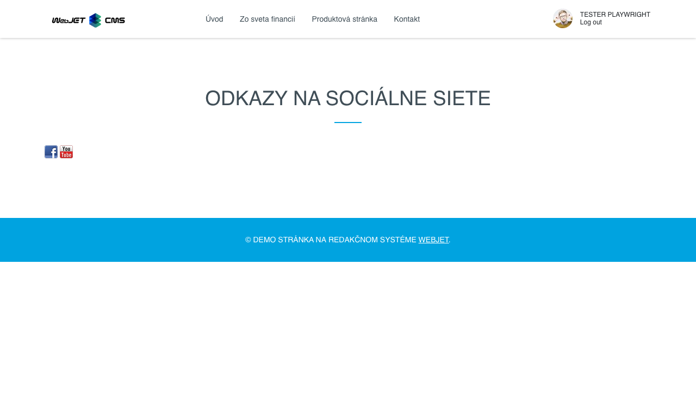

# Odkazy na sociální sítě

Vloží do stránky ikony s odkazy na sociální sítě Facebook, Twitter, Instagram, LinkedIn, Flickr atp.

## Nastavení aplikace

Nastavení obsahuje karty:
- **Základní**
- **Styl**

### Karta - Základní

V kartě můžete zadat adresu vaší stránky pro jednotlivé sociální sítě. Pro prázdná pole se ikona sociální sítě nezobrazí.

### Karta - Styl

V kartě můžete nastavit:
- **Vizuální styl** - zobrazení ikon
- **Zarovnání ikon** - vlevo, střed, vpravo

## Zobrazení aplikace

