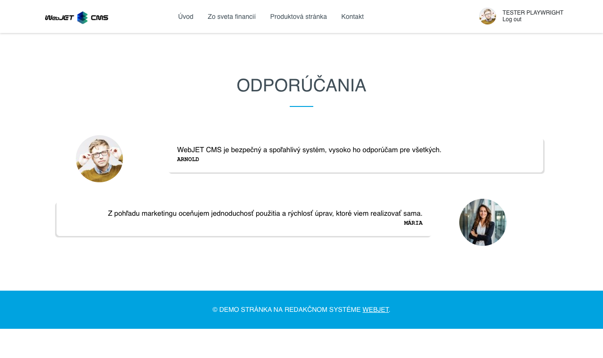
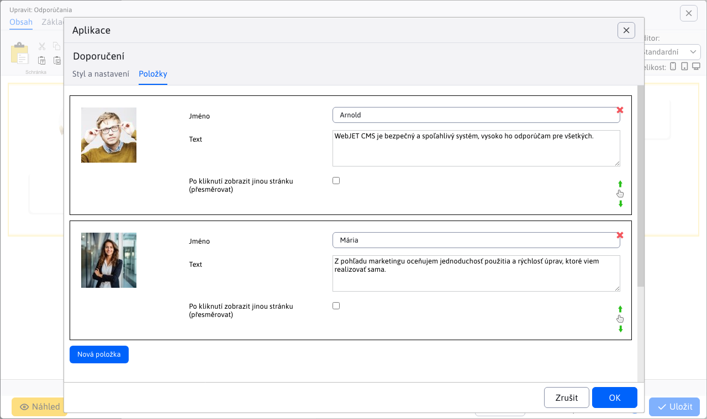
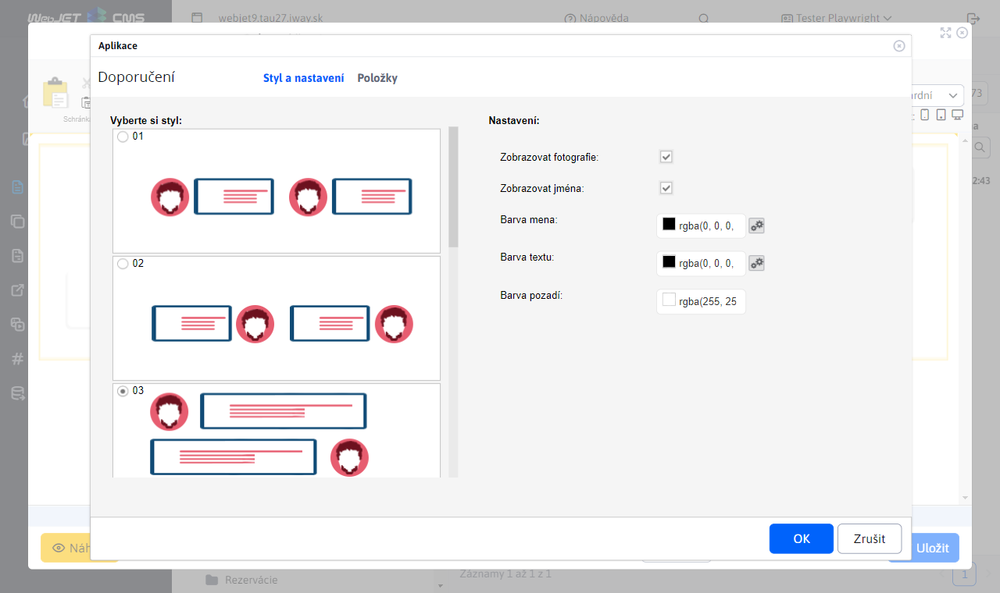

# Doporučení

Vložte si do stránky aplikaci zobrazující doporučení vašich zákazníků.
Aplikace zvýší důvěryhodnost Vaší stránky a potencionálního zákazníka ujistí o kvalitě Vašich služeb.

## Nastavení aplikace

### Položky

V této části lze přidat, upravit nebo vymazat položku (doporučení). Tabulka podporuje také možnost změny řazení pomocí akce `drag&drop`.

Pro každou položku umíte nastavit:

- **Pořadí** - pořadí doporučení v zobrazení
- **Obrázek** - obrázek zákazníka, který dal doporučení
- **Jméno** - jméno zákazníka, který dal doporučení
- **Text** - text doporučení
- **Po kliknutí zobrazit jinou stránku (přesměrovat)** - pokud je tato možnost zvolena, zobrazí se pole pro zadání URL adresy, na kterou bude uživatel přesměrován po kliknutí na položku

### Styl

V této části můžete zvolit styl, který se aplikuje na doporučení. Čili umíte zvolit jak se mají zobrazovat na webové stránce.

### Nastavení

V této části lze nastavit:

- Zobrazovat fotografie
- Zobrazovat jména
- Barva jména
- Barva textu
- Barva pozadí

