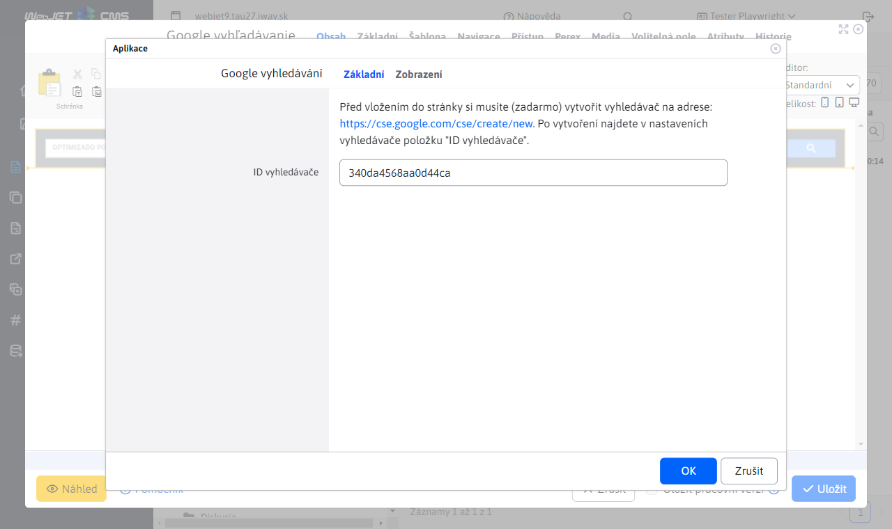
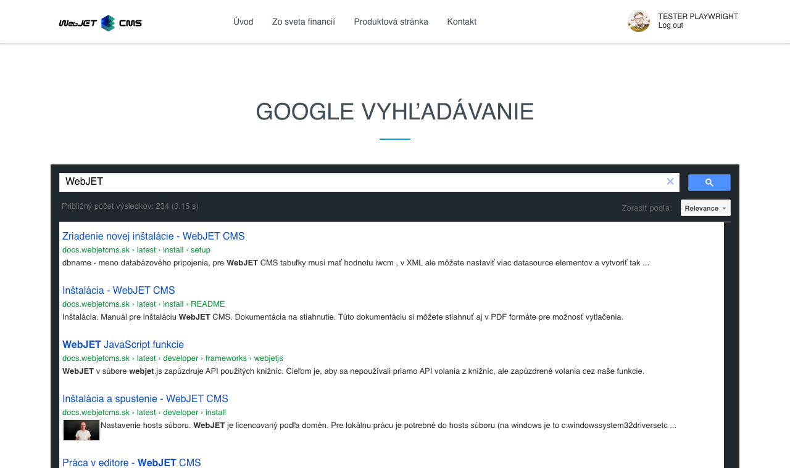

# Google vyhledávání

Prostřednictvím této aplikace si můžete do vaší stránky umístit vyhledávací pole Google pro vyhledávání na vašem webu s využitím Google indexu/Google Custom Search.

Před vložením do stránky si musíte (zdarma) vytvořit vyhledávač na adrese: [cse.google.com](https://cse.google.com/cse/create/new). Po vytvoření naleznete v nastaveních vyhledávače položku "ID vyhledávače".

## Nastavení aplikace

V této části lze nastavit:
- ID vyhledávače - hodnota získaná na stránce [cse.google.com](https://cse.google.com/cse/create/new)

## Zobrazení aplikace

