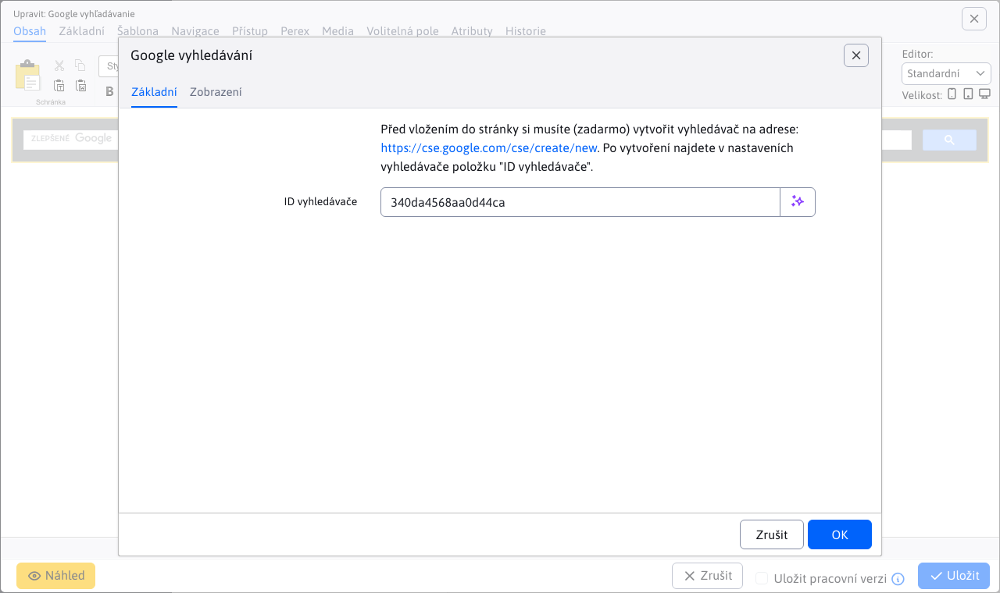

# Vyhledávání na Googlu

Pomocí této aplikace můžete na stránku umístit vyhledávací pole Google a vyhledávat na webu pomocí služby Google Index/Google Custom Search.

Před vložením vyhledávače do webu je nutné (zdarma) vytvořit vyhledávač na následující adrese: [cse.google.com](https://cse.google.com/cse/create/new). Po vytvoření najdete položku "ID vyhledávače" v nastavení vyhledávače.

## Nastavení aplikace

V této části lze nastavit:
- ID vyhledávače - hodnota získaná na stránce [cse.google.com](https://cse.google.com/cse/create/new)

## Zobrazení aplikace

