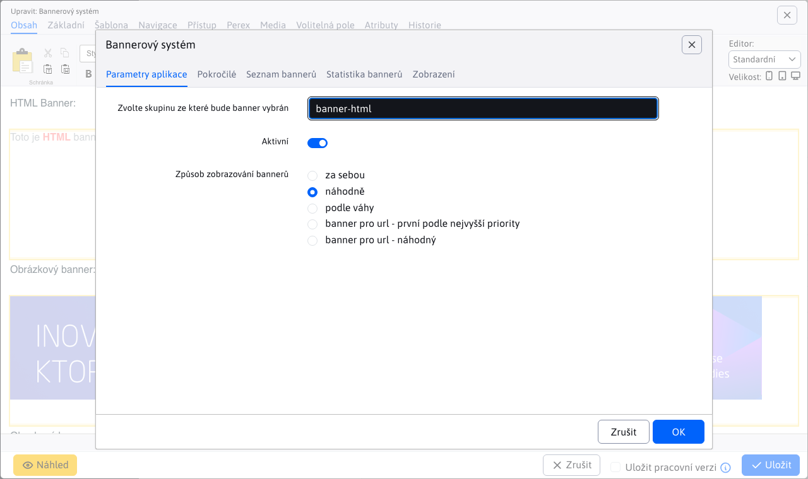
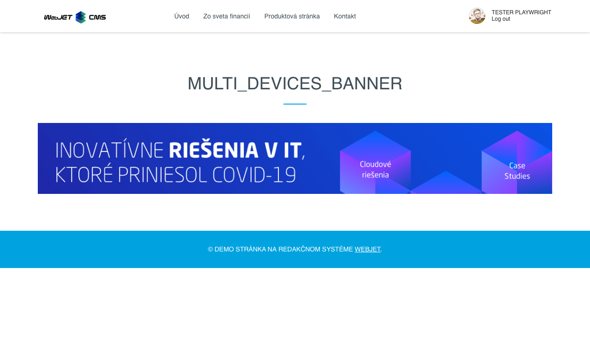

# Bannerový systém

## Seznam bannerů

Aplikace bannerového systému, která umožňuje vložit banner na stránku. Systém podporuje následující typy bannerů:
- Obrázek - zobrazí statický nebo animovaný obrázek. `gif`. Zaznamenává kliknutí na banner.
- Html kód - vloží do stránky zadaný HTML kód dynamického banneru. Nezaznamenává kliknutí na banner.
- Obsahový banner - vloží na pozadí obrázek, nad kterým je umístěn text a tlačítka pro provedení akce (tlačítka pro kliknutí na akci).
- Video - vloží do stránky místní video soubor nebo video z YouTube.

V tabulce jsou bannery, které nelze zobrazit, zobrazeny červeně. Zaškrtnuta je nejen aktivní možnost, ale také omezení počtu zobrazení/kliknutí a omezení data. K filtrování zobrazitelných bannerů můžete použít filtrování podle sloupce Zobrazitelné.

## Obecné parametry banneru

Parametry na kartách Základní a Omezení jsou společné pro různé typy bannerů.

- Název - název vašeho banneru (nezobrazuje se nikde na webu, slouží pouze k vaší identifikaci).
- Typ banneru - obrázek, kód HTML nebo obsahový banner
- Skupina - skupina pro banner, po zadání začátku názvu skupiny nebo znaku `*` zobrazí existující skupiny, ze kterých můžete vybírat. Skupiny se používají jako specifikace umístění při návrhu webové stránky (např. `top-banner`, nebo `banner-left-menu`) a při zobrazení stránky se na dané pozici zobrazí banner ze zadané skupiny.
- Aktivní - můžete aktivovat/deaktivovat zobrazení banneru.
- Priorita - pokud banneru nastavíte vyšší prioritu, bude mít přednost před bannery s nižší prioritou (záleží také na nastavení aplikace pro zobrazování banneru).

Na kartě Omezení můžete nastavit:
- Datum zahájení - datum a čas zahájení zobrazování banneru (banner se začne zobrazovat po zadaném datu). Pokud je pole prázdné, omezení se neuplatní.
- Datum ukončení - datum a čas ukončení zobrazování banneru (po zadaném datu se přestane zobrazovat). Pokud je pole prázdné, omezení se neuplatní.
- Maximální počet zobrazení - maximální počet zobrazení banneru. Nastavením na hodnotu 0 se toto omezení vypne.
- Zobrazení (pouze pro čtení) - zobrazuje aktuální počet zobrazení banneru.
- Maximální počet kliknutí - maximální počet kliknutí na banner (pouze u bannerů, které zaznamenávají kliknutí, typicky banner Obrázek). Nastavením na hodnotu 0 toto omezení vypnete.
- Kliknutí (pouze pro čtení) - zobrazuje aktuální počet kliknutí na banner.
- Klient - pokud uživatel nemá oprávnění "Zobrazit všechny bannery", zobrazí se v seznamu bannerů pouze ty bannery, u kterých je nastaven jako klient. Může to být např. agentura, která v systému upravuje vaše bannery.
- Vybrat stránky - Kliknutím na tlačítko Přidat webovou stránku vyberte jednu nebo více stránek, na kterých se může banner zobrazit. Pokud není vybrána žádná stránka, banner lze zobrazit na všech stránkách (pokud není výběrem adresáře vytvořeno omezení).
- Vybrat adresář - kliknutím na tlačítko Přidat adresář vyberte jeden nebo více adresářů, ve kterých se bude banner zobrazovat. Pokud je pro banner nastaven adresář, bude se banner zobrazovat na všech stránkách v tomto adresáři i na všech stránkách v podadresářích. Pokud není vybrán žádný adresář, bude se banner zobrazovat na všech stránkách (pokud není výběrem stránky vytvořeno omezení).

Karta Volitelná pole umožňuje nastavit hodnoty polí podle potřeb vaší implementace, karta Statistiky zobrazuje graf statistik zobrazení a kliknutí na banner.

## Banner typu obrázok

Banner typu obrázku obsahuje na kartě Nastavení následující možnosti:
- Adresa umístění banneru - adresa obrázku banneru (např. `/images/banner.gif`).
- Linka přesměrování - adresa, na kterou jste přesměrováni po kliknutí na banner (např. `/sk/produkty/`).
- Cíl - můžete vybrat, v jakém rámu bude linka přesměrování otevřená (vlastní rám, nové okno, horní rám, nadřazený rám).

## Banner typu HTML kód

Banner typu HTML kód obsahuje v kartě Nastavení následující možnosti:
- Linka přesměrování - adresa, na kterou jste přesměrováni po kliknutí na banner (např. `/sk/produkty/`). V kódu HTML musíte odkaz nasměrovat na adresu `/components/_common/clk.jsp?bid=ID` kde ID je ID banneru (abyste získali ID, musíte ho nejprve uložit).
- Kód HTML - zadejte kód HTML dynamického banneru.

## Banner typu video

Banner typu video obsahuje v kartě Nastavení následující možnost:
- Adresa umístění banneru, můžete zadat
  - Adresa videa MP4 (např. `/images/video/bloky.mp4`), které lze vybrat z nahraných souborů.
  - Adresa jakéhokoli videa na YouTube (např. `https://www.youtube.com/watch?v=A5upeBuEMbg`)
- Linka přesměrování - adresa, na kterou jste přesměrováni po kliknutí na banner (např. `/sk/produkty/`), funguje správně pouze pro video `mp4`, v případě YouTube není odkaz z technických důvodů klikatelný.
- Cíl - můžete vybrat, v jakém rámu bude linka přesměrování otevřená (vlastní rám, nové okno, horní rám, nadřazený rám).

## Banner typu Obsahový banner

Banner typu obrázku obsahuje na kartě Nastavení následující možnosti:
- Adresa webové stránky, na které se banner zobrazí - **Varování:** banner s obsahem se nezobrazuje na základě skupiny, ale na základě shody zobrazené webové stránky s adresou zadanou v tomto poli. Můžete tedy nakonfigurovat zobrazení bannerů na základě adres URL stránek.
- Linka přesměrování - adresa, na kterou jste přesměrováni po kliknutí na tlačítko v banneru (např. `/sk/produkty/`).
- Odkaz na obrázek - adresa obrázku banneru (např. `/images/banner.jpg`).
- Odkaz na mobilní obrázek - adresa obrázku banneru pro mobilní zařízení (např. `/images/banner-lores.jpg`). Tento obrázek se použije pro rozlišení užší než 760 pixelů.
- Primární nadpis - hlavní (největší) nadpis v banneru.
- Sekundární nadpis - pod nadpisem v banneru (může zůstat prázdný).
- Popisný text - doplňkový text pod nadpisy (lze ponechat prázdný).

Pokud **Odkaz na obrázek** nebo **Odkaz na obrázek pro mobilní zařízení** obsahuje umístění **Soubor MP4 nebo adresa videa YouTube** na pozadí se zobrazí přehrávač videa. Hodnota pro mobilní zařízení se použije, pokud je telefon na serveru detekován podle hodnoty `User-Agent` obsahující hodnotu `iphone` nebo `mobile` pro Android.

Podmíněné zobrazení podle parametru URL (banner kampaně):
- Hodnota parametru URL pro přímé zobrazení - pro reklamní kampaně je možné nastavit pole **Hodnota parametru URL pro přímé zobrazení**. Zde můžete zadat kód (např. `webjetcms`) a pak se banner zobrazí vždy, pokud je v adrese URL shoda parametrů. Pokud tedy máte k jedné stránce přiřazeno více bannerů, můžete je zobrazit přesně podle zdroje reklamní kampaně (např. podle zdrojové stránky nebo odkazu z e-mailu či reklamní kampaně na Facebooku).
- Banner bude k dispozici jako - zobrazí náhled adresy pro zobrazení banneru. Název parametru (výchozí `utm_campaign`) lze nastavit v proměnné conf. `bannerCampaignParamName`.
- Zobrazovat pouze při zadání parametru URL - pokud je vybrán banner, nezobrazí se ve výchozím nastavení (např. pokud je nastaveno náhodné zobrazení banneru), ale zobrazí se pouze tehdy, pokud je v URL zadán parametr. Použijte v případě, že máte např. vlastní banner, který chcete zobrazit pouze v případě, že návštěvník přijde z e-mailové kampaně (např. s akcí na zvýhodněný nákup platnou pouze pro danou e-mailovou kampaň).

Kromě nadpisů a obrázků banner generuje také dvě tlačítka, která jsou nastavena v blocích Primární odkaz (používá se pro primární tlačítko) a Sekundární odkaz (pro sekundární tlačítko). Pokud nadpis nezadáte, tlačítko se nevytvoří.

- Název odkazu - název, který se zobrazí na tlačítku (např. Mám zájem).
- Adresa URL odkazu - adresa, na kterou je návštěvník přesměrován po kliknutí na tlačítko. Pro měření kliknutí zadejte adresu `/components/_common/clk.jsp?bid=ID` kde ID je ID banneru (abyste získali ID, musíte ho nejprve uložit). Hodnota přesměrování se v tomto případě přebírá z pole Linka přesměrování.
- Způsob otevření odkazu - nastavení, zda se odkaz otevře v aktuálním nebo novém okně.

Pokud pro zobrazenou stránku není nalezen žádný obsahový banner a stránka má nastavený obrázek Perex, bude tento obrázek použit jako banner kampaně. V proměnné conf. `bannerDefaultImageUrl` je možné definovat adresu URL obrázku, který se zobrazí, pokud banner není nalezen ani v perexu obrázku. Tím zajistíte, že se místo prázdného místa zobrazí výchozí obrázek/banner. Nadpis (hlavní nadpis) bude odpovídat nadpisu aktuální stránky.

## Vložení aplikace do stránky

Chcete-li do stránky vložit bannerovou aplikaci, zvolte v editoru stránky v nabídce aplikace možnost Bannerový systém. Aplikace má následující parametry:
- Vyberte skupinu, ze které bude banner vybrán - vyberte skupinu z nabídky a stiskněte tlačítko Vybrat.
- Skupina - zobrazí aktuálně vybranou skupinu bannerů.
- Aktivní - aplikaci můžete dočasně aktivovat/deaktivovat, aniž byste ji museli z webu odstranit.
- Jak se bannery zobrazují:
  - postupně - bannery se cyklicky mění, jsou seřazeny podle ID banneru.
    - Index banneru relace - každá vložená bannerová aplikace musí mít jedinečný index, aby bylo možné rozlišit pořadí bannerů.
  - random - náhodný výběr banneru ze skupiny
  - podle váhy - bannery s vyšší prioritou se budou zobrazovat častěji.
- Zobrazit v iFrame - banner je umístěn v iFrame. Nastavte rozměry iFrame (vhodné pro bannery s kódem HTML, aby nedošlo k narušení/konfliktu s kódem zobrazené stránky).
  - Interval obnovení banneru - po uplynutí intervalu se na stránce zobrazí další banner ze skupiny. Pokud nezadáte nic nebo 0, další banner se zobrazí až po ruční obnově stránky.
  - width - šířka iframe v bodech
  - height - výška iframe v bodech

Chcete-li v bannerech používat video soubory, můžete nastavit:
- Třída CSS pro video - hodnota atributu stylů CSS pro zobrazení videosouboru, pokud je prázdná, předpokládá se použití videosouboru s poměrem stran. `16:9` nastavením hodnoty `embed-responsive embed-responsive-16by9 ratio ratio-16x9 banner-has-video`. Pokud se poměr stran liší, můžete změnit. `16by9` a `16x9` pro jinou podporovanou hodnotu (`21x9, 4x3, 1x1`).
- Třída CSS pro banner s video obsahem - hodnota atributu stylů CSS pro zobrazení video souboru banneru s obsahem, ve výchozím nastavení `jumbotron-has-video`. Chcete-li video zobrazit v plné velikosti obrazovky, nastavte možnost `jumbotron-has-video-fullscreen`, tato hodnota se použije automaticky, i když vybraná skupina bannerů obsahuje slovo `fullscreen`.

## Zobrazení banneru pro konkrétní typ zařízení

Při vkládání banneru na stránku máte možnost určit typ zařízení (nebo více zařízení), které banner zobrazí. Toto nastavení zajišťuje proměnná **Zobrazení na zařízeních** v grafech **Pokročilé**. Na výběr jsou 3 typy zařízení.

- Pokud vyberete všechny typy zařízení nebo nic, zobrazí se banner pro všechna zařízení.
- Pokud vyberete pouze jeden typ nebo kombinaci zařízení, banner se zobrazí pouze na tomto typu zařízení.

Poznámka: zařízení je na serveru rozpoznáno podle hlavičky HTTP. `User-Agent`. Telefon je detekován, když je nalezen výraz `iphone` nebo `mobile` při detekci výrazu `android`. Tablet jako `ipad||tablet||kindle` nebo pokud obsahuje `android` a neobsahuje `mobile`.

V editoru webové stránky v náhledu se bannery zobrazí bez ohledu na typ zařízení, pro které jsou nastaveny. Důvodem je poskytnout celkový přehled o použitých bannerech. Příklad je uveden na následujícím obrázku, kde vidíme editor stránky se 2 bannery. První z nich je nastaven výhradně pro **Stolní počítač** druhý pro kombinaci **Telefon a tablet**. V editoru se však zobrazují obě.

V náhledu se pro tento případ zobrazí textové informace. **Zobrazení na zařízeních XXX** podle vybraných zařízení. Pokud jsou vybrány všechny typy zařízení, text se nezobrazí.

Pro testování při zobrazení webové stránky můžete použít parametr URL. `?forceBrowserDetector=` abychom mohli přesvědčit WebJET, že přistupujeme k určitému typu zařízení. Podporované typy tohoto parametru jsou `phone`, `tablet` a `pc`. Pokud například přejdeme na výše uvedenou stránku s parametrem `?forceBrowserDetector=pc` simulujeme přístup z počítače. Na této stránce se zobrazí pouze první banner, který byl nastaven na zařízení Desktop.

Pokud zobrazíte webovou stránku s parametrem URL `?forceBrowserDetector=phone` nebo `?forceBrowserDetector=tablet`, zobrazí se banner, který byl definován speciálně pro zařízení Telefon nebo Tablet.

## Možné konfigurační proměnné

`bannerCacheTime` - pokud je nastavena na > 0 (v minutách), pak se výběr bannerů z DB ukládá do mezipaměti, což znamená, že se seznam bannerů nekontroluje při každém zobrazení stránky (ale může dojít k překročení limitů zobrazení). Zobrazení banneru je však rychlejší a méně zatěžuje databázový server.
