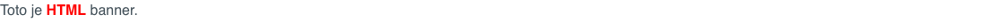
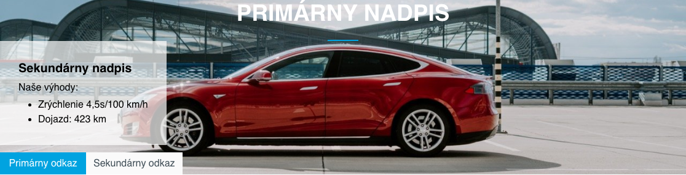

# Bannerový systém

## Seznam bannerů

Aplikace Bannerový systém, umožňuje do stránky vložit banner. Systém podporuje následující typy bannerů:
- Obrázek - zobrazí statický obrázek, nebo animovaný `gif`. Eviduje kliknutí na banner.
- Html kód - vloží do stránky zadaný HTML kód dynamického banneru. Neeviduje kliknutí na banner.
- Obsahový banner - vloží do stránky obrázek v pozadí nad kterým se nachází text a tlačítka pro provedení akce (tzv. `call to action` tlačítka).
- Video - vloží do stránky lokální video soubor, nebo video z YouTube.

V tabulce jsou červenou barvou zobrazeny bannery, které nelze zobrazit. Kontroluje se nejen možnost aktivní, ale i omezení na počet zobrazení/kliknutí a datumová omezení. Můžete použít filtrování podle sloupce Zobrazitelný pro filtrování zobrazitelných bannerů.

## Všeobecné parametry banneru

Parametry v kartě Základní a Omezení jsou společné pro různé typy bannerů.

- Název - vaše pojmenování banneru (nezobrazuje se nikde na web stránce, používá se jen pro vaši identifikaci).
- Typ banneru - Obrázek, HTML kód nebo Obsahový banner
- Skupina - skupina pro banner, po zadání začátku názvu skupiny, nebo znaku `*` zobrazí existující skupiny na výběr. Skupiny se používají jako určení umístění v designu webové stránky (např. `top-banner`, nebo `banner-left-menu`) a následně při zobrazení stránky se na dané pozici zobrazí banner ze zadané skupiny.
- Aktivní - můžete aktivovat / deaktivovat zobrazování banneru.
- Priorita - pokud nastavíte banneru vyšší prioritu, bude upřednostněn před bannery s nižší prioritou (záleží také na nastavení aplikace pro zobrazení banneru).

V kartě omezení můžete nastavit:
- Datum začátku - počáteční datum a čas, kdy se má banner začít zobrazovat (zobrazovat se začne až po zadaném datu). Pokud je pole prázdné, omezení se neaplikuje.
- Datum konce - koncové datum a čas, kdy se má banner přestane zobrazovat (zobrazovat se přestane po zadaném datu). Pokud je pole prázdné, omezení se neaplikuje.
- Maximální počet vidění - maximální počet zobrazení banneru. Nastavení na hodnotu 0 vypne toto omezení.
- Vidění (pouze pro čtení) - zobrazuje aktuální počet zobrazení banneru.
- Maximální počet kliknutí - maximální počet kliknutí na banner (pouze pro bannery, které kliknutí evidují, typicky Obrázkový banner). Nastavení na hodnotu 0 vypne toto omezení.
- Kliknutí (pouze pro čtení) - zobrazuje aktuální počet kliknutí na banner.
- Klient - pokud uživatel nemá právo "Zobrazovat všechny bannery" v seznamu bannerů se zobrazí jen ty, kde je nastaven jako klient. Může to být například. agentura, která vám v systému upravuje bannery.
- Vyberte stránky - kliknutím na Přidat web stránku můžete vybrat jednu nebo více stránek, na kterých se banner může zobrazovat. Pokud není vybrána žádná stránka, banner se může zobrazit na všech stránkách (pokud není omezení vytvořeno pomocí výběru adresáře).
- Vyberte adresář - kliknutím na Přidat adresář můžete vybrat jeden nebo více adresářů, ve kterých se banner bude zobrazovat. Pokud je pro banner nastaven adresář, bude se banner zobrazovat ve všech stránkách v tomto adresáři, jakož i ve všech stránkách v pod-adresářích. Pokud není vybrán žádný adresář, banner se zobrazí ve všech stránkách (pokud není omezení vytvořeno pomocí výběru stránky).

V kartě Volitelná pole můžete nastavovat hodnoty polí podle potřeb vaší implementace, karta Statistika zobrazuje graf statistiky zobrazení a kliknutí na banner.

## Banner typu obrázek

Banner typu obrázek obsahuje v kartě Nastavení následující možnosti:
- Adresa umístění banneru - adresa obrázku banneru (např. `/images/banner.gif`).
- Linka přesměrování - adresa na kterou se přesměruje po kliknutí na banner (např. `/sk/produkty/`).
- Cíl – můžete zvolit v jakém rámu se linka přesměrování otevře (vlastní rám, nové okno, nejvyšší rám, nadřazený rám).

## Banner typu HTML kód

Banner typu HTML kód obsahuje v kartě Nastavení následující možnosti:
- Linka přesměrování - adresa na kterou se přesměruje po kliknutí na banner (např. `/sk/produkty/`). V HTML kódu musíte příslušný odkaz směřovat na adresu `/components/_common/clk.jsp?bid=ID` kde ID je ID banneru (musíte jej nejprve uložit pro získání ID).
- HTML kód - zadejte HTML kód dynamického banneru.

## Banner typu video

Banner typu video obsahuje v kartě Nastavení následující možnost:
- Adresa umístění banneru, můžete zadat
  - Adresa MP4 videa (např. `/images/video/bloky.mp4`), které může být vybráno z nahraných souborů
  - Adresa libovolného YouTube videa (např. `https://www.youtube.com/watch?v=A5upeBuEMbg`)
- Linka přesměrování - adresa na kterou se přesměruje po kliknutí na banner (např. `/sk/produkty/`), korektně funguje jen pro video `mp4`, pro YouTube se na odkaz z technických důvodů nedá kliknout.
- Cíl – můžete zvolit v jakém rámu se linka přesměrování otevře (vlastní rám, nové okno, nejvyšší rám, nadřazený rám).

## Banner typu Obsahový banner

Banner typu obrázek obsahuje v kartě Nastavení následující možnosti:
- Adresa web stránky na které se banner zobrazí - **Upozornění:** obsahový banner se nezobrazuje na základě skupiny, ale na základě shody zobrazené web stránky s adresou zadanou v tomto poli. Umíte tak nastavovat zobrazení bannerů podle URL adres stránek.
- Linka přesměrování - adresa na kterou se přesměruje po kliknutí na tlačítko v banneru (např. `/sk/produkty/`).
- Odkaz na obrázek - adresa obrázku banneru (např. `/images/banner.jpg`).
- Odkaz na obrázek pro mobilní zařízení - adresa obrázku banneru pro mobilní zařízení (např. `/images/banner-lores.jpg`). Tento obrázek se použije pro rozlišení užší než 760 bodů.
- Primární nadpis - hlavní (největší) nadpis v banneru.
- Sekundární nadpis - pod nadpis v banneru (může zůstat prázdný).
- Popisný text - doplňkový text pod nadpisy (může zůstat prázdný).

Pokud **Odkaz na obrázek** nebo **Odkaz na obrázek pro mobilní zařízení** obsahuje umístění **MP4 souboru nebo adresu YouTube videa** zobrazí se v pozadí video přehrávač. Hodnota pro mobilní zařízení se použije v případě detekce telefonu na serveru podle hodnoty `User-Agent` obsahující hodnotu `iphone` nebo `mobile` pro Android.

Podmíněné zobrazení podle URL parametru (kampaňový banner):
- Hodnota URL parametru pro přímé zobrazení - pro reklamní kampaně lze nastavit pole **Hodnota URL parametru pro přímé zobrazení**. Zde lze zadat kód (např. `webjetcms`) a následně se banner vždy zobrazí pokud je shoda parametru v URL. Pokud tedy máte k jedné stránce přiřazeno více bannerů umíte je přesně zobrazovat podle zdroje reklamní kampaně (např. podle zdrojových stránek, nebo odkazu z emailu, nebo reklamní kampaně na Facebooku).
- Banner bude dostupný jako - zobrazuje vám náhled adresy pro zobrazení banneru. Jméno parametru (výchozí `utm_campaign`) lze nastavit v konf. `bannerCampaignParamName`.
- Zobrazovat pouze při zadaném URL parametru - pokud je zvoleno banner se nebude standardně zobrazovat (např. pokud je nastaveno náhodné zobrazení banneru), ale zobrazí se jen když je v URL zadán parametr. Použijte když máte např. upravený banner, který chcete zobrazit jedině přijde-li návštěvník z emailové kampaně (např. s akcí na zvýhodněný nákup platný pouze pro emailovou kampaň).

Banner kromě nadpisů a obrázků generuje také dvě tlačítka, která se nastavují v blocích Primární odkaz (použije se pro primární tlačítko) a Sekundární odkaz (pro sekundární tlačítko). Když nezadáte název tlačítko se nevygeneruje.

- Název odkazu - název, který se zobrazí na tlačítku (např. Mám zájem).
- URL adresa odkazu - adresa, na kterou je návštěvník přesměrován po kliknutí na tlačítko. Chcete-li měřit kliknutí zadejte adresu `/components/_common/clk.jsp?bid=ID` kde ID je ID banneru (musíte jej nejprve uložit pro získání ID). Hodnota přesměrování se v takovém případě vezme z pole Linka přesměrování.
- Způsob otevření odkazu - nastavení, zda se odkaz otevře v aktuálním okně, nebo do nového okna.

Pokud pro zobrazenou stránku není nalezen obsahový banner a stránka má nastaven Perex obrázek, použije se tento obrázek jako kampaňový banner. V konf. proměnné `bannerDefaultImageUrl` je možné definovat URL adresu obrázku, který se má zobrazit pokud se nenajde banner ani v perex obrázku. Zajistí se tak zobrazení výchozího obrázku/banneru namísto prázdného místa. Jako název (hlavní nadpis) se použije název aktuální stránky.

## Vložení aplikace do stránky

Chcete-li do stránky vložit aplikaci pro banner, zvolte si v editoru stránek v menu aplikace Bannerový systém. Aplikace má následující parametry:
- Zvolte skupinu, ze které bude banner vybrán - z nabídky si vyberte skupinu a stiskněte tlačítko Vybrat.
- Skupina - zobrazuje aktuálně vybranou skupinu bannerů.
- Aktivní - můžete aplikaci dočasně aktivovat/deaktivovat bez potřeby jejího smazání z web stránky
- Způsob zobrazování bannerů:
  - za sebou - bannery se cyklicky mění, jsou uspořádány podle banner ID
    - Index banneru v session - každá vložená banner aplikace musí mít jedinečný index pro rozlišení pořadí bannerů.
  - náhodně - náhodný výběr banneru ze skupiny
  - podle váhy - častěji se budou zobrazovat bannery s vyšší prioritou
- Zobrazit v iFrame - banner se umístí do iFrame. Nastavte rozměry iFrame (vhodné pro bannery typu HTML kód aby nedošlo k narušení/konfliktu kódu zobrazené stránky).
  - Interval obnovení banneru - po uplynutí intervalu se na stránce zobrazí další banner ze skupiny. Pokud nezadáte nic nebo 0, další banner se zobrazí až po manuální aktualizaci stránky.
  - šířka - šířka iframe v bodech
  - výška - výška iframe v bodech

Pro použití video souborů v bannerech lze nastavit:
- CSS třída pro video - hodnota CSS atributu stylů pro zobrazení video souboru, je-li prázdné předpokládá se použití video souboru v poměru stran `16:9` nastavením hodnoty `embed-responsive embed-responsive-16by9 ratio ratio-16x9 banner-has-video`. V případě jiného poměru stran můžete změnit hodnotu `16by9` a `16x9` za jinou podporovanou hodnotu (`21x9, 4x3, 1x1`).
- CSS třída pro video obsahového banneru - hodnota CSS atributu stylů pro zobrazení video souboru obsahového banneru, ve výchozím nastavení `jumbotron-has-video`. Chcete-li zobrazit video na celou velikost obrazovky nastavte na hodnotu `jumbotron-has-video-fullscreen`, tato hodnota se použije automaticky i pokud zvolená skupina bannerů obsahuje slovo `fullscreen`.

## Zobrazení banneru pro specificky typ zařízení

Při vkládání banneru do stránky máte možnost specifikovat typ zařízení (nebo více), které tento banner uvidí. Toto nastavení zajišťuje proměnná **Zobrazení na zařízeních** v kartě **Pokročilé**. Na výběr jsou 3 typy zařízení.

- Pokud zvolíte všechny typy zařízení nebo nezvolíte nic, banner se zobrazí pro všechna zařízení.
- Pokud zvolíte pouze jeden typ nebo kombinaci zařízení, banner se zobrazí pouze tímto typem zařízení.

Upozornění: zařízení se detekuje na serveru podle HTTP hlavičky `User-Agent`. Telefon se detekuje při nalezení výrazu `iphone` nebo `mobile` při detekci výrazu `android`. Tablet jako `ipad||tablet||kindle` nebo pokud obsahuje `android` a neobsahuje `mobile`.

V editoru web stránky v náhledu se zobrazí banner nezávisle na nastaveném typu zařízení, pro které jsou určeny. Důvodem je abyste měli celkový přehled o použitých bannerech. Příklad je na následujícím obrázku, kde vidíme editor stránky se 2 bannery. První je nastaven výhradně pro **Desktop** ten druhý pro kombinaci **Telefon a Tablet**. Obě se však v editoru zobrazují.

V náhledu je pro takový případ zobrazena textová informace **Zobrazení na zařízeních: XXX** podle zvolených zařízení. Text se nezobrazí, pokud jsou zvoleny všechny typy zařízení.

Pro otestování při zobrazení web stránky můžete využít URL parametr `?forceBrowserDetector=`, kterým umíme WebJET přesvědčit, že přistupujeme se zařízením specifického typu. Podporované typy tohoto parametru jsou `phone`, `tablet` a `pc`. Například, pokud na dříve zmíněnou stránku přejdeme s nastaveným parametrem `?forceBrowserDetector=pc` simulujeme přístup z počítače. Na této stránce se zobrazí pouze první banner, který byl nastaven na zařízení typu Desktop.

Pokud web stránku zobrazíte s URL parametrem `?forceBrowserDetector=phone` nebo `?forceBrowserDetector=tablet`, zobrazí se banner, který byl specificky definován pro zařízení typu Telefon nebo Tablet.

## Možné konfigurační proměnné

`bannerCacheTime` - pokud je nastaveno na hodnotu > 0 (v minutách) tak se výběr bannerů z DB cachuje, což znamená, že se nekontroluje seznam bannerů při každém zobrazení stránky (může ale dojít k překročení limitů vidění). Zobrazení banneru je ale rychlejší a méně zatěžuje databázový server.
