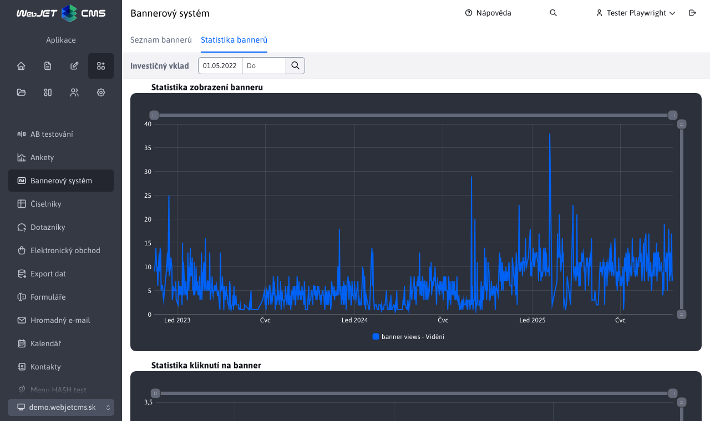

# Statistika bannerů

Aplikace Statistika bannerů zobrazuje přehled Top 10 bannerů za zvolené období. Výchozí období je poslední měsíc. Toto období lze změnit pomocí datového filtru v hlavičce stránky.

Aplikace obsahuje datatabulku Top 10 bannerů i 2 čárové grafy, zobrazující "Top statistika vidění bannerů" a "Top statistika kliknutí bannerů". Při změně datumového rozsahu pomocí filtru v hlavičce stránky se aktualizuje datatabulka i obě grafy.

Hodnota ve sloupci "Název" zobrazené tabulky je klikatelný link, který Vás přesměruje na detail daného banneru.

## Detail banneru

Detail banneru je podsekce aplikace "Statistika bannerů" a také zobrazuje datatabulku a 2 čárové grafy. Rozdíl je v tom, že datatabulka zobrazuje pouze právě prohlížený banner a čárové grafy statistiku kliknutí a vidění také pouze pro tento banner.

I tato podsekce obsahuje datový filtr v hlavičce stránky, který se chová stejně jako u statistiky bannerů, s tím rozdílem, že základní rozsah není poslední měsíc, ale převezme se nastavený rozsah ze statitiky bannerů.

I v tomto případě je hodnota sloupce "Název" klikatelný link. Po kliknutí budete přesměrováni na stránku "Seznamu bannerů" kde se otevře editor daného banneru.

