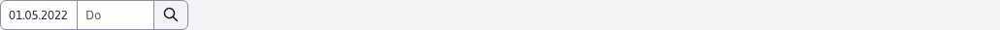
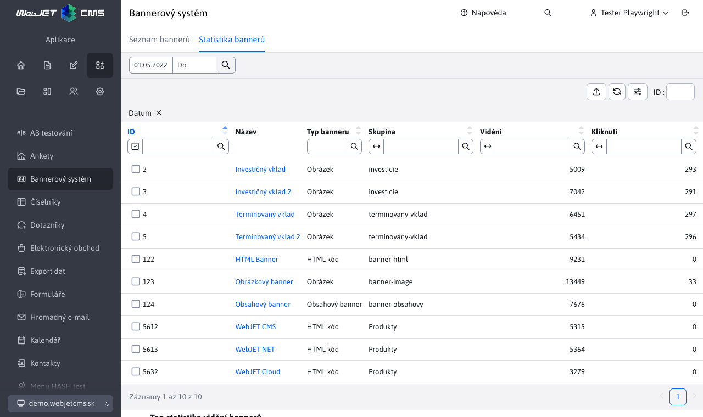
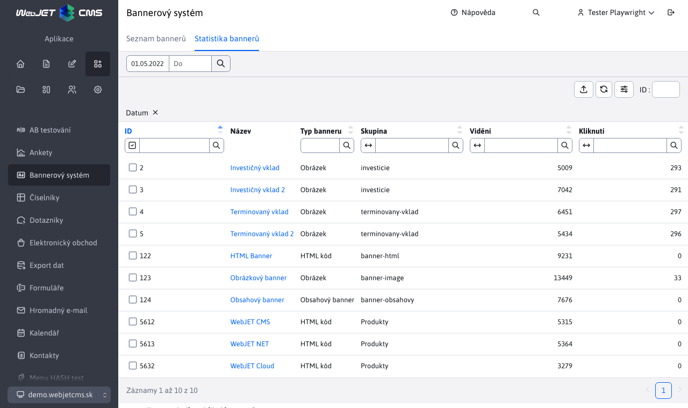

# Statistiky bannerů

Aplikace Statistiky bannerů zobrazuje přehled 10 nejlepších bannerů za zvolené období. Výchozím obdobím je poslední měsíc. Toto období lze změnit pomocí filtru data v záhlaví stránky.

Aplikace obsahuje datovou tabulku 10 nejlepších bannerů a 2 sloupcové grafy zobrazující statistiky "Nejčastějších zobrazení banneru" a "Nejčastějších kliknutí na banner". Při změně rozsahu dat pomocí filtru v záhlaví stránky se datová tabulka i oba grafy aktualizují.

Hodnota ve sloupci "Název" zobrazené tabulky je klikatelný odkaz, který vás přesměruje na detail banneru.

## Detail transparentu

Detail banneru je podsekcí aplikace "Statistiky banneru" a zobrazuje také datovou tabulku a 2 řádkové grafy. Rozdíl je v tom, že datová tabulka zobrazuje pouze aktuálně zobrazený banner a sloupcové grafy zobrazují statistiky kliknutí a zobrazení pouze pro tento banner.

Tato podsekce obsahuje také filtr data v záhlaví stránky, který se chová stejně jako v bannerové statistice s tím rozdílem, že základním rozsahem není poslední měsíc, ale přebírá se nastavený rozsah z bannerové statistiky.

I v tomto případě je hodnota sloupce "Název" klikatelným odkazem. Po kliknutí budete přesměrováni na stránku "Seznam bannerů", kde se otevře editor banneru.

