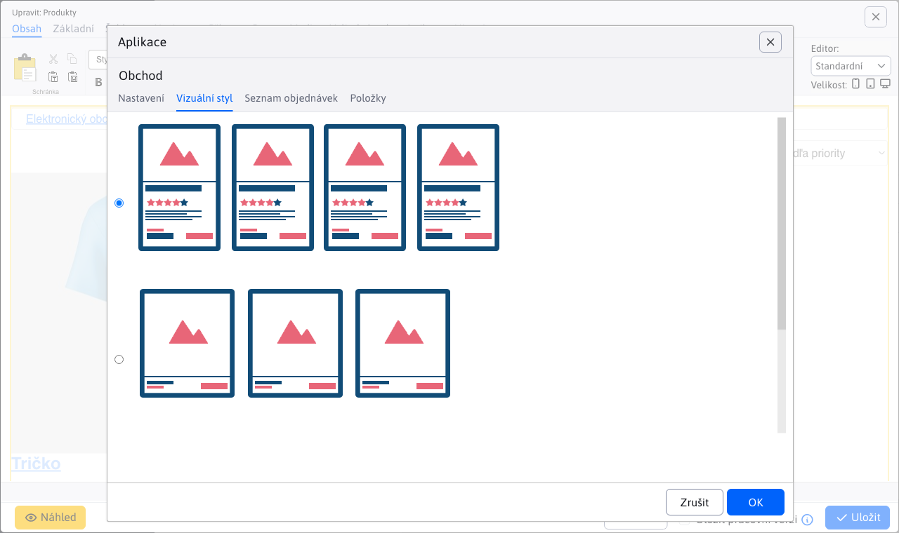
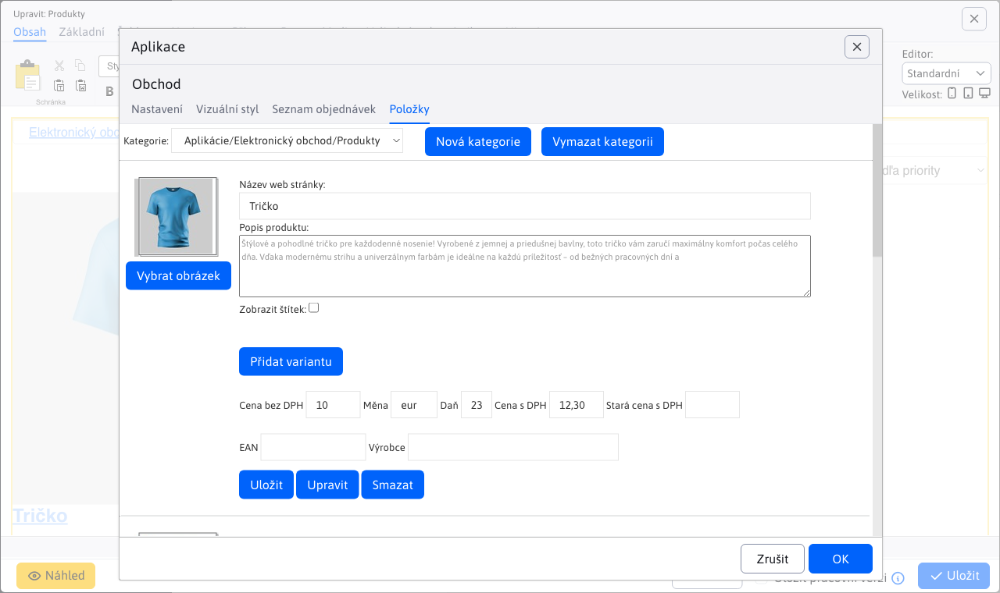

# Elektronický obchod

Přes aplikaci E-shop můžete vytvořit a spravovat jednoduchý elektronický obchod. V rámci aplikace definujete jednotlivé produkty a jejich atributy (např. velikost, barva), způsoby doručení či platby. Aplikace evidujete seznam přijatých objednávek, umožňuje nastavovat jejich stav s možností notifikace změn v objednávce na zákazníky email.

## Nastavení aplikace

### Karta Nastavení:
- **Adresář**: Zadejte cestu k adresáři.
- **Uspořádat podle**: Vyberte kritérium uspořádání, například „Priority“.
  - **Vzestupně**: Definujte, zda se má uspořádat vzestupně.
- **Stránkování**: Určuje, zda je stránkování zapnuto.
- **Počet položek na stránce**: Zadejte počet položek na stránce, například `15`.
- **Pozice stránkování**: Vyberte, kde se má stránkování zobrazit, například „Nad i pod produkty“.
- **Šířka náhledového obrázku**: Zadejte šířku náhledu obrázku v pixelech, například `190`.
- **Výška náhledového obrázku**: Zadejte výšku náhledu obrázku v pixelech, například `190`.
- **Zobrazit výběr kategorie**: Definujte, zda se má zobrazit výběr kategorie.
- **Zobrazit možnost uspořádání**: Zapnutí možnosti uspořádání produktů.
- **Testovací režim (nelze vytvořit objednávka)**: Aktivace testovacího režimu.
- **Katalog produktů (bez nákupního košíku)**: Zobrazení katalogu bez možnosti nákupu.
- **Tajný klíč pro službu "ověřeno zákazníky" (heureka.sk)**: Zadejte tajný klíč pro službu.

#### Způsob doručení:
- **Zadejte způsob doručení**: Vyplňte dostupné způsoby doručení.
  - Při stisku **Přidat** lze vyplnit: **Cena bez DPH**, **Měna**, **Daň**, **Cena s DPH**, **Stará cena s DPH**

### Karta Vizuální styl:
- Možnost vybrat ze dvou stylů pro zobrazení.

### Seznam objednávek:

Při zobrazení lze vyfiltrovat podle:
- **Stav**
- **Vydáno / odesláno**
- **Jméno**
- **E-mail**
- **Číslo**

### Karta položky:
- **Název web stránky**: Zadejte název web stránky.
- **Popis produktu**: Zadejte popis produktu.
- **Zobrazit štítek**: Zapnout zobrazení štítku produktu.

#### Přidat variantu:
- **Název varianty**: Zadejte název varianty produktu.
- **Hodnoty varianty**: Zadejte dostupné hodnoty varianty.

#### Informace o produktu:
- **Cena bez DPH**
- **Měna**
- **Daň**
- **Cena s DPH**
- **Stará cena s DPH**
- **EAN**
- **Výrobce** Povolené země

## Pro dynamické nastavení povolených zemí, kde lze zboží odeslat, slouží konstanta&#x20;

. Konstanta obsahuje čárkou oddělený seznam `basketInvoiceSupportedCountries` identifikátorů.`ccTLD`Příklad

**, pro povolení zemí Slovensko, Česko a Polsko musí být konstanta nastavena jako&#x20;**.`.sk,.cz,.pl`Zobrazení aplikace

##

