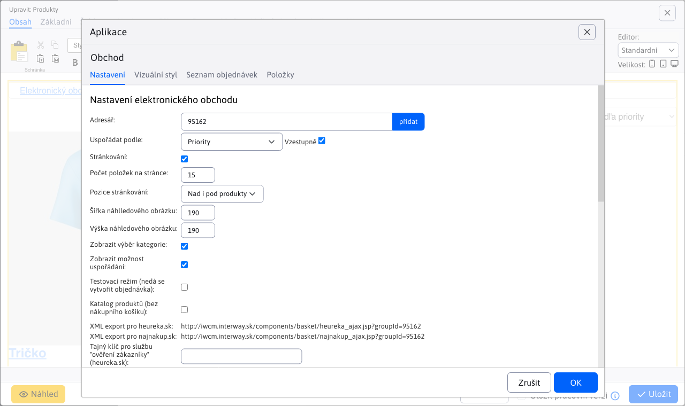
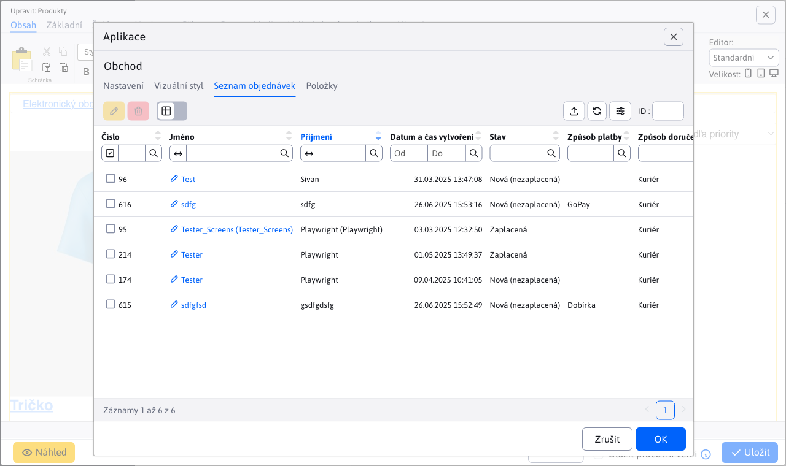
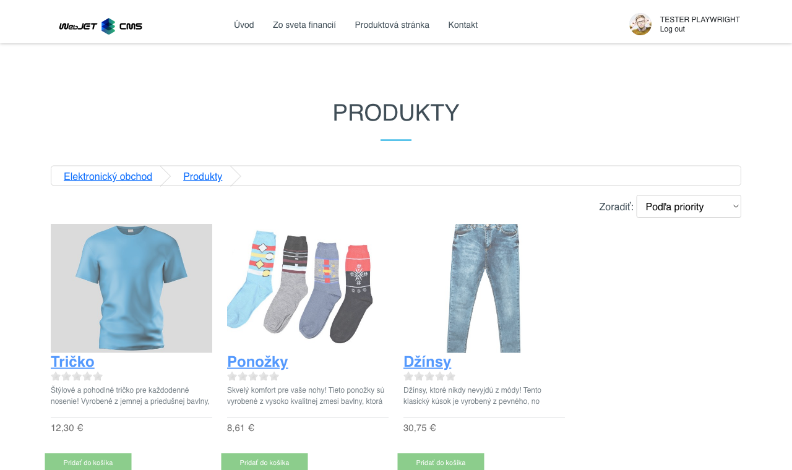

# Elektronické obchodování

Prostřednictvím aplikace E-shop můžete vytvořit a spravovat jednoduchý e-shop. V aplikaci definujete jednotlivé produkty a jejich atributy (např. velikost, barvu), způsoby doručení nebo platby. Aplikace eviduje seznam přijatých objednávek, umožňuje nastavit jejich stav s možností upozornění na změny v objednávce na e-mail zákazníka.

## Nastavení aplikace

### Karta Nastavení:
- **Adresář**: Zadejte cestu k adresáři.
- **Uspořádat podle**: Vyberte kritérium řazení, například "Priorita".
  - **Vzestupně**: Určete, zda se mají řadit vzestupně.
- **Stránkování**: Určuje, zda je povoleno stránkování.
- **Počet položek na stránce**: Zadejte počet položek na stránce, např. `15`.
- **Pozice stránkování**: Vyberte, kde se má stránkování zobrazit, například "Nad a pod produkty".
- **Šířka miniatury obrázku**: Zadejte šířku miniatury obrázku v pixelech, např. `190`.
- **Výška náhledu obrázku**: Zadejte výšku miniatury obrázku v pixelech, např. `190`.
- **Zobrazit výběr kategorií**: Určete, zda se má zobrazit výběr kategorie.
- **Zobrazit možnost uspořádání**: Povolte možnost uspořádání produktů.
- **Testovací režim (nelze vytvořit žádnou objednávku)**: Aktivace testovacího režimu.
- **Katalog produktů (bez nákupního košíku)**: Zobrazení katalogu bez možnosti nákupu.
- **Tajný klíč pro službu "ověřeno zákazníky" (heureka.sk)**: Zadejte tajný klíč služby.

#### Způsob doručení:
- **Zadejte způsob doručení**: Vyplňte prosím dostupné způsoby doručení.
  - Při stisknutí **Přidat** lze vyplnit: **Cena bez DPH**, **Měna**, **Daň**, **Cena s DPH**, **Stará cena s DPH**

### Karta Vizuální styl:
- Možnost výběru ze dvou stylů zobrazení.

### Seznam objednávek:

Při zobrazení je možné filtrovat podle:
- **Stav**
- **Vydáno / odesláno**
- **Název**
- **E-mail**
- **Číslo**

### Karta položky:
- **Název webové stránky**: Zadejte název webové stránky.
- **Popis produktu**: Zadejte popis produktu.
- **Zobrazit štítek**: Povolit zobrazení štítku produktu.

#### Přidat variantu:
- **Název varianty**: Zadejte název varianty produktu.
- **Variantní hodnoty**: Zadejte dostupné hodnoty variant.

#### Informace o výrobku:
- **Cena bez DPH**
- **Měna**
- **Daň**
- **Cena s DPH**
- **Stará cena s DPH**
- **EAN**
- **Výrobce** Zobrazení aplikace

##

