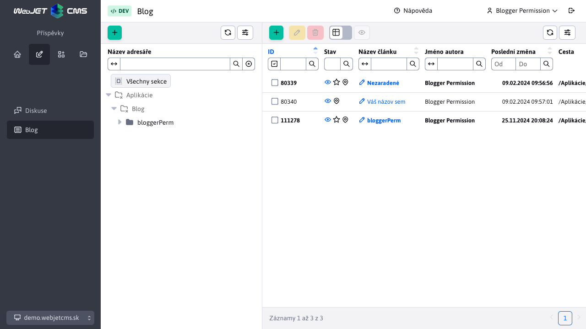
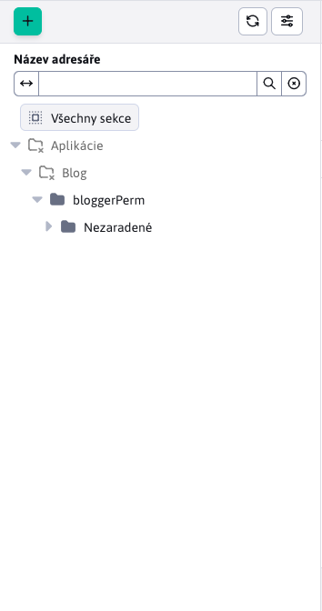
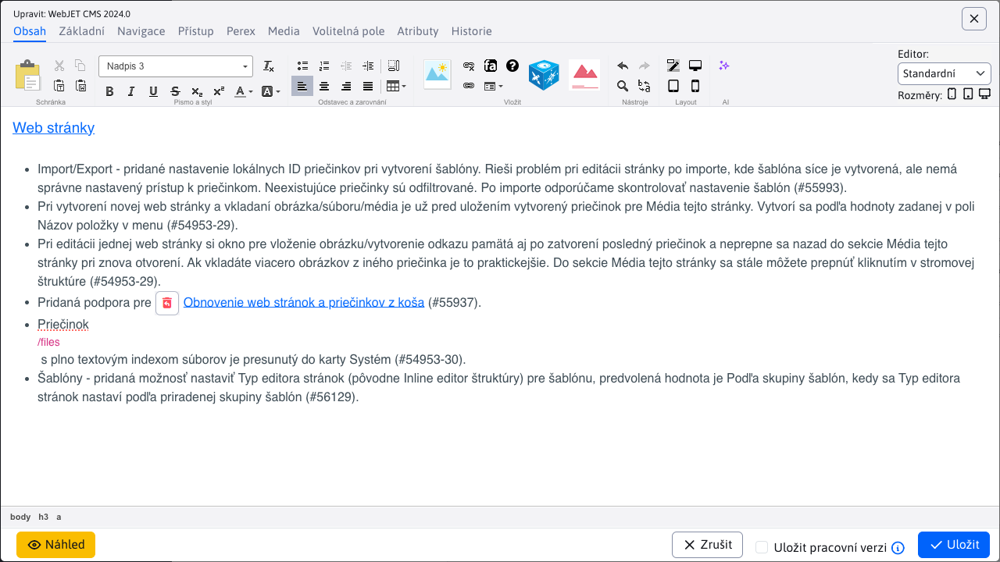
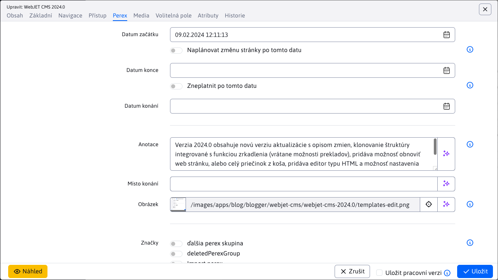
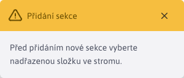
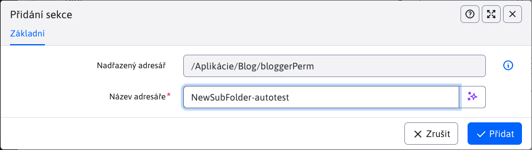
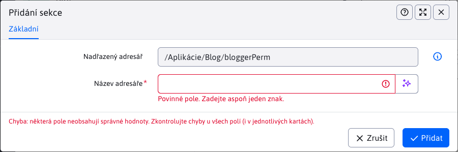
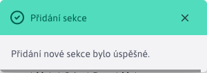
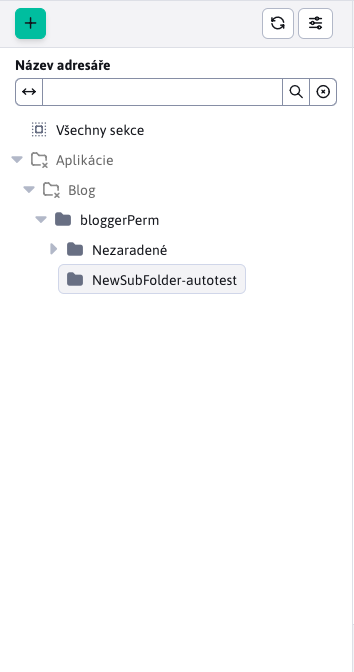

# Seznam článků

Aplikace Seznam článků obsahuje seznam všech článků, právě přihlášeného uživatele typu blogger. Umožňuje mu upravovat strukturu svého blogu přidáváním dalších sekcí (pod-složek) a vytvářet/upravovat/duplikovat/mazat články.

Výsledkem aplikace je zobrazení článků na web stránce, přičemž články jsou umístěny do kategorií/sekcí.

!>**Upozornění:** tato aplikace se zobrazí právě přihlášenému uživateli, pouze pokud splňuje jednu z následujících podmínek:

- Právě přihlášený uživatel je takzvaný **bloger**. Jinak řečeno, uživatel musí mít právo Blog a také musí patřit do skupiny uživatelů Blog. Takový uživatel může vytvářet nové blog příspěvky a nové sekce v rámci jeho blogu.
- Právě přihlášený uživatel je takzvaný **administrátor blogerů**, který je admin, musí mít právo Blog i Správa blogerů a neměl by patřit do skupiny uživatelů Blog. Takový uživatel vytváří nové blogery (uživatele), umí smazat stávajícího blogera a případně provést úpravu v textu libovolného blogera.

Známe tedy dva typy uživatelů:

- **bloger** může pracovat pouze se složkami, na které má právo a články, které spadají pod jeho složky. Bližší informace k uživatelům typu **bloger** naleznete v sekci [Správa blogerů](bloggers.md).
- **administrátor blogerů** může pracovat se složkami všech blogerů, jakož is články spadajícími pod tyto složky.

## Filtrování podle složky

V levém panelu se zobrazuje strom složek, v pravém panelu seznam článků. Výchozí položka **Všechny sekce** zobrazí články ze všech dostupných sekcí blogu. Výběr konkrétní složky zobrazí pouze jeho články.

Složky můžete rozbalovat, vyhledávat podle názvu a obnovit tlačítkem nad stromem. Společné nadřazené složky, například **Aplikace** a **Blog**, zachovávají hierarchii. Pokud slouží pouze k navigaci, mají odlišnou ikonu a nelze je vybrat jako sekci. Celá cesta se zobrazí po přejetí myší nad název složky.

Tlačítkem **Nastavení** nad stromem můžete změnit poměr šířky stromu a tabulky nebo nastavit pevnou šířku stromu v pixelech. Nastavení se uloží pro přihlášeného uživatele samostatně pro tuto aplikaci.

Bloger vidí své složky, administrátor blogerů složky blogerů v aktuální doméně. Strom také respektuje oprávnění zobrazovat skryté složky. Výběr sekce zůstává zachován při vyhledávání, obnovení stromu a opětovném otevření adresy s ID složky za znakem `#`. Na úzké obrazovce se seznam článků zobrazí pod stromem.

Pokud nejsou dostupné žádné složky, zobrazí se informační zpráva a přidávání článků i sekcí je vypnuto.

## Přidání článku

Nový článek vytvoříte pomocí tlačítka <button class="btn btn-sm btn-success" type="button"><i class="ti ti-plus"></i></button> . Práce s články je podobná jako práce s [běžnými web stránkami](../../webpages/README.md).

U nového článku je zařazení ve stromové struktuře přednastaveno podle složky zvolené ve stromu (např. /Aplikace/Blog/bloggerPerm).

!>**Upozornění:** pokud se pokusíte vytvořit nový článek u zvolené položky **Všechny sekce** nastaví se sekce Nezařazené, nebo první složku na kterou má bloger práva. Sekci můžete změnit v editoru v kartě Základní nastavením hodnoty Nadřazená složka.

V seznamu článků se zobrazí nadpis článku. Chcete-li v seznamu zobrazit i krátký úvod, zadejte jej v editoru článku v kartě Perex do pole Anotace. Doporučujeme také zadat ilustrační obrázek do pole Obrázek v kartě Perex.

Na webové stránce se článek zobrazí podle definované designové šablony. takto:

## Přidání sekce

Novou sekci vytvoříte pomocí tlačítka nad stromem <button class="btn btn-sm btn-success" type="button"><i class="ti ti-plus"></i></button> .

Pokusíte-li se vytvořit novou sekci bez zvolení cílové složky ve stromu, budete vyzváni k jejímu zvolení.

Po zvolení složky a stisknutí tlačítka <button class="btn btn-sm btn-success" type="button"><i class="ti ti-plus"></i></button> se otevře dialog **Přidání sekce**. Zobrazuje zvolenou nadřazenou složku a povinné pole **Název složky**.

Prázdný název, název obsahující pouze mezery nebo název již existující sekce ve stejné složce nelze uložit. Chyba se zobrazí přímo u pole a dialog zůstane otevřený, abyste mohli název opravit.

Pokud se sekce úspěšně vytvoří, budete informováni notifikací.

Po úspěšném vytvoření sekce se strom automaticky obnoví. Novou sekci naleznete pod zvolenou nadřazenou složkou.

