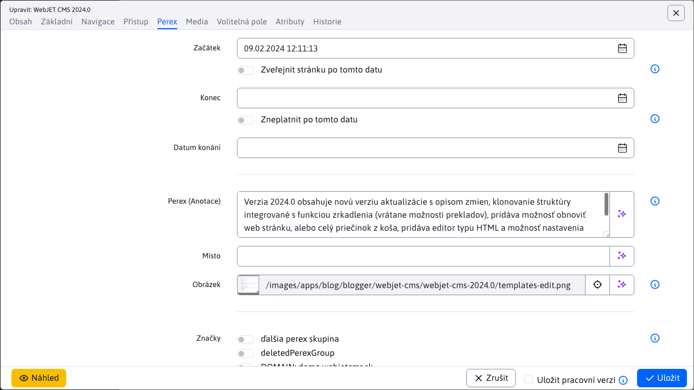
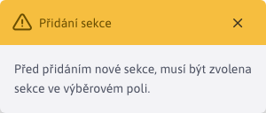
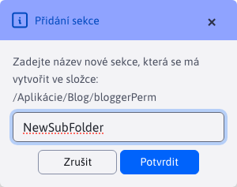

# Seznam článků

Aplikace Seznam článků obsahuje seznam všech článků, ke kterým se aktuálně přihlásil uživatel typu blogger. Umožňuje mu upravovat strukturu jeho blogu přidáváním dalších sekcí (podsložek) a vytvářet/upravovat/duplikovat/mazat články.

Výsledkem aplikace je zobrazení článků na webové stránce, přičemž články jsou rozděleny do kategorií/sekcí.

**Varování:** tato aplikace se zobrazí pouze aktuálně přihlášenému uživateli, pokud je splněna jedna z následujících podmínek:
- Aktuálně přihlášený uživatel je tzv. **blogger**. Jinými slovy, uživatel musí mít právo Blog a zároveň musí patřit do skupiny uživatelů Blog. Takový uživatel může v rámci svého blogu vytvářet nové příspěvky a nové sekce.
- Aktuálně přihlášený uživatel je tzv. **administrátor blogerů** který je administrátorem, musí mít práva Blog a Spravovat blogery a neměl by patřit do skupiny uživatelů Blog. Takový uživatel může vytvářet nové blogery (uživatele), mazat stávající blogery a případně provádět úpravy textu libovolného blogera.

Známe tedy dva typy uživatelů:
- **blogger** může pracovat pouze se složkami, ke kterým má právo, a s články, které patří do jeho složek. Další informace o typu uživatele **blogger** najdete v části [Správa blogů](bloggers.md).
- **administrátor blogerů** může pracovat se složkami všech bloggerů i s články, které do těchto složek patří.

## Filtrování podle složky

Stránka obsahuje v levém horním rohu filtr externích sekcí (podsložek), který umožňuje filtrovat zobrazené články pouze pro vybranou sekci (složku) blogu. Výchozí hodnota **Všechny sekce**, zobrazí všechny články ze všech sekcí (podsložek).

Samotný výběr sekcí je uspořádán jako stromová struktura, pod kterou jsou vnořené hlubší sekce. Uživatel vidí celou cestu k sekci a hlavní složka má stejný název jako jeho **přihlašovací jméno (login)**, což je v příkladu na obrázku `bloggerPerm`.

## Přidání článku

Chcete-li vytvořit nový článek, použijte tlačítko . Práce s články je podobná práci s [běžné webové stránky](../../webpages/README.md).

U nového článku je zařazení do stromové struktury přednastaveno podle hodnoty ve filtru externí sekce (např. /Applications/Blog/bloggerPerm).

**Varování:** pokud se pokusíte vytvořit nový článek bez výběru sekce v externím filtru (při jeho hodnotě **Všechny sekce**) je nastavena sekce Nezařazené nebo první složka, ke které má blogger práva. Tuto sekci můžete změnit v editoru na kartě Základní nastavením hodnoty na hodnotu Nadřazená složka.

Název článku se zobrazí v seznamu článků. Pokud chcete v seznamu zobrazit krátký úvod, zadejte jej do pole Anotace v editoru článků na kartě Perex. Doporučujeme také zadat ilustrační obrázek do pole Obrázek na kartě Perex.

Článek se na webové stránce zobrazí podle definované šablony vzhledu, např. takto:

## Přidání oddílu

Chcete-li vytvořit novou sekci, použijte tlačítko .

Pokud se pokusíte vytvořit nový oddíl bez výběru cílové složky v externím filtru, budete vyzváni k jejímu výběru.

Po výběru složky a stisknutí tlačítka  budete vyzváni k zadání názvu nové sekce (podsložky).

Spusťte proces potvrzením akce tlačítkem .

Pokud není název nové sekce zadán nebo dojde k chybě, proces vytváření sekce se přeruší a vy budete upozorněni prostřednictvím oznámení.

Pokud se sekce úspěšně vytvoří, budete o tom informováni oznámením.

Ihned po úspěšném vytvoření sekce se její hodnota automaticky přidá do externího filtru.

