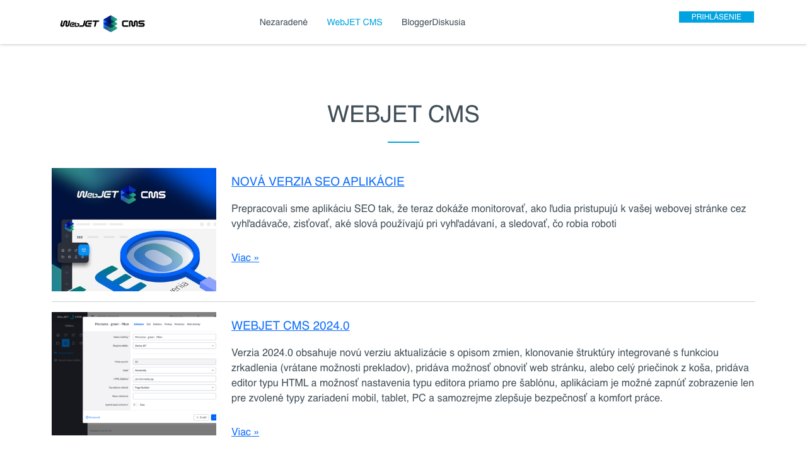
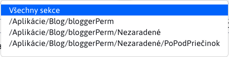
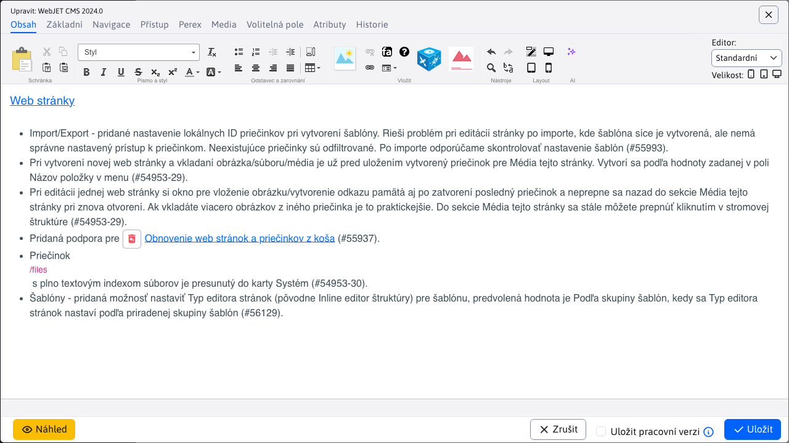
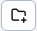

# Seznam článků

Aplikace Seznam článků obsahuje seznam všech článků, právě přihlášeného uživatele typu blogger. Umožňuje mu upravovat strukturu svého blogu přidáváním dalších sekcí (pod-složek) a vytvářet/upravovat/duplikovat/mazat články.

Výsledkem aplikace je zobrazení článků na web stránce, přičemž články jsou umístěny do kategorií/sekcí.

!>**Upozornění:** tato aplikace se zobrazí právě přihlášenému uživateli, pouze pokud splňuje jednu z následujících podmínek:
- Právě přihlášený uživatel je takzvaný **bloger**. Jinak řečeno, uživatel musí mít právo Blog a také musí patřit do skupiny uživatelů Blog. Takový uživatel může vytvářet nové blog příspěvky a nové sekce v rámci jeho blogu.
- Právě přihlášený uživatel je takzvaný **administrátor blogerů**, který je admin, musí mít právo Blog i Správa blogerů a neměl by patřit do skupiny uživatelů Blog. Takový uživatel vytváří nové blogery (uživatele), umí smazat stávajícího blogera a případně provést úpravu v textu libovolného blogera.

Známe tedy dva typy uživatelů:
- **bloger** může pracovat pouze se složkami, na které má právo, a články, které spadají pod jeho složky. Bližší informace k uživatelům typu **bloger** naleznete v sekci [Správa blogerů](bloggers.md).
- **administrátor blogerů** může pracovat se složkami všech blogerů, jakož is články spadajícími pod tyto složky.

## Filtrování podle složky

Stránka obsahuje v levém horním rohu externí filtr na sekce (pod-složky), který umožňuje filtrování zobrazených článků pouze pro zvolenou sekci blogu (složku). Přednastavená hodnota **Všechny sekce**, zobrazí všechny články ze všech sekcí (pod-složek).

Samotný výběr sekcí je seřazen jako stromová struktura, kde hlouběji vnořené sekce jsou nižší. Uživatel vidí celou cestu k sekci, a hlavní složka má stejný název jako její **přihlašovací jméno (login)**, co v příkladu na obrázku je `bloggerPerm`.

## Přidání článku

Nový článek vytvoříte pomocí tlačítka . Práce s články je podobná jako práce s [běžnými web stránkami](../../webpages/README.md).

U nového článku je zařazení ve stromové struktuře přednastaveno podle hodnoty v externím filtru sekcí (např. /Aplikace/Blog/bloggerPerm).

!>**Upozornění:** pokud se pokusíte vytvořit nový článek bez zvolení sekce v externím filtru (při jeho hodnotě **Všechny sekce**) nastaví se sekce Nezařazené, nebo první složku na kterou má bloger práva. Sekci můžete změnit v editoru v kartě Základní nastavením hodnoty Nadřazená složka.

V seznamu článků se zobrazí nadpis článku. Chcete-li v seznamu zobrazit i krátký úvod, zadejte jej v editoru článku v kartě Perex do pole Anotace. Doporučujeme také zadat ilustrační obrázek do pole Obrázek v kartě Perex.

Na webové stránce se článek zobrazí podle definované designové šablony. takto:

## Přidání sekce

Novou sekci vytvoříte pomocí tlačítka .

Pokusíte-li se vytvořit novou sekci bez zvolení cílové složky v externím filtru, budete vyzváni k jejímu zvolení.

Po zvolení složky a stisknutí tlačítka  bude vyzván z zadání názvu nové sekce (pod-složka).

Proces spustíte potvrzením akce tlačítkem .

Pokud nebude zadán název pro novou sekci, nebo nastane nějaká chyba, proces vytvoření sekce se přeruší a budete informováni skrze notifikaci.

Pokud se sekce úspěšně vytvoří, budete informováni notifikací.

Okamžitě po úspěšném vytvoření sekce se jeho hodnota automaticky doplní do externího filtru.

