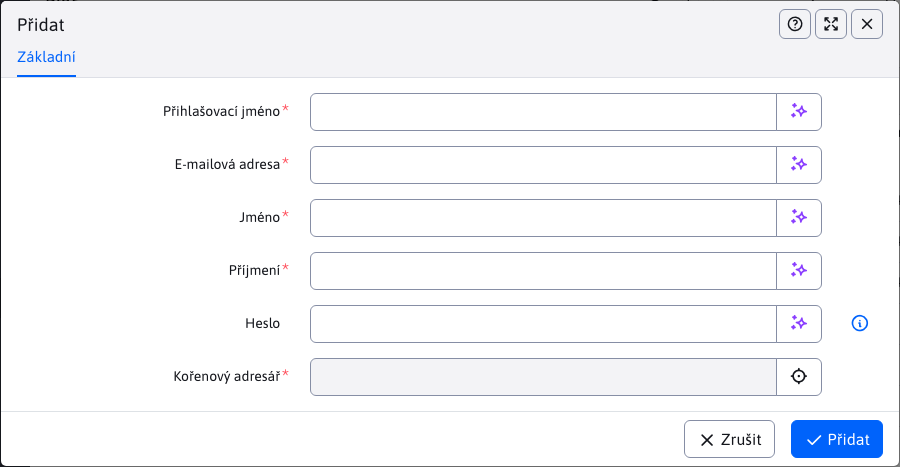

# Seznam blogerů

Sekce Seznam bloggerů slouží k vytváření a správě uživatelů typu **blogger**.

Přístup do této sekce mají pouze **správci blogů**. Administrátor blogerů musí mít právo Spravovat blogery a neměl by patřit do žádné skupiny uživatelů. **Blog**. Při vytváření bloggera se vytvoří nový uživatel s potřebnými právy k vytváření článků.

Kromě toho musí být [skupina uživatelů](../../../admin/users/user-groups.md) s názvem `Blog`. Pokud neexistuje, vytvořte ji před přidáním prvního bloggera.

**Varování:** admin bloggerů se nepřidává do skupiny uživatelů Blog.

Pokud chcete, aby měl administrátor blogerů také možnost zasahovat do struktury a článků jednotlivých blogerů ([Seznam článků](./README.md)) musí mít také správně nastaven Seznam blogů/článků.

## Přidání a úpravy blogera

Blogger se přidává přímo prostřednictvím editoru a obsahuje následující pole:
- Přihlašovací jméno - toto jméno musí být jedinečné pro všechny uživatele (nejen pro blogery).
- E-mailová adresa - e-mailová adresa blogera.
- Jméno.
- Příjmení.
- Heslo - pro nově vytvořeného uživatele nechte heslo prázdné, WebJET heslo vygeneruje a odešle na e-mail. Text e-mailu můžete upravit nastavením ID stránky s textem e-mailu ve skupině uživatelů Blog.
- Kořenová složka - nadřazená složka (nebo `root`), kam budou přidány složky bloggerů, např. `/Blog`. Pro nově vytvořeného uživatele se vytvoří složka. `/Blog/LOGIN`.



Vytvořený Blogger můžete upravovat, ale hodnoty Adresář webových stránek a Přihlašovací jméno již nelze měnit.

Pokud chcete zobrazit/nastavit další informace o bloggerovi, můžete tak učinit v okně [Seznam uživatelů](../../../admin/users/README.md) kde je **blogger** se zachází jako s každým jiným uživatelem.

Z bezpečnostních důvodů lze blogera smazat pouze v sekci Uživatelé jako standardního uživatele a poté musí být smazány i jeho články.

### Základní nastavení

- Kromě základních údajů, jako je jméno, příjmení, heslo ..., je blogger automaticky nastaven jako **Schválený uživatel**.
- Protože se jedná o typ uživatele **blogger**, je přidán do skupiny uživatelů **Blog**.
- Získá práva pro vstup do sekce správce (správa webu).
- Získává práva k nahrávání souborů do adresářů
  - `/images/blog/LOGIN`
  - `/files/blog/LOGIN`
  - `/images/gallery/blog/LOGIN`
- Získá přístupová práva, například některá práva k webovým stránkám a adresářům. Tato práva potřebuje zejména pro práci s články. Více informací o článcích naleznete v [Seznam článků](./README.md).
- Bonusová práva lze přidat, pokud konstantu upravíte před vytvořením bloggeru. `bloggerAppPermissions` o právech, která mu mají být po vytvoření povolena.

### Struktura blogera

Pro každý nově vytvořený typ uživatele **blogger** automaticky vytvoří strukturu složek, do které může přidávat nové články nebo tuto strukturu dále rozšiřovat.

Složka, ve které je tato struktura vytvořena, byla zadána parametrem Kořenová složka při vytváření bloggeru. V této složce bude vytvořena podsložka s názvem odpovídajícím hodnotě Přihlašovací jméno daného bloggera. Protože každý uživatel musí mít jedinečné přihlašovací jméno (`login`), nemůže dojít ke kolizi názvů složek. Pro každou takto vytvořenou složku bude vytvořena další podsložka/oddíl s názvem **Nezařazené**.

Příklad:

Pokud jako **Kořenová složka** byl zvolen `/Aplikácie/Blog/` takže po vytvoření bloggeru s přihlašovacím jménem `bloggerPerm`, bude taková struktura vytvořena v sekci webové stránky:

```
- /Aplikácie/Blog/
  - /Aplikácie/Blog/bloggerPerm
    - /Aplikácie/Blog/bloggerPerm/Nezaradené
```

V těchto složkách budou automaticky vytvořeny 3 webové stránky (články). 2 budou mít stejný název jako složky, ve kterých budou vytvořeny, s tím, že budou obsahovat aplikaci pro výpis článků v dané sekci, jedna stránka je ukázkový článek blogu.

Na hlavní stránce každé složky se nachází aplikace se seznamem článků, která je technicky vzato. [seznam novinek](../news/README.md). Standardní parametry lze upravit v [Překladové klíče](../../../admin/settings/translation-keys/README.md) s klíčem `components.blog.atricles-code`.

### Práva k adresářům a stránkám

Protože blogger musí mít možnost vidět adresáře a články, které pro něj byly vytvořeny, automaticky získává právo na svou hlavní složku. To znamená, že bude moci vidět a upravovat stávající strukturu, která pro něj byla vytvořena, ale nebude se moci dostat jinam. Jeho hlavní složka je ta, jejíž název je stejný jako jeho přihlašovací jméno.

Více informací o úpravě struktury a článek zde [Seznam článků](./README.md).

### Vstup do sekce Diskuze

Každý uživatel blogu může také vstoupit do sekce [Diskuse](../forum/README.md) spravovat diskusi pod jednotlivými články.

## Nastavení šablony

Jednotlivé články se vytvářejí ve standardní stromové struktuře webových stránek. Pro blog doporučujeme připravit samostatnou šablonu. Pokud chcete používat také diskusi, vložte ji do šablony do volného pole/zápatí tak, aby se diskuse objevila v každém článku.

Na stránce diskuse zadejte následující kód:

```html
!INCLUDE(/components/forum/forum.jsp, type=open, noPaging=true, sortAscending=true, isBlog=true)!
```

Parametr `isBlog=true` zakáže diskusi na hlavní stránce složky (kde se obvykle nachází seznam článků ve složce).

V záhlaví stránky můžete pomocí kódu vygenerovat odsazení nabídky z kořenové složky s parametrem `startOffset`:

```html
!INCLUDE(/components/menu/menu_ul_li.jsp, rootGroupId=1, startOffset=1, maxLevel=1, menuIncludePerex=false, classes=basic, generateEmptySpan=false, openAllItems=false, onlySetVariables=false, rootUlId=menu, menuInfoDirName=)!
```

to způsobí, že se nabídka vygeneruje s posunem o zadaný počet složek, takže se v nabídce zobrazí pouze sekce/složky aktuálně zobrazeného blogu.

V sekci Blog se při úpravě článku nezobrazuje karta Šablona, takže blogger nemůže ve výchozím nastavení změnit/nastavit šablonu. Používá se výchozí pro kořenovou složku.
