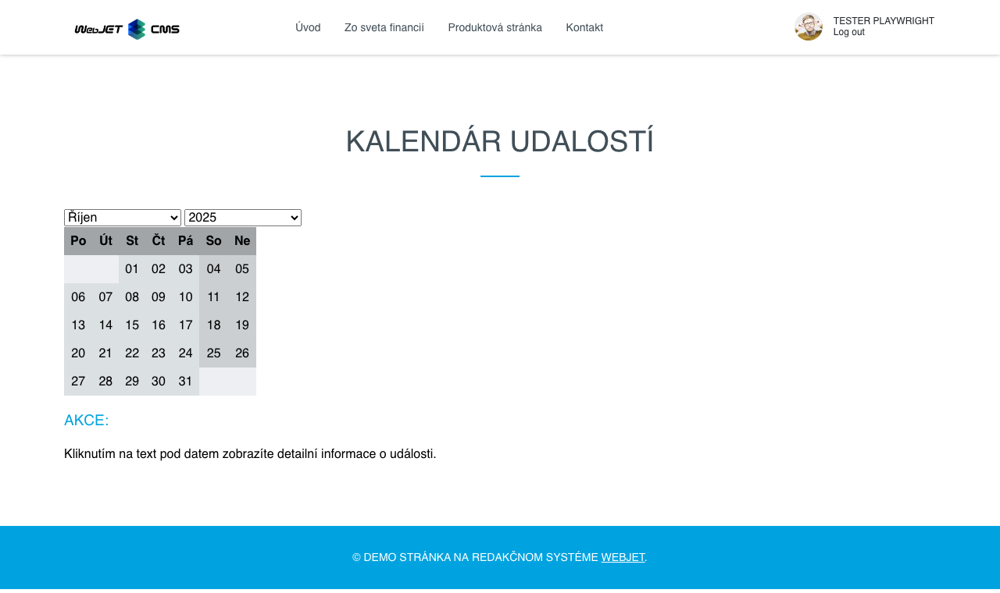
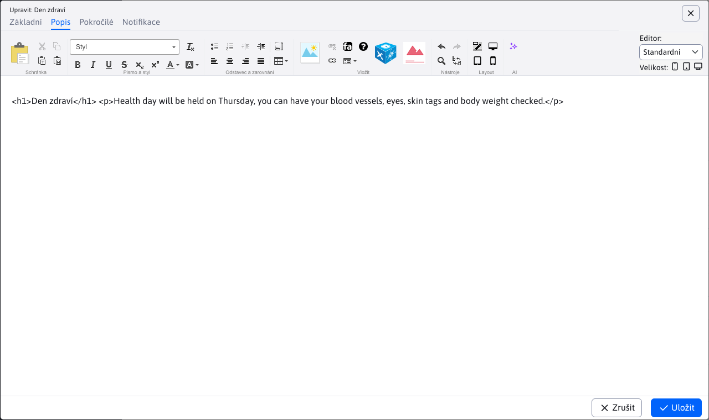
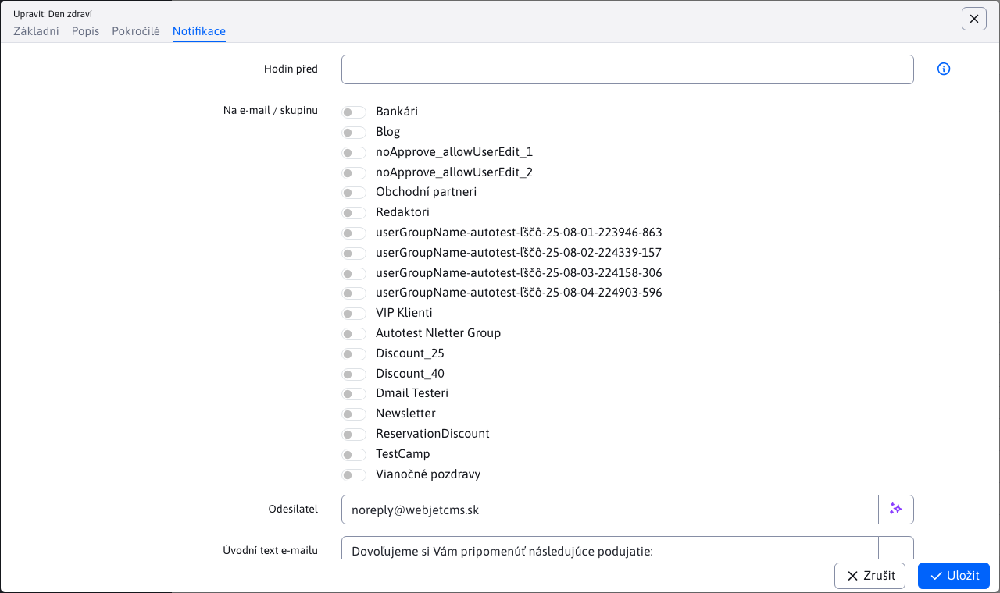

# Kalendář akcí

Kalendář událostí umožňuje zaznamenávat a zobrazovat různé události, o kterých chcete návštěvníky webu informovat.

Zadané události se zobrazí v aplikaci kalendáře na webové stránce:

## Základní

Na kartě Základní jsou uvedeny základní informace o události. Vyžadován je pouze název. Začátek a konec události se automaticky předvyplní podle aktuálního dne.

## Popis

Karta obsahuje editor, ve kterém můžete zadat popis události, připojit k textu obrázky a aplikace.

## Pokročilé

Na kartě Upřesnit můžete nastavit podrobnější informace o událostech. Obsahuje také [volitelná pole](../../../frontend/webpages/customfields/README.md) "Info 1" až "Info 5".

Důležitá je také volba typu akce. Pokud vybraný typ události vyžaduje schválení, bude před zobrazením události na webové stránce odeslán e-mail s žádostí o schválení.

## Oznámení

Na kartě Oznámení můžete nastavit zasílání oznámení skupině uživatelů předem nastavený počet hodin před začátkem události.

