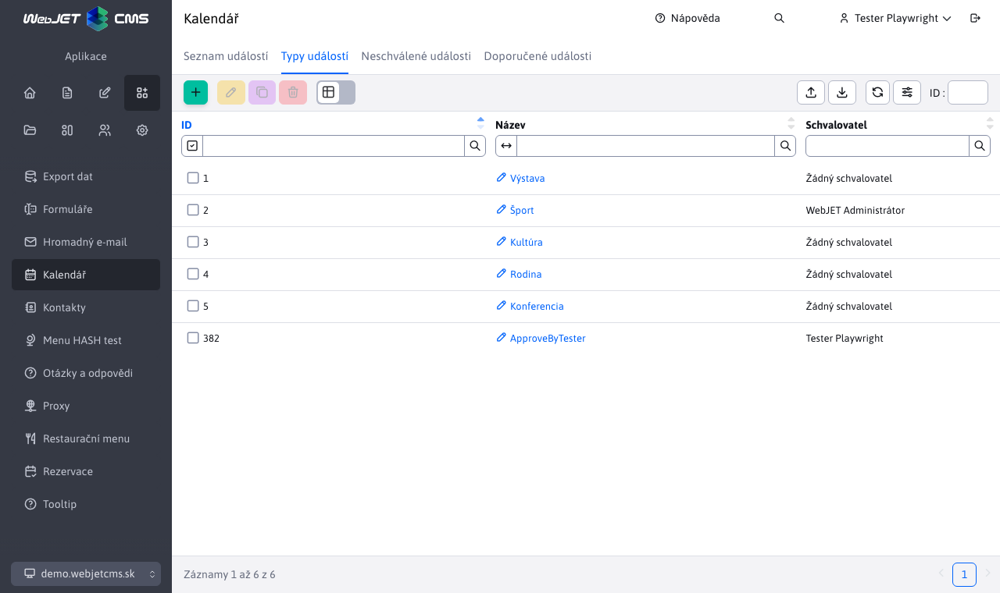

# Konfigurace typů událostí

V konfiguraci typů událostí se nastavují typy událostí, do kterých lze kategorizovat záznamy kalendáře událostí.

Upozornění: nepoužívejte znak v názvu typu události `,` nebo `+`.

# Schválení

Kromě názvu typu události je možné zadat také [také nastavit schvalovatele](../non-approved-events/README.md). Je-li zadáno, nezačne se při vytvoření nové události daného typu událost na webové stránce zobrazovat okamžitě, ale čeká na schválení vybraným schvalovatelem.

