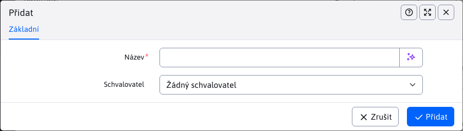

# Konfigurace typů událostí

V konfiguraci typů událostí nastavujete typy událostí, do kterých lze kategorizovat záznamy v kalendáři události.

Upozornění: v názvu typu události nepoužívejte znak `,` nebo `+`.

# Schvalování

Kromě názvu typu události je možné [nastavit i schvalovatele](../non-approved-events/README.md). Pokud je zadán, po vytvoření nové události v daném typu se událost nezačne zobrazovat ihned na webové stránce, ale čeká na její schválení zvoleným schvalovatelem.

