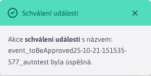
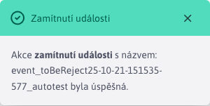

# Nepovolené události

Sekce Události v kalendáři -> Neschválené události slouží k procesu schválení/odmítnutí kalendáře. [události](../README.md) čeká na schválení. Aktuálně přihlášený uživatel může vidět/schvalovat pouze události, které čekají na schválení, a zároveň je schvalovatelem. Kdo událost schvaluje, je určeno [typ události](../calendar-types/README.md).

!>**Varování:** po schválení/neschválení události již není událost nadále **se nezobrazí** v sekci Neschválené události, takže svůj výběr nebudete moci změnit. Událost však bude stále viditelná v sekci [Seznam událostí](../README.md).

## Schválení události

Schvalování událostí se spouští tlačítkem . Po úspěšném schválení se zobrazí informativní zpráva.

## Neschválení (odmítnutí) události

Odmítnutí události je vyvoláno tlačítkem . Po úspěšném odmítnutí se zobrazí informační zpráva.

