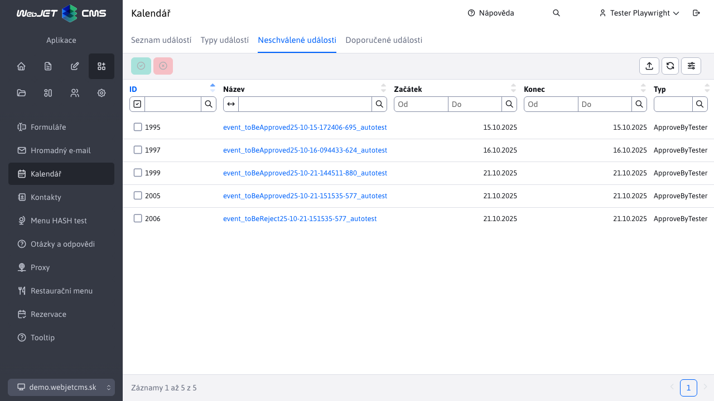

# Neschválené události

Sekce Kalendární události -> Neschválené události slouží k procesu schválení/zamítnutí kalendářových [událostí](../README.md), které čekají na schválení. Právě přihlášený uživatel vidí/může schválit pouze takové události, které čekají na schválení a současně je jejich schvalovatel právě on. To, kdo je schvaluje událost je dáno [typem události](../calendar-types/README.md).

!>**Upozornění:** po schválení/zamítnutí události se tato událost již nadále **nebude zobrazovat** v sekci Neschválené události, takže nebude mít možnost změnit svou volbu. Událost však bude nadále viditelná v části [Seznam událostí](../README.md).

## Schválení události

Schválení události se spouští tlačítkem . Po úspěšném schválení se zobrazí informativní hlášení.

## Neschválení (zamítnutí) události

Zamítnutí události se spouští tlačítkem . Po úspěšném zamítnutí se zobrazí informativní hlášení.

