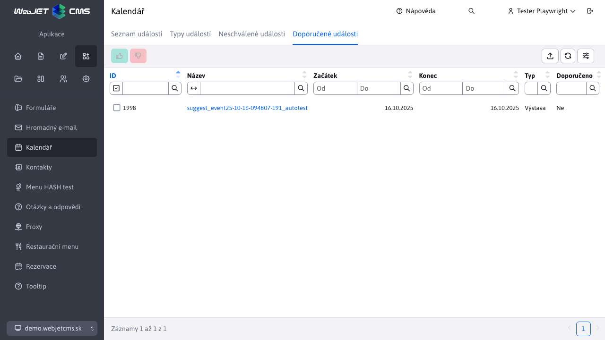

# Doporučení události

Sekce Kalendární události -> Doporučené události slouží k procesu doporučení/nedoporučení kalendářových [událostí](../README.md).

Zobrazují se události, které jsou schváleny (automaticky nebo administrátorem) a jejichž začátek je v budoucnosti.

!>**Upozornění:** po doporučení/nedoporučení se událost nadále **bude zobrazovat** v tabulce, takže je možné jejich stav doporučení změnit. Nicméně, až se začátek události dostane do minulosti, **přestanou se zobrazovat**. Události však budou nadále viditelné v části [Seznam událostí](../README.md)

## Doporučení události

Doporučení události se spouští tlačítkem . Po úspěšném doporučení se zobrazí informativní hláška.

## Nedoporučení události

Nedoporučení události se spouští tlačítkem . Po úspěšném nedoporučení se zobrazí informativní hláška.

