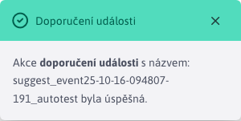

# Doporučení k události

Sekce Události v kalendáři -> Doporučené události slouží k procesu doporučování/nedoporučování kalendáře. [události](../README.md).

Zobrazuje události, které byly schváleny (automaticky nebo správcem) a jejichž datum zahájení je v budoucnosti.

**Varování:** po doporučení/nedoporučení pokračuje událost v realizaci **zobrazí** v tabulce, aby bylo možné změnit jejich stav doporučení. Když se však začátek události dostane do minulosti, **přestat zobrazovat**. Události však budou stále viditelné v [Seznam událostí](../README.md)

## Doporučení k události

Doporučení události je vyvoláno tlačítkem . Po úspěšném doporučení se zobrazí informační zpráva.

## Nedoporučení akce

Událost neodmítnutí je spuštěna tlačítkem . Po úspěšném nedoporučení se zobrazí informativní zpráva.

