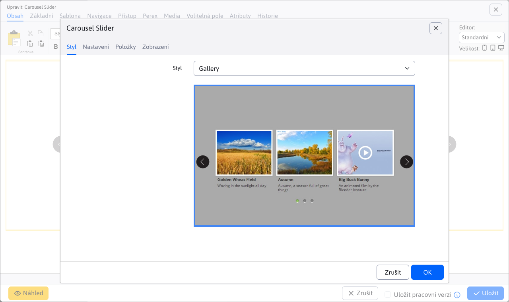
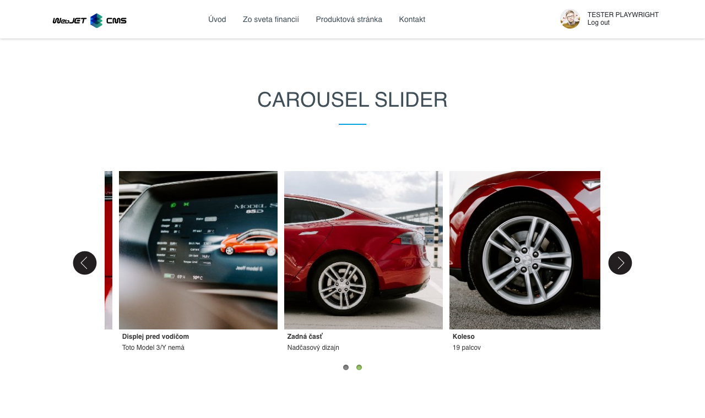

# Carousel Slider

Oživte svou stránku s interaktivním obrázkovým kolotočem. Klepnutím na malou verzi fotky se zobrazí zvětšený originál, což přidává zajímavost a interaktivitu. Vyberte si z široké nabídky designových stylů, které mohou obsahovat také nadpisy a doplňkový text. Zaujměte a zapojte své návštěvníky pomocí poutavých obrázkových prezentací.

## Nastavení aplikace

Dostupné karty:
- **Generované CSS styly**
- **Rozšířené**
- **Položky**

### Generované CSS styly

V této části si můžete vybrat styl aplikace Carousel Slider.

### Rozšířené

V této části lze nastavit rozšířená nastavení:
- **Rozměry**
  - Šířka
  - Výška
- **Kvalita malého obrázku**
  - Šířka
  - Výška
- Maximální počet obrázků na jeden slide
- Směr (horizontální, vertikální)
- Náhled obrázku
- Počet řádků
- Styl navigace (žádné, kuličky)
- Zobraz šipky (žádné, vždy, při přejetí myší)
- Posouvání dotykem
- Náhodné pořadí
- Automatické spuštění
- Pozastavit při přejetí myší
- Kruhové zobrazení
- Zobraz stín
- Smyčka (neustále, zastavit po cyklu)
- Interval

### Položky

V této části lze vidět a spravovat položky aplikace, takže klasické akce jako přidání/úprava/mazání…

Pro jednotlivé položky můžete nastavit tyto parametry:
- **Obrázek**, podporován je výběr obrázku pomocí průzkumníka, jakož i přímé zadání cesty obrázku
- **Nadpis**, nadpis obrázku
- **Podnadpis**, podnadpis obrázku
- **Po kliknutí zobrazit jinou stránku (přesměrovat)**, výběr stránky na kterou budete přesměrováni (podporováno je i přímé zadání cesty)

## Zobrazení aplikace

