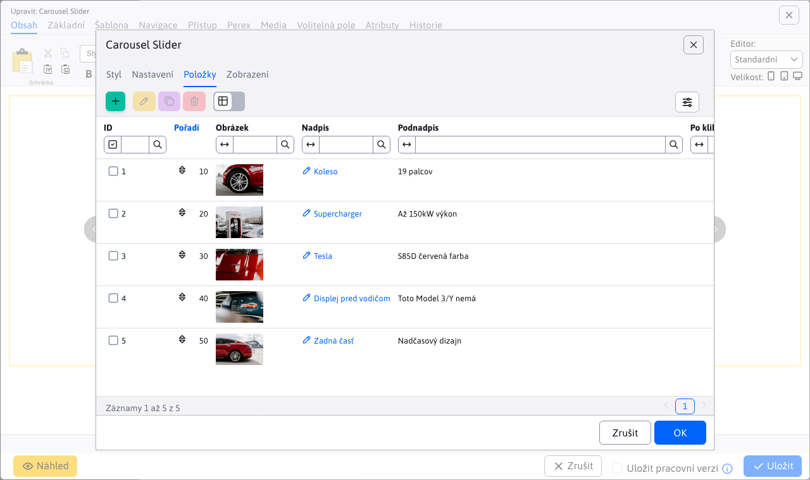

# Carousel Slider

Oživte svou stránku s interaktivním obrázkovým kolotočem. Klepnutím na malou verzi fotky se zobrazí zvětšený originál, což přidává zajímavost a interaktivitu. Vyberte si z široké nabídky designových stylů, které mohou obsahovat také nadpisy a doplňkový text. Zaujměte a zapojte své návštěvníky pomocí poutavých obrázkových prezentací.

## Nastavení aplikace

### Styl

V této části je možno si vybrat styl aplikace. Dostupné styly jsou: `Classic, Fashion, Gallery, Rotator, Simplicity, Stylish`

### Nastavení

V této části lze nastavit:
- Rozměry
- Kvalita malého obrázku
- Maximální počet obrázků na jeden slide
- Směr (horizontální, vertikální)
- Náhled obrázku
- Počet řádků
- Styl navigace (žádné, kuličky)
- Zobraz šipky (žádné, vždy, při přejetí myší)
- Posouvání dotykem
- Náhodné pořadí
- Automatické spuštění
- Pozastavit při přejetí myší
- Kruhové zobrazení
- Zobraz stín
- Smyčka (neustále, zastavit po cyklu)
- Interval

### Položky

V této části lze přidat nebo odebrat položku z aplikace. Při přidání položky lze specifikovat nadpis, podnadpis, přesměrování a vybrat obrázek. Položka se odstraňuje kliknutím na červený křížek.

## Zobrazení aplikace

