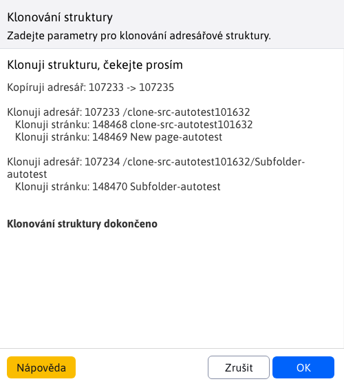

# Klonování struktury

Pomocí Klonování struktury můžeme naklonovat celý obsah adresáře ve stránkách do jiného adresáře bez nutnosti znovu vytváření celé adresářové struktury. Tato možnost je dostupná v sekci **Web stránky** jak **Klonování struktury**. Po výběru této možnosti se zobrazí okno k akci klonování. Typicky se používá k vytvoření nové jazykové mutace web sídla ze stávající verze. Jazyk je stažen z nastavení zdrojové a cílové složky.

Pro provedení akce klonování je třeba zadat ID zdrojové složky (kterou složku klonujeme) a ID cílové složky (kam na naklonuje zdrojovou složku). ID složek můžete zadat přímo, pokud si je pamatujete, nebo může využít možnosti **Vybrat**, která otevře nové okno se stromovou strukturou složek, kde si konkrétní složku volíte kliknutím na její název.

Samotné klonování využívá [Zrcadlení struktury](../docmirroring/README.md) a [Automatický překlad](../../../admin/setup/translation.md). To znamená, že při spuštění klonování se vybrané složky (pokud již nejsou) automaticky propojí konfigurační proměnnou `structureMirroringConfig`. Ze zdrojové složky se naklonují všechny podsložky (i jejich všechna vnoření) is web stránkami do cílové složky s tím, že originální a klonované složky/stránky se mezi sebou propojí. Jazyk je stažen z nastavení zdrojové a cílové složky. Tyto složky/stránky se také automaticky přeloží, pokud je nastaven překladač.

## Možnosti

### ID zdrojového adresáře

Nastavte ID složky ze které se bude klonovat.

### ID cílového adresáře

Nastavte ID složky do které se bude klonovat. Tato složka vytvoří stránky a podsložky podle zdrojové složky.

### Ponechat aktivní zrcadlení

Pokud zvolíte možnost **Po naklonování ponechat aktivní zrcadlení struktury** zachová se nastaveno [zrcadlení](../docmirroring/README.md) mezi zdrojovou a cílovou složkou. Následně když vznikne nová složka, nebo web stránka bude se přenášet mezi zrcadlenými složkami.

Nastavení můžete rozpojit i později úpravou konf. proměnné `structureMirroringConfig` ze které vymažete řádek s nastavenými ID složek.

### Ponechat URL adresu

Zvolením možnosti **Ponechat URL adresu** za bezpečí, že se URL adresa stránek a složek nebude překládat do jazykové mutace cílové složky. To znamená, že nová jazyková mutace bude mít **stejné URL adresy ale jiný prefix, kterým tyto adresy začínají**.

Příklad: Mějme složky SK (s nastaveným slovenským jazykem) a EN (s nastaveným slovenským jazykem). Složka SK obsahuje podsložku **majetek**, který má hlavní stránku se stejným názvem. Adresa takové stránky je **/cs/majetek/**. Použijeme-li klonování struktury **bez ponechání URL**, ze složky SK do složky EN, kopie této stránky bude mít URL **/en/property/**. Použijeme-li klonování struktury **s ponecháním URL**, ze složky SK do složky EN, kopie této stránky bude mít URL **/en/majetek/**. Jak vidíme, url nebyla přeložena, změnil se pouze prefix ze /sk na /en, což reprezentuje nadřazenou složku.

