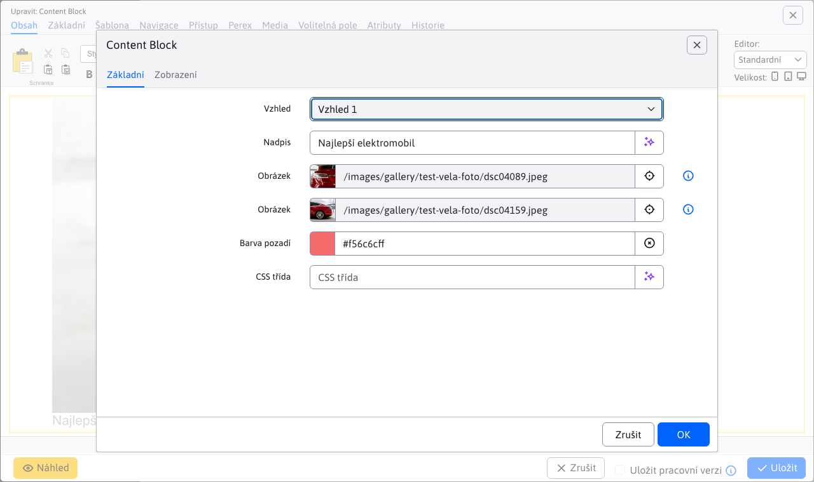
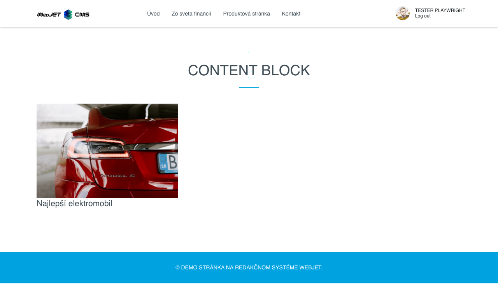

# Content Block

Slouží k vložení připraveného HTML kódu. Zadáte základní údaje jako nadpis, obrázek, barva a do stránky se vygeneruje definovaný blok HTML kódu podle zvoleného typu. Kód bloku vám připraví designér web sídla dle požadavků.

## Nastavení aplikace

V této části lze nastavit:
- Design
- Nadpis
- Obrázek 1
- Obrázek 2
- Barva pozadí
- CSS třída

## Zobrazení aplikace

## Nastavení

Celkový počet dostupných bloků lze nastavit v konfigurační proměnné `contentBlockTypeCount`, ve výchozím nastavení nastaveno na `5`.
