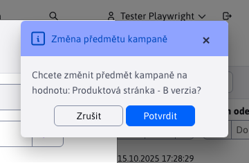
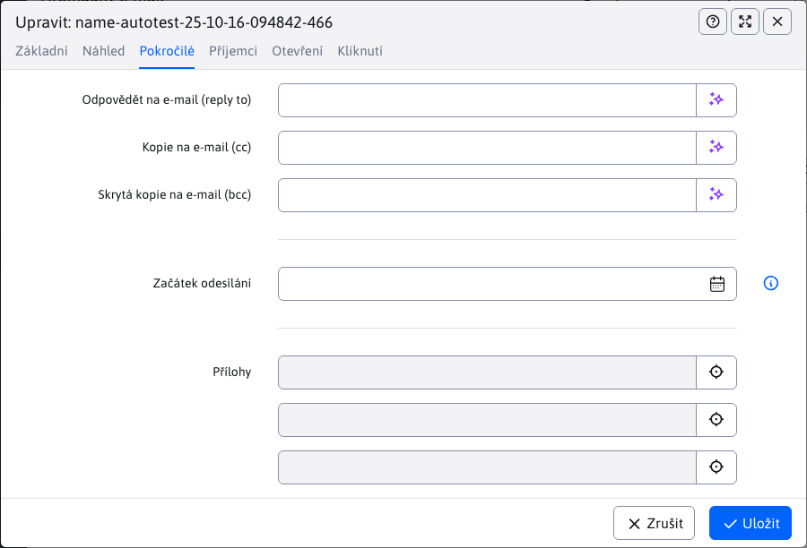
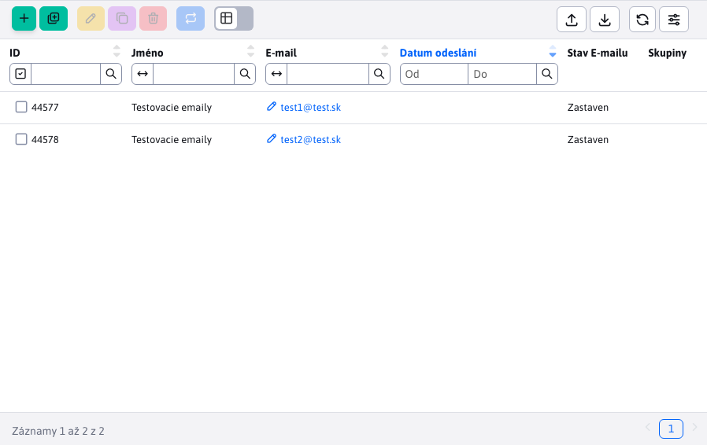
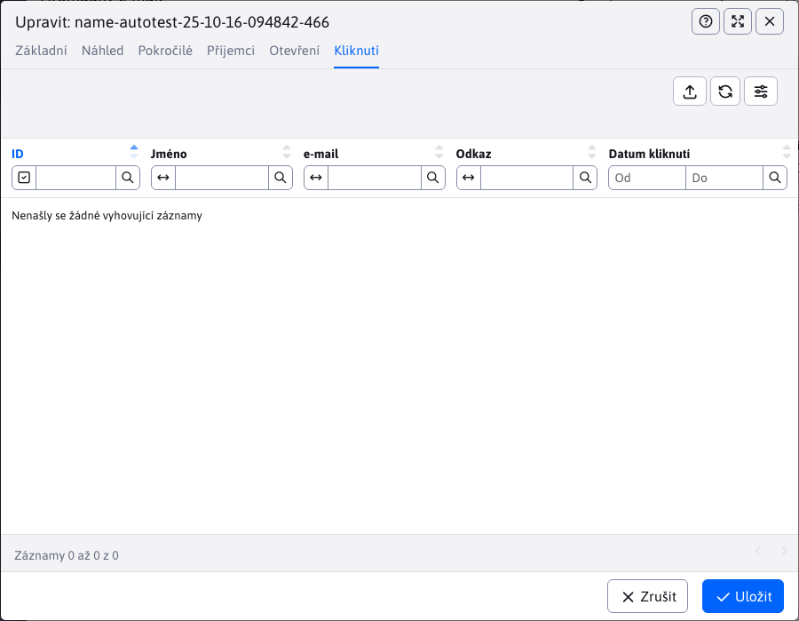

# Kampaně

Aplikace hromadný e-mail vám umožní posílat hromadné **personalizované** emailové zprávy více uživatelům. Každá zpráva se posílá samostatně, jednotliví příjemci nevidí e-mail adresy ostatních příjemců.

Výhodou je, že každý e-mail může být personalizovaný – pokud do těla mailu vložíte značku `!name!` místo ní se vloží skutečné jméno příjemce.

E-mail lze posílat návštěvníkům, kteří jsou registrováni v admin části systému Web JET, nebo vytvořit soubor se seznamem jmen a e-mail adres a ty pak importovat jako příjemce emailu.

## Základní

Při vytváření nového záznamu máme v kartě **Základní** na výběr pouze jednu kartu se základními informacemi, které potřebujeme vyplnit a to **Předmět** a **Web stránka**.

**Předmět** se automatický vyplní po zvolení **Web stránka s textem e-mailu**. Přednastaven bude do předmětu název web stránky, který můžete samozřejmě změnit. Pokud změníte hodnotu **Web stránka s textem e-mailu** a **Předmět** již obsahuje nějakou hodnotu, budete vyzváni notifikací zda si přejete změnit aktuální předmět za nový.

Údaje o odesílateli se vyplní automaticky podle přihlášeného uživatele, ale můžete je samozřejmě změnit. Chcete-li aby se jako přednastavené používaly jiné hodnoty, můžete k tomu použít konfigurační proměnné `dmailDefaultSenderName` a `dmailDefaultSenderEmail`.

Text emailu je převzat z vybrané web stránky (včetně jejího designu). Doporučujeme si v sekci Web stránky vytvořit složku například. `Newsletter` s nastavenou vhodnou šablonou. V této složce nejprve vytvořte web stránku s textem emailu a následně ji vyberte v kampani.

Do textu webové stránky můžete vložit následující značky pro vložení údajů uživatele:
- `!RECIPIENT_NAME!` - jméno a příjmení příjemce
- `!RECIPIENT_EMAIL!` - emailová adresa příjemce
- `!EMAIL_ID!` - unikátní ID emailu

Pokud je příjemce z databáze uživatelů WebJET CMS lze využít i další značky registrovaného uživatele:
- `!LOGGED_USER_NAME!` - jméno a příjmení (je-li konf. proměnná `fullNameIncludeTitle` nastavena na true obsahuje i titul)
- `!LOGGED_USER_FIRSTNAME!` - jméno
- `!LOGGED_USER_LASTNAME!` - příjmení
- `!LOGGED_USER_TITLE!` - titul
- `!LOGGED_USER_LOGIN!` - přihlašovací jméno
- `!LOGGED_USER_EMAIL!` - emailová adresa
- `!LOGGED_USER_COMPANY!` - firma
- `!LOGGED_USER_CITY!` - město
- `!LOGGED_USER_ADDRESS!` - adresa (ulice)
- `!LOGGED_USER_COUNTRY!` - stát
- `!LOGGED_USER_PHONE!` - telefon
- `!LOGGED_USER_ZIP!` - PSČ
- `!LOGGED_USER_ID!` - ID uživatele
- `!LOGGED_USER_BIRTH_DATE!` - datum narození
- `!LOGGED_USER_FIELDA!` - volné pole A
- `!LOGGED_USER_FIELDB!` - volné pole B
- `!LOGGED_USER_FIELDC!` - volné pole C
- `!LOGGED_USER_FIELDD!` - volné pole D
- `!LOGGED_USER_FIELDE!` - volné pole E
- `!LOGGED_USER_GROUPS!` - seznam skupin uživatelů

## Pokročilé

V kartě **Pokročilé** můžete nastavit pole email zprávy pro odpověď, kopii a skrytou kopii.

Pokud zadáte datum do pole začátek odesílání začnou se emaily odesílat až po zadaném čase (můžete si tedy e-mailovou kampaň naplánovat předem).

K emailu můžete přiložit maximálně 3 přílohy (soubory).

## Skupiny

V kartě **Skupiny** vybráním/zaškrtnutím konkrétní skupiny uživatelů se **po uložení kampaně** přidají uživatelé patřící pod tyto skupiny mezi příjemce. Což znamená, že budou dostávat emaily této kampaně.

Akce na které je třeba si dát pozor:
- při změně seznamu příjemců je nezbytné **opětovné uložení kampaně** (pokud ještě uložena nebyla), pro korektní přepočítávání příjemců a odeslaných emailů.
- změníte-li seznam příjemců PO odeslání emailů, výsledná statistika nebude správná a může vzbudit dojem problému při odesílání.

Při uložení kampaně se spočítá reálný seznam příjemců a již odeslaných emailů z databázové tabulky `emails`.

## Příjemci

V kartě **Příjemci** vidíme přehled všech příjemců, kteří budou dostavět emaily kampaně. Příjemce lze v tabulce přidat, upravit, duplikovat nebo smazat.

!>**Upozornění,** seznam příjemců je ošetřen proti určitým nevyhovujícím hodnotám:
- ochrana proti duplicitě, kontroluje se duplicita v zadaných emailech i s těmi, které již existují v kampani
- ochrana proti nevhodnému emailu, email musí splňovat standardní formát **jméno@domena.sk** (speciální výjimka při [Import z xlsx](#import-z-xlsx))
- ochrana proti odhlášeným emailům, nelze přidat příjemce, jehož emailová adresa je v seznamu [Odhlášené e-maily](../unsubscribed/README.md)

### Stav E-mailu

Důležitý je sloupec "Stav E-mailu" který může obsahovat hodnoty:
- Nový - nově přidaný email, je třeba uložit kampaň pro přidání tohoto emailu do kampaně.
- Uložen - email je uložen, čeká v řadě na odeslání
- Odeslaný - email je odeslán, ve sloupci Datum odeslání je uloženo přesné datum a čas odeslání emailu
- Zastaven - email je připraven k odesílání, v tabulce seznamu kampaní označte kampaň a klikněte na tlačítko **Spustit odesílání** pro odeslání emailu.
- Chyba odeslání - byl překročen počet pokusů o odeslání e-mailu (výchozí 3 pokusy). Buď je e-mail nesprávný, nebo je jiná chyba v kampani.

### Manuální přidání

Manuální přidání emailů do kampaně provedete kliknutím na tlačítko "Přidat". Povinné je pole "E-mail", do které musíte zadat jeden nebo více emailů oddělených **čárkou, středníkem, mezerou nebo novým řádkem**. Můžete využít více typů oddělení současně, jako například. `test1@test.sk, test2@test.sk; test3@test.sk  test4@test.sk`. Zadané e-maily se následně přidají mezi příjemce kampaně.

Pole **Jméno** je volitelné. Pokud jej nevyplníte, tak se jméno příjemce získá z databáze uživatelů na základě shody emailu (pokud existuje). Pokud se takový email v databázi nenachází, vloží se jako jméno hodnota `- -`. Pokud pole **Jméno** vyplníte, tak se nastaví všem emailů, které právě vkládáte prostřednictvím pole **E-mail**.

Manuální přidání nabízí možnost **Přeskočit vadné záznamy**. Zadáte-li jako E-mail `Test1@test.sk, Test2@test.sk; Test13Wrong Test4@test.sk Test2@test.sk` a možnost Přeskočit vadné záznamy **je vypnuta**, tak se přidávání příjemců zastaví na první nevyhovující hodnotě a zobrazí se chyba:

Uložení skončilo na třetím emailu `Test13Wrong` kvůli hodnotě v nesprávném formátu. Předchozí dva emaily byly vyhovující a uložily se (pro zobrazení můžete znovu načíst údaje v tabulce).

**Je-li možnost zapnuta**, tak se nevyhovující hodnoty přeskočí a zobrazí se oznámení s informací které hodnoty a proč se neuložily:

Jelikož ze zadaných pěti byly pouze 3 emaily vyhovující, tak se přidali pouze tři příjemci ke kampani.

### Import z xlsx

Hromadný způsob k přidání/aktualizaci příjemců je přes standardní import příjemců z xlsx souboru.

V souboru v prvním řádku je třeba mít definovány následující názvy:
- `Meno|recipientName` - jméno a příjmení příjemce
- `E-mail|recipientEmail` - emailová adresa příjemce

Korektní soubor pro import získáte jednoduše exportem příjemců. Následně můžete smazat sloupec ID a vyplnit jména a email adresy pro import příjemců.

!>**Upozornění:**

- Import z xlxs souboru nepodporuje přidání více emailů v jedné buňce jako v případě manuálního přidání. V buňce musí být vždy jen jedna emailová adresa.
- Import z xlxs souboru podporuje výjimku formátu emailu. Při manuálním přidání musí mít každý mail formát **jméno@domena.sk**. Pokud však kopírujete emaily např. z aplikace `Outlook`, zkopírovaná hodnota může mít formát `"Ján Tester <jan_tester@test.com>"`. V případě, že hodnota obsahuje znaky `<>`, **(přesně v tomto pořadí)**, použije se hodnota mezi nimi. V tomto případě by to byla právě hodnota `jan_tester@test.com`. Tato hodnota musí mít formát **jméno@domena.sk**.

## Otevření

V kartě **Otevření** se zaznamená otevření e-mailu příjemcům. Toto je realizováno pomocí vloženého obrázku. Ne všichni příjemci potvrdí načtení obrázku ze serveru, takže seznam není kompletní.

##

Karta **Klepnutí** zobrazuje seznam kliknutí na odkaz v emailu. Příjemce může na odkaz kliknout vícekrát, proto může být v tabulce kliknutí zaznamenáno vícekrát od jednoho příjemce.

