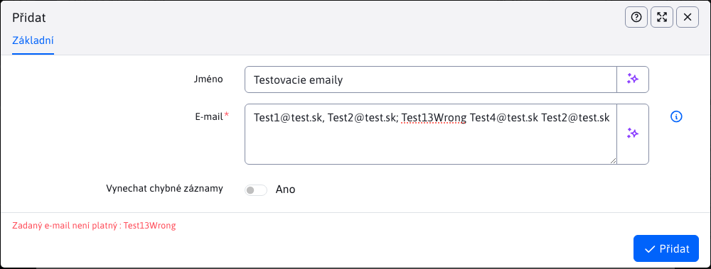
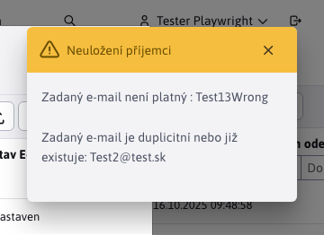
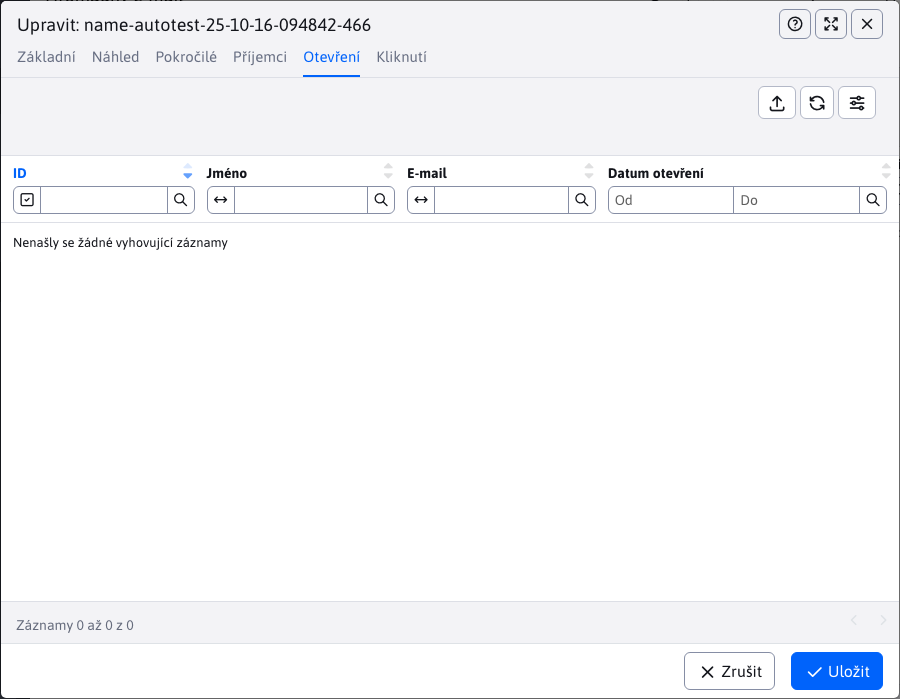

# Kampaně

Aplikace pro hromadné zasílání e-mailů umožňuje odesílat hromadné **personalizované** e-mailové zprávy více uživatelům. Každá zpráva je odeslána samostatně, jednotliví příjemci nevidí e-mailové adresy ostatních příjemců.

Výhodou je, že každý e-mail může být personalizovaný - pokud do těla e-mailu vložíte značku. `!name!` místo toho se vloží skutečné jméno příjemce.

E-maily lze zasílat návštěvníkům, kteří jsou zaregistrováni v administrátorské části systému Web JET, nebo vytvořit soubor se seznamem jmen a e-mailových adres a poté je importovat jako příjemce e-mailů.

## Základní

Při vytváření nového záznamu máme na kartě **Základní** je na výběr pouze jedna záložka se základními informacemi, které potřebujeme vyplnit, a to "Předmět" a "Webová stránka". Údaje o odesílateli se vyplní automaticky podle přihlášeného uživatele, ale můžete je samozřejmě změnit.

Text e-mailu je převzat z vybrané webové stránky (včetně jejího designu). Doporučujeme vytvořit v sekci Webové stránky složku, např. `Newsletter` s příslušnou sadou šablon. V této složce nejprve vytvořte webovou stránku s textem e-mailu a poté ji vyberte v kampani.

Do textu webové stránky můžete vložit následující značky pro vložení uživatelských dat:
- `!RECIPIENT_NAME!` - jméno a příjmení příjemce
- `!RECIPIENT_EMAIL!` - e-mailová adresa příjemce
- `!EMAIL_ID!` - jedinečné e-mailové ID

Pokud je příjemce z databáze uživatelů WebJET CMS, je možné použít i jiné značky registrovaného uživatele:
- `!LOGGED_USER_NAME!` - jméno a příjmení (pokud je proměnná konf.) `fullNameIncludeTitle` nastaveno na true zahrnuje název)
- `!LOGGED_USER_FIRSTNAME!` - jméno
- `!LOGGED_USER_LASTNAME!` - příjmení
- `!LOGGED_USER_TITLE!` - název
- `!LOGGED_USER_LOGIN!` - přihlašovací jméno
- `!LOGGED_USER_EMAIL!` - e-mailová adresa
- `!LOGGED_USER_COMPANY!` - firma
- `!LOGGED_USER_CITY!` - město
- `!LOGGED_USER_ADDRESS!` - adresa (ulice)
- `!LOGGED_USER_COUNTRY!` - stát
- `!LOGGED_USER_PHONE!` - telefon
- `!LOGGED_USER_ZIP!` - POSTCODE
- `!LOGGED_USER_ID!` - ID uživatele
- `!LOGGED_USER_BIRTH_DATE!` - datum narození
- `!LOGGED_USER_FIELDA!` - volné pole A
- `!LOGGED_USER_FIELDB!` - volné pole B
- `!LOGGED_USER_FIELDC!` - volné pole C
- `!LOGGED_USER_FIELDD!` - volné pole D
- `!LOGGED_USER_FIELDE!` - volné pole E
- `!LOGGED_USER_GROUPS!` - seznam skupin uživatelů

## Pokročilé

V kartách **Pokročilé** můžete nastavit pole e-mailové zprávy pro odpověď, kopii a skrytou kopii.

Pokud do pole Datum zahájení zadáte datum, e-maily se začnou odesílat po uplynutí zadaného času (takže můžete e-mailovou kampaň naplánovat předem).

K e-mailu můžete připojit až 3 přílohy (soubory).

## Skupiny

V kartách **Skupiny** výběr/zaškrtnutí konkrétní skupiny uživatelů způsobí. **po uložení kampaně** přidat uživatele patřící do těchto skupin jako příjemce. To znamená, že budou dostávat e-maily z této kampaně.

Akce, na které je třeba si dát pozor:
- při změně seznamu příjemců je nutné **znovu zachránit kampaň** (pokud ještě nebyl uložen), pro správné počítání příjemců a odeslaných e-mailů.
- pokud změníte seznam příjemců PO odeslání e-mailů, výsledné statistiky nebudou správné a mohou vyvolat dojem problému s odesíláním.

Při ukládání kampaně se z databázové tabulky vypočítá skutečný seznam příjemců a již odeslaných e-mailů. `emails`.

## Příjemci

V kartách **Příjemci** můžeme zobrazit přehled všech příjemců, kterým budou e-maily kampaně zasílány. Příjemce lze v tabulce přidávat, upravovat, duplikovat nebo odstraňovat.

!>**Varování,** seznam příjemců je ošetřen proti určitým nevyhovujícím hodnotám:
- Ochrana proti duplicitám, kontrola duplicit v zadaných e-mailech i v již existujících e-mailech v kampani.
- ochranu před nevhodnými e-maily, musí e-mail splňovat standardní formát. **meno@domena.sk** (zvláštní výjimka pro [Import z xlsx](#import-z-xlsx))
- ochrana proti odhlášení e-mailů, není možné přidat příjemce, jehož e-mailová adresa je v seznamu. [Odhlášené e-maily](../unsubscribed/README.md)

### Stav e-mailu

Důležitý je sloupec "Stav e-mailu", který může obsahovat hodnoty:
- Nový - nově přidaný e-mail, pro přidání tohoto e-mailu do kampaně je třeba kampaň uložit.
- Uloženo - e-mail je uložen a čeká ve frontě na odeslání.
- Odesláno - e-mail je odeslán, přesné datum a čas odeslání e-mailu jsou uloženy ve sloupci Datum odeslání.
- Zastaveno - e-mail je připraven k odeslání, vyberte kampaň v tabulce seznamu kampaní a klikněte na tlačítko. **Začněte odesílat** odeslat e-mail.
- Chyba odeslání - byl překročen počet pokusů o odeslání e-mailu (standardně 3 pokusy). Buď je e-mail nesprávný, nebo se v kampani vyskytla jiná chyba.

### Ruční přidání

Chcete-li do kampaně přidat e-maily ručně, klikněte na tlačítko "Přidat". Povinné je pole "E-mail", do kterého musíte zadat jeden nebo více e-mailů oddělených znakem **čárka, středník, mezera nebo nový řádek**. Můžete používat více typů přihrádek najednou, např.. `test1@test.sk, test2@test.sk; test3@test.sk  test4@test.sk`. Zadané e-maily se pak přidají k příjemcům kampaně.

Pole **Název** je nepovinný. Pokud jej nevyplníte, bude jméno příjemce načteno z databáze uživatelů na základě shody e-mailu (pokud existuje). Pokud takový e-mail v databázi není, vloží se hodnota jako jméno `- -`. Pokud je pole **Název** se nastaví na všechny e-maily, které aktuálně zadáváte prostřednictvím tohoto pole. **E-mail**.

Ruční přidávání nabízí možnost **Přeskočení chybných záznamů**. Pokud zadáte E-mail jako `Test1@test.sk, Test2@test.sk; Test13Wrong Test4@test.sk Test2@test.sk` a možnost Přeskočit chybné záznamy **je vypnuta**, přidávání příjemců se zastaví na první nevyhovující hodnotě a zobrazí se chyba:

Uložení skončilo třetím e-mailem `Test13Wrong` kvůli hodnotě v nesprávném formátu. Předchozí dva e-maily byly vyhovující a byly uloženy (pro zobrazení údajů v tabulce je můžete znovu načíst).

**Pokud je tato možnost zapnutá**, jsou nevyhovující hodnoty přeskočeny a zobrazí se oznámení, které hodnoty nebyly uloženy a proč:

Protože se shodovaly pouze 3 z 5 e-mailů, byli do kampaně přidáni pouze 3 příjemci.

### Import z xlsx

Hromadný způsob přidávání/aktualizace příjemců je standardní import příjemců ze souboru xlsx.

V souboru v prvním řádku je třeba mít definovány následující názvy:
- `Meno|recipientName` - jméno a příjmení příjemce
- `E-mail|recipientEmail` - e-mailová adresa příjemce

Správný importní soubor získáte jednoduše exportem příjemců. Poté můžete odstranit sloupec ID a vyplnit jména a e-mailové adresy pro import příjemců.

!>**Varování:**

- Import ze souboru xlxs nepodporuje přidání více e-mailů do jedné buňky jako v případě ručního přidání. V buňce musí být vždy pouze jedna e-mailová adresa.
- Import ze souboru xlxs podporuje výjimku formátu e-mailu. Při ručním přidávání musí mít každý e-mail formát **meno@domena.sk**. Pokud však kopírujete e-maily např. z aplikace Outlook, může mít kopírovaná hodnota formát `"Ján Tester <jan_tester@test.com>"`. Pokud hodnota obsahuje znaky `<>`, **(přesně v tomto pořadí)**, použije se hodnota mezi nimi. V tomto případě by to byla právě hodnota `jan_tester@test.com`. Tato hodnota musí mít formát **meno@domena.sk**.

## Volná místa

V kartách **Volná místa** je zaznamenáno otevření e-mailu příjemcem. To se provádí pomocí vloženého obrázku. Ne všichni příjemci potvrdí načtení obrázku ze serveru, takže seznam není úplný.

##

Karta **Klikněte na** zobrazí seznam kliknutí na odkaz v e-mailu. Příjemce může na odkaz kliknout vícekrát, takže v tabulce lze zaznamenat více kliknutí od jednoho příjemce.

