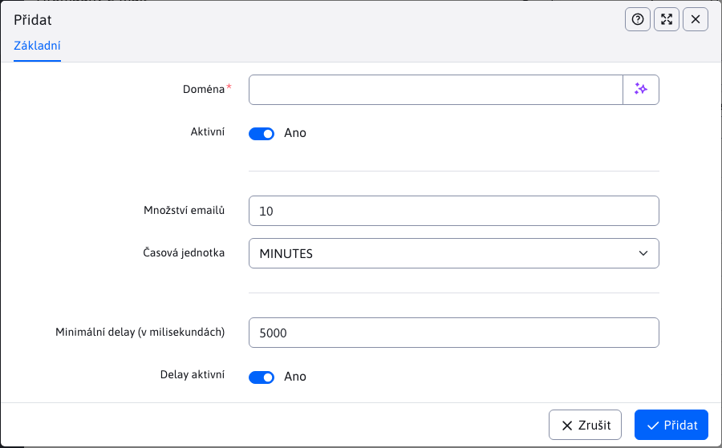

# Doménové limity

Aplikace doménové limity umožňuje nastavit limity počtu odesílaných emailů podle domény. Zlepší tak doručení emailů, protože mail servery při vysokém počtu odeslaných emailů z jedné IP adresy mohou emaily blokovat, nebo je rovnou dávat do složky spam.

V tabulce jsou červenou barvou zvýrazněny limity, které jsou neaktivní a neaplikují se při odesílání emailů. Pro přesně nespecifikované domény se použijí hodnoty zadané pro doménu `*`, neboli nastavení limitů s doménou `*` se aplikuje na všechny neuvedené domény.

V editaci v poli "Doména" zadejte doménové jméno za zavináčem email adresy (např. gmail.com, centrum.sk, seznam.sk).

Pole "Množství emailů" definuje maximální množství emailů zaslaných na danou doménu v intervalu Časová jednotka. Můžete tedy nastavit např. 10 emailů za minutu.

Pole "Minimální mezera (v milisekundách)" nastavuje minimální interval mezi jednotlivými emaily. Nastavením hodnoty 5000 bude minimální interval 5000 ms (5 sekund) mezi odesláními emailu na zadanou doménu.

