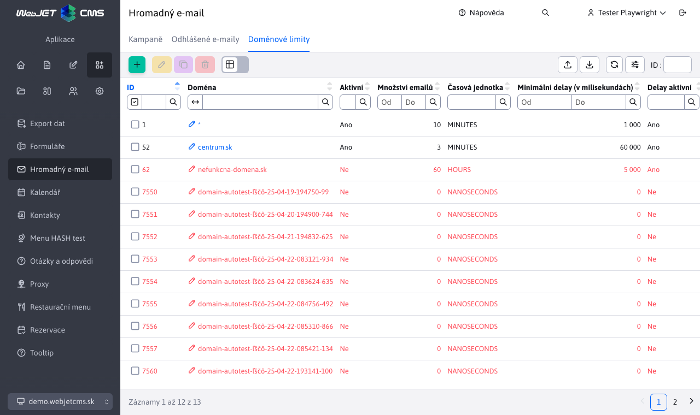

# Omezení domény

Aplikace Omezení domén umožňuje nastavit omezení počtu e-mailů odeslaných na doménu. Tím se zlepší doručování e-mailů, protože poštovní servery s vysokým počtem e-mailů odeslaných z jedné IP adresy mohou e-maily zablokovat nebo je rovnou zařadit do složky spamu.

V tabulce jsou červeně zvýrazněny limity, které jsou neaktivní a nejsou použity při odesílání e-mailů. U nespecifikovaných domén se použijí hodnoty zadané pro danou doménu. `*`, tj. stanovení limitů s doménou `*` se použije na všechny domény, které nejsou uvedeny v seznamu.

Do pole "Doména" zadejte za e-mailovou adresu název domény (např. gmail.com, centrum.sk, seznam.sk).

Pole "Množství e-mailů" definuje maximální množství e-mailů odeslaných do dané domény v intervalu časové jednotky. Můžete tedy nastavit např. 10 e-mailů za minutu.

Pole "Minimální mezera (v milisekundách)" nastavuje minimální interval mezi e-maily. Při nastavení hodnoty 5000 bude minimální interval mezi odesláním e-mailu do zadané domény 5000 ms (5 sekund).

