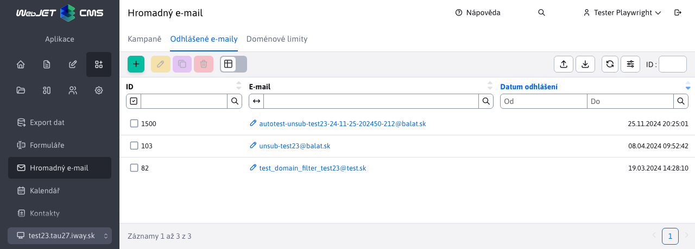

# Odhlášené e-maily

Aplikace Hromadný e-mail obsahuje uzel Odhlášené e-maily, ve kterém se eviduje seznam odhlášených emailů. Na adresy v tomto seznamu nebudou přes aplikaci Hromadný e-mail odeslány žádné emaily/kampaně.

Před odesláním se vždy kontroluje seznam odhlášených e-mailů, tedy i kdybyste email naimportovali nově do hromadného e-mailu nebude na e-mail adresy ze seznamu odhlášených emailů kampaň zaslána.



Seznam můžete plnit manuálně, importem z Excel souboru a automaticky odkazem v email zprávě. Stačí do email zprávy přidat následující HTML kód:

```html
<a href="/odhlasenie-z-mailingu.html?email=!RECIPIENT_EMAIL!&save=true">Kliknite pre odhlásenie</a>
```

přičemž stránka s adresou `/odhlasenie-z-mailingu.html` obsahuje aplikaci pro odhlášení:

```html
!INCLUDE(/components/dmail/unsubscribe.jsp, senderEmail=name@your-domain.com, senderName="Your Name", confirmUnsubscribe=true)!
```

[Klepnutí na odkaz](../form/README.md#odhlášení) zajistí odhlášení email adresy příjemce z mailové kampaně.


Při vytváření, editování, duplikování záznamu se v editoru povinně zadává e-mail na odhlášení.


