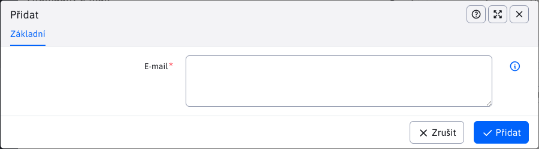

# Odhlášené e-maily

Aplikace Hromadné e-maily obsahuje uzel Neodebrané e-maily, který zaznamenává seznam neodebraných e-mailů. Na adresy v tomto seznamu nebudou prostřednictvím aplikace Hromadná pošta odesílány žádné e-maily/kampaň.

Před odesláním se vždy kontroluje seznam pro odhlášení, takže i když e-mail znovu importujete do hromadného e-mailu, kampaň nebude odeslána na e-mailové adresy v seznamu pro odhlášení.


Seznam můžete naplnit ručně, importem ze souboru aplikace Excel a automaticky propojením v e-mailové zprávě. Stačí do e-mailové zprávy přidat následující kód HTML:

```html
<a href="/odhlasenie-z-mailingu.html?email=!RECIPIENT_EMAIL!&save=true">Kliknite pre odhlásenie</a>
```

čímž se stránka s adresou `/odhlasenie-z-mailingu.html` obsahuje aplikaci pro odhlášení:

```html
!INCLUDE(/components/dmail/subscribe.jsp, senderEmail=noreply@interway.sk, senderName="WebJET CMS")!
```

Kliknutím na odkaz se e-mailová adresa příjemce odhlásí z e-mailové kampaně.



Při vytváření, úpravách nebo duplikaci záznamu je nutné zadat e-mail, abyste se mohli v editoru odhlásit.
