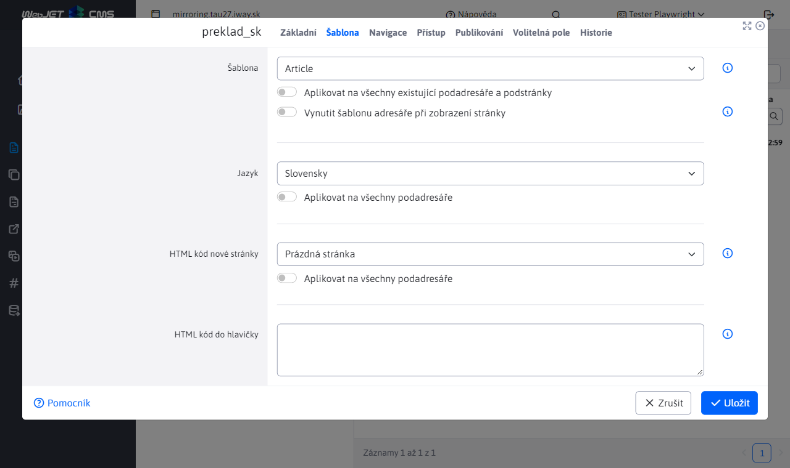
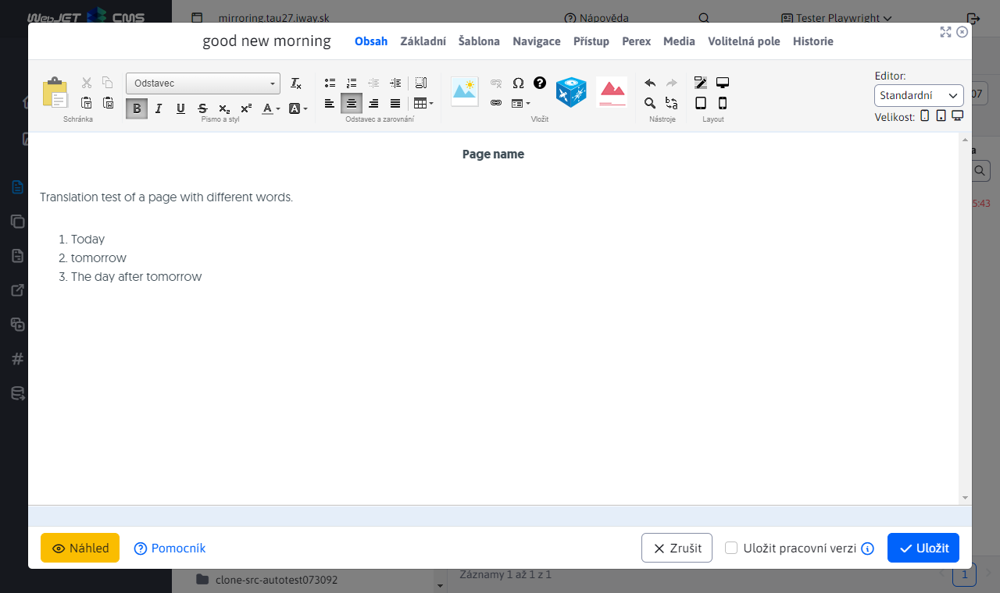

# Zrcadlení struktury

Zrcadlení struktury vzájemně převazuje adresáře a stránky jazykových mutací. Změna v jedné jazykové mutaci se automaticky projeví i ve druhé. Zároveň propojuje web stránky ve veřejné části, tedy pokud se nacházím na stránce `SK/O nás` a kliknu na `EN` verzi v hlavičce stránky, dostanu se na zrcadlenou stránku `EN/About Us`.

Funkcionalita je za účelem odlehčení redaktorů při vytváření stránek a možnosti propojení obsahů ve veřejné části webu. Struktura jazykových mutací je identická a **sníží se pracnost při přidávání nových sekcí** zda změně pořadí. Cílem je, aby se struktura v jazykových mutacích časem nerozešla.

## Nastavení

V rámci WebJET CMS zrcadlení struktury aktivuje nastavením konfigurační proměnné `structureMirroringConfig` s definicí, které adresáře mají být takto provázány.

Formát zápisu je následující:

```
groupId-sk,groupId-en,groupId-cz:poznamka (napr meno domeny)
ineGroupId1,ineGroupId2:poznamka inej domeny
```

přičemž jako `groupId-sk,groupId-en,groupId-cz` zadáváte ID adresáře v sekci Web stránky. U více doménového WebJETu můžete zadat více řádků konfigurace - každou doménu na nový řádek. Zadané ID adresářů mohou, ale nemusí být kořenové adresáře ve WebJETu.

Za znak `:` lze zadat poznámku, například. jméno domény a podobně.

## Průběh zrcadlení

Jako příklad mějme situaci zrcadlení SK a EN struktury. Ve WebJET CMS v části WEB Stránky vytvořte 2 kořenové adresáře SK a EN. Následně nastavte konfigurační proměnnou `structureMirroringConfig`.

Vytvořením adresáře/stránky v SK nebo EN adresáři se automaticky vytvoří nový adresář/stránka v druhé jazykové mutaci a vzájemně se propojí. Automaticky vytvořený adresář/stránka ve druhé jazykové mutaci se nastaví na nezobrazovat, aby byl dostatek času na jeho překlad.

- Stránka – Zobrazovat na NE
- Adresář - Způsob zobrazení v menu - NEZOBRAZOVAT

Pokud vám nevyhovuje nastavení vypnutí zobrazení web stránky/složky (např. během vytváření web sídla kdy nevadí, že se sekce ihned začne zobrazovat) nastavte konf. proměnnou `structureMirroringDisabledOnCreate` na hodnotu `false`.

Při další práci se zrcadlí následující operace:
- Vytvoření adresáře/stránky
- Smazání adresáře/stránky
- Změna pořadí adresáře/stránky ve struktuře (kromě kořenových složek)
- Přesunutí adresáře/stránky do jiného adresáře

Zbývající vlastnosti adresářů/stránek zůstávají zachovány a nemají vliv na svůj ekvivalent ve druhé jazykové mutaci.

## Vytvoření odkazu na jazykové mutace v hlavičce stránky

Aplikace umožňuje do hlavičky stránky vložit odkazy na všechny jazykové mutace, které směřují na ekvivalent aktuálně zobrazené stránky v ostatních jazykových mutacích. V případě, že stránka v jazykové mutaci **je nastavena na nezobrazovat**, odkaz směřuje **na úvodní stránku jazykové mutace**.

Odkaz je ve formě `SK | CZ | EN` generován jako `ul-li` seznam. Pro vygenerování vložte do hlavičky následující aplikaci:

```html
!INCLUDE(/components/structuremirroring/language_switcher.jsp)!
```

Názvy SK, CZ, EN jsou generovány ze zadaných ID adresářů v konfiguraci zrcadlení, používá se hodnota zadaná v poli **Navigační lišta a menu**.

## Automatický překlad

WebJET dokáže automaticky překládat název adresáře nebo stránky při jejím vytvoření. Je zapotřebí následující nastavení:
- [nakonfigurovat překladač](../../../admin/setup/translation.md)
- kořenovým adresářem jednotlivých jazykových mutací je třeba ve vlastnostech adresáře v kartě Šablona nastavit pole Jazyk na jazyk daného adresáře

Překladač při vytvoření stránky hledá ve složkách rekurzivně směrem ke kořenu nastavení pole Jazyk a když není prázdné použije jej jako zdrojový nebo cílový jazyk. Pokud jazyk není nalezen, použije se jazyk nastavený v šabloně zdrojové a cílové složky.



Překládá se **Název web stránky**, název položky v menu, URL adresa a **Obsah** web stránky.

### Nová stránka

Při vytváření stránky se vždy spustí automatický překlad. Pokud vytvoříte novou stránku s názvem "dobré ráno" ve složce `preklad_sk`, kde je nastaven Český jazyk, tak v adresáři `preklad_en` vznikne stránka `good morning`, obsah stránky bude také přeložen do Anglického jazyka.

Web stránka ve složce `preklad_sk`:


Vygenerovaná stránka s překladem do anglického jazyka ve složce `preklad_en`:



### Úprava stávající web stránky

Pokud již existuje stránka v cílovém jazyce je třeba rozlišit, zda má být automaticky znovu přeložena při změně jiné jazykové mutace. Obvykle po automatickém překladu je stránka manuálně zkontrolována redaktorem, jazykově korigována, jsou opravena nesprávná slova.

WebJET potřebuje vědět, zda přeložená stránka byla již upravena skutečným uživatelem. Existuje konfigurační proměnná `structureMirroringAutoTranslatorLogin` do které můžete zadat přihlašovací jméno uživatele (virtuálního), který slouží k evidenci automatického překladu - stránka v jiném jazyce se uloží jakoby těmto uživatelům. Při znovu uložení původní jazykové verze se opakovaně přeloží text web stránky pokud je autorem této stránky stále tento virtuální uživatel – tedy jiný (skutečný) uživatel zatím nezměnil přeloženou web stránku.

V uživatelích tedy vytvořte nového (virtuálního) uživatele s právy na editaci potřebných web stránek a jeho přihlašovací jméno zadejte do konf. proměnné `structureMirroringAutoTranslatorLogin`. S tímto uživatelem byste se neměli nikdy přihlašovat a používat jej k redaktorské činnosti, je to jen technický/virtuální uživatel. Výchozí přihlašovací jméno je `autotranslator`, pokud použijete toto přihlašovací jméno nemusíte nastavovat uvedenou konf. proměnnou.

Automatický překlad již existující stránky se provede za následujících podmínek:
- Pokud konfigurační proměnná `structureMirroringAutoTranslatorLogin` je nastavena a daný uživatel existuje v databázi.
  - A autor cílové stránky je shodný s `structureMirroringAutoTranslatorLogin` - tedy stránka zatím nebyla korigována skutečným uživatelem.
- Pokud konfigurační proměnná `structureMirroringAutoTranslatorLogin` není nastavena, nebo v databázi se nenachází uživatel s takovým přihlašovacím jménem, tak se rozhoduje na základě toho, zda je stránka zobrazena. Automatický překlad se spustí pouze v jazykových verzích, které **nejsou zatím zobrazeny**, tedy mají hodnotu `available` nastavenou na `false`.

Při nastavené hodnotě `structureMirroringAutoTranslatorLogin` je tedy detekce spolehlivější, protože i ještě nezveřejněnou verzi web stránky mohl již jiný uživatel opravit/korigovat, ale ještě ji nezveřejnil. Při vaší změně by nastalo přepsání textu, což je nežádoucí stav. Doporučujeme vytvořit (virtuálního) uživatele a jeho přihlašovací jméno nastavit do `structureMirroringAutoTranslatorLogin` pro spolehlivější detekci změn.

Při ukládání stránky se změny aplikují na všechny kopie. Pokud tedy z SK verze vytvořím EN a DE verzi (které ještě nejsou publikovány, nebo nebyly změněny reálným redaktorem), tak při změně EN verze se text přeloží do DE verze. SK verze se neovlivní, protože je již typicky publikována, respektive je vytvořena reálným (ne `structureMirroringAutoTranslatorLogin`) uživatelům.

Je-li nastavena konf. proměnná `syncGroupAndWebpageTitle` na hodnotu `true` (což je standardní hodnota) automaticky se synchronizuje název složky s názvem hlavní stránky ve složce. Při změně názvu hlavní stránky se přejmenuje také složka a to iv přeložených verzích.

## Technické informace

Více technických informací se nachází v [dokumentaci pro vývojáře](../../../developer/apps/docmirroring.md).
