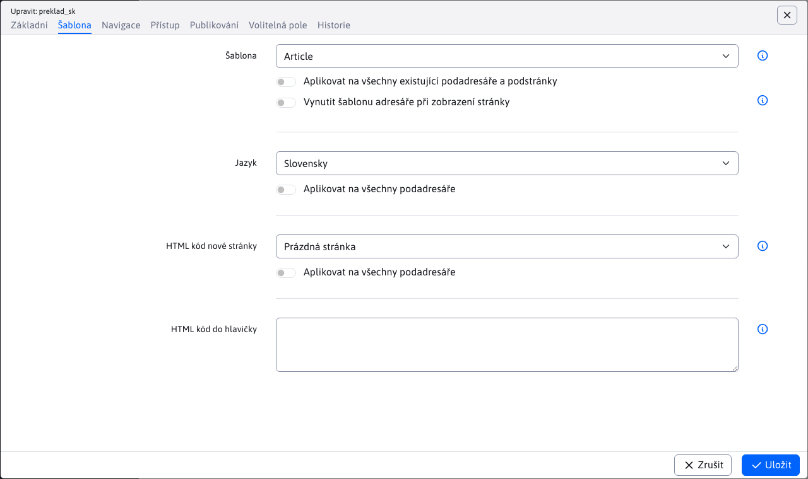
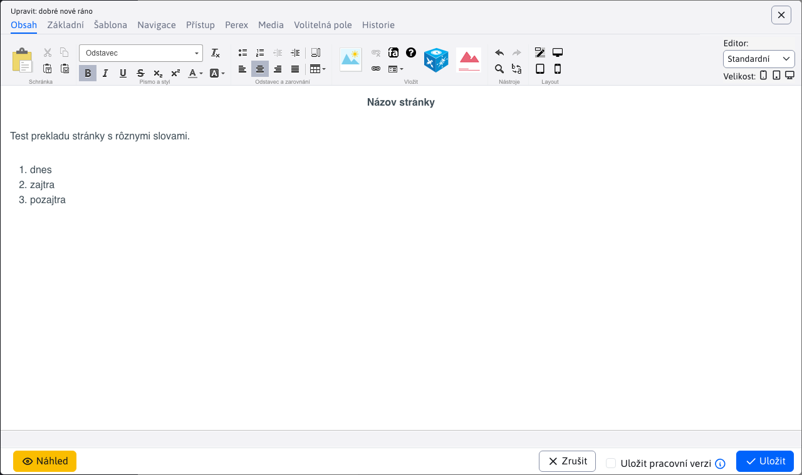

# Zrcadlení struktury

Zrcadlová struktura propojuje adresáře a jazykové stránky. Změna v jednom jazyce se automaticky promítne i do druhého. Propojuje také webové stránky ve veřejné části, takže pokud jsem na stránce `SK/O nás` a klikněte na `EN` verze v záhlaví stránky, dostanu se na zrcadlenou stránku. `EN/About Us`.

Funkce slouží k odlehčení editorů od vytváření stránek a možnosti propojování obsahu ve veřejné části webu. Struktura jazykových mutací je totožná a **se sníží pracovní zátěž při přidávání nových sekcí.** nebo změnu pořadí. Cílem je, aby se struktura v jazykových mutacích v průběhu času neodlišovala.

## Nastavení

V systému WebJET CMS se zrcadlení struktury aktivuje nastavením konfigurační proměnné `structureMirroringConfig` s definicí adresářů, které mají být tímto způsobem svázány.

Formát záznamu je následující:

```
groupId-sk,groupId-en,groupId-cz:poznamka (napr meno domeny)
ineGroupId1,ineGroupId2:poznamka inej domeny
```

přičemž jako `groupId-sk,groupId-en,groupId-cz` zadáte ID adresáře v části Webová stránka. V případě WebJETu s více doménami můžete zadat více řádků konfigurace - každou doménu na novém řádku. Zadaná ID adresářů mohou, ale nemusí být kořenovými adresáři v síti WebJET.

Pro značku `:` je možné zadat poznámku, např. název domény apod.

## Průběh zrcadlení

Jako příklad uveďme situaci zrcadlení struktur SK a EN. V systému WebJET CMS v sekci WEB Pages vytvořte 2 kořenové adresáře SK a EN. Poté nastavte konfigurační proměnnou `structureMirroringConfig`.

Vytvoření adresáře/stránky v adresáři SK nebo EN automaticky vytvoří nový adresář/stránku v druhém jazyce a propojí je dohromady. Automaticky vytvořený adresář/stránka v druhém jazyce bude nastaven tak, aby se nezobrazoval, aby byl dostatek času na překlad.

- Stránka - Zobrazit na NE
- Adresář - Způsob zobrazení v nabídce - NEZOBRAZOVAT

Pokud se vám nelíbí nastavení zakázání zobrazení webové stránky/složky (např. při vytváření webu, kdy vám nevadí, že se sekce začne zobrazovat okamžitě), nastavte proměnnou conf. `structureMirroringDisabledOnCreate` na hodnotu `false`.

Následující operace se zrcadlí v další práci:
- Vytvoření adresáře/stránky
- Odstranění adresáře/stránky
- Změna pořadí adresáře/stránky ve struktuře (kromě kořenových složek)
- Přesun adresáře/stránky do jiného adresáře

Ostatní vlastnosti adresáře/stránky zůstávají zachovány a nemají vliv na jejich ekvivalent v druhém jazyce.

## Vytvoření odkazu na jazykové mutace v záhlaví stránky

Aplikace umožňuje vložit do záhlaví stránky odkazy na všechny jazyky, které odkazují na ekvivalent aktuálně zobrazené stránky v jiných jazycích. Pokud je stránka v jazykové mutaci **je nastaven tak, aby se nezobrazoval**, odkaz vede na **na domovskou stránku jazykové verze**.

Odkaz je ve tvaru `SK | CZ | EN` generované jako `ul-li` Seznam. Chcete-li jej vygenerovat, vložte do záhlaví následující aplikaci:

```html
!INCLUDE(/components/structuremirroring/language_switcher.jsp)!
```

Názvy SK, CZ, EN jsou generovány ze zadaných ID adresářů v konfiguraci zrcadlení, použije se hodnota zadaná v poli. **Navigační panel a menu**.

## Automatický překlad

WebJET dokáže automaticky přeložit název adresáře nebo stránky při jejím vytvoření. Je nutné následující nastavení:
- [konfigurovat překladač](../../../admin/setup/translation.md)
- kořenový adresář každé jazykové mutace, je nutné nastavit pole Jazyk ve vlastnostech adresáře na kartě Šablona na jazyk adresáře.

Překladač při vytváření stránky prohledává složky rekurzivně směrem ke kořenu pole nastavení jazyka, a pokud není prázdné, použije je jako zdrojový nebo cílový jazyk. Pokud není žádný jazyk nalezen, použije se jazyk nastavený v šabloně zdrojové a cílové složky.



Překládá se **Název webové stránky**, název položky menu, adresa URL a **Obsah** webové stránky.

### Nová stránka

Při vytváření stránky se vždy spustí automatický překlad. Pokud vytvoříte novou stránku s názvem "dobré ráno" ve složce `preklad_sk` kde je nastavena slovenština, v adresáři `preklad_en` bude vytvořena stránka `good morning`, bude obsah stránek přeložen také do češtiny.

Webová stránka ve složce `preklad_sk`:



Vygenerovaná stránka s českým překladem ve složce `preklad_en`:


### Úprava stávajících webových stránek

Pokud již stránka v cílovém jazyce existuje, je třeba rozlišit, zda má být při změně do jiného jazyka automaticky přeložena. Obvykle se po automatickém překladu stránka ručně zkontroluje editorem, jazykově opraví, opraví se chybná slova.

WebJET potřebuje vědět, zda byla přeložená stránka již upravena skutečným uživatelem. K dispozici je konfigurační proměnná `structureMirroringAutoTranslatorLogin` kde můžete zadat přihlašovací jméno (virtuálního) uživatele, které se použije pro záznam automatického překladu - stránka v jiném jazyce se uloží, jako by ji vytvořil tento uživatel. Při opětovném uložení původní jazykové verze se text webové stránky znovu přeloží, pokud je autorem této stránky stále tento virtuální uživatel - tj. jiný (skutečný) uživatel dosud přeloženou webovou stránku nezměnil.

V části users vytvořte nového (virtuálního) uživatele s právy k úpravám potřebných webových stránek a do proměnné conf. zadejte jeho přihlašovací jméno. `structureMirroringAutoTranslatorLogin`. Nikdy byste se neměli přihlašovat s takovým uživatelem a používat ho pro redakční práci, je to jen technický/virtuální uživatel. Výchozí přihlašovací jméno je `autotranslator` pokud použijete toto přihlášení, nemusíte nastavovat proměnnou conf..

Automatický překlad existující stránky se provádí za následujících podmínek:
- Pokud je konfigurační proměnná `structureMirroringAutoTranslatorLogin` je nastaven a uživatel v databázi existuje.
  - A autor vstupní stránky je totožný se jménem `structureMirroringAutoTranslatorLogin` - takže stránka ještě nebyla opravena skutečným uživatelem.
- Pokud je konfigurační proměnná `structureMirroringAutoTranslatorLogin` není nastaven nebo v databázi není žádný uživatel s takovým přihlašovacím jménem, rozhoduje se podle toho, zda se stránka zobrazí. Automatický překlad se spouští pouze v jazykových verzích, které **zatím nezobrazeno**, tj. mají hodnotu `available` nastavit na `false`.

Při nastavené hodnotě `structureMirroringAutoTranslatorLogin` detekce je spolehlivější, protože i nezveřejněná verze webové stránky již mohla být opravena jiným uživatelem, ale ještě nebyla zveřejněna. Vaše změna by vedla k přepsání textu, což je nežádoucí stav. Doporučujeme vytvořit (virtuálního) uživatele a nastavit jeho přihlašovací jméno na hodnotu `structureMirroringAutoTranslatorLogin` pro spolehlivější detekci změn.

Po uložení stránky se změny použijí na všechny kopie. Pokud tedy vytvořím EN a DE verzi z SK verze (které ještě nebyly zveřejněny nebo nebyly změněny skutečným editorem), pak když změním EN verzi, text se přeloží do DE verze. SK verze nebude ovlivněna, protože je obvykle již zveřejněna nebo vytvořena skutečným (nikoli skutečným) editorem. `structureMirroringAutoTranslatorLogin`) uživatelům.

Pokud je nastavena proměnná conf. `syncGroupAndWebpageTitle` na hodnotu `true` (což je výchozí hodnota) automaticky synchronizuje název složky s názvem hlavní stránky ve složce. Při změně názvu hlavní stránky se přejmenuje i složka, a to i v přeložených verzích.

## Technické informace

Další technické informace naleznete v [dokumentace pro vývojáře](../../../developer/apps/docmirroring.md).
