# Číselníky

Aplikace Číselníky umožňuje vytvářet, upravovat, mazat a duplikovat pojmenované typy číselníků a ukládat do nich data. Typy číselníků i jejich data lze také exportovat a importovat pomocí souboru.

Typy číselníků se vybírají ve stromovém seznamu v levém panelu. Pravý panel zobrazuje datatabulku s daty vybraného typu číselníku.

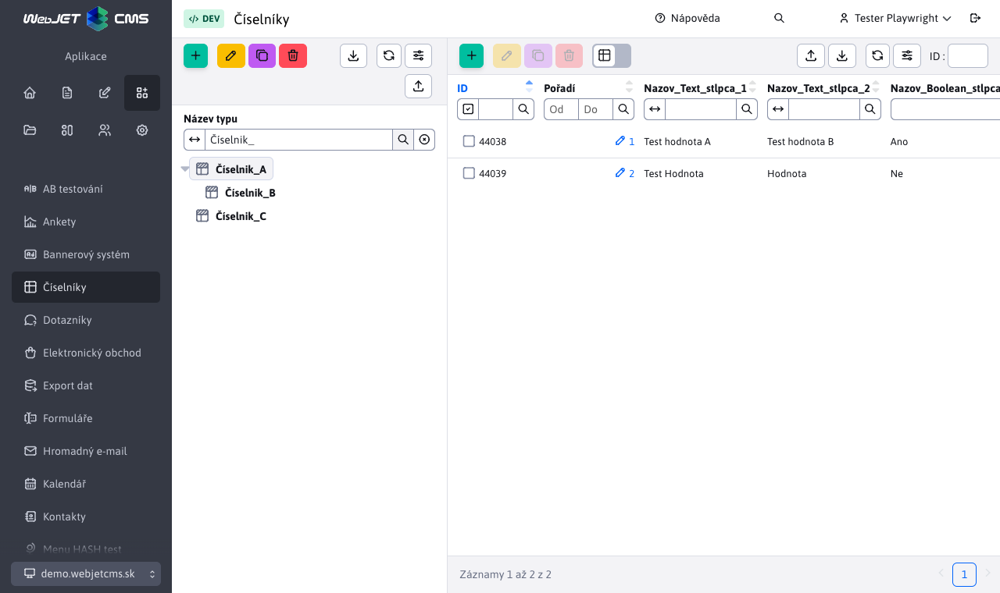

## Typy číselníků

Typy číselníků jsou zobrazeny ve stromové struktuře v levé části. Tlačítky nad stromem můžete typ vytvořit, upravit, duplikovat, smazat, importovat nebo exportovat. Při úpravě se otevře stejný editor s nastaveními polí a propojení. Vyhledávání pod tlačítky filtruje názvy typů.

Tlačítkem <button class="btn btn-sm btn-outline-secondary" type="button"><i class="ti ti-adjustments-horizontal"></i></button> nad stromem můžete změnit poměr šířky stromu a tabulky, nastavit pevnou šířku stromu v pixelech nebo zobrazit **vymazané typy**. Nastavení se uloží pro přihlášeného uživatele samostatně pro tuto aplikaci.

!> **Vymazané typy** se standardně ve stromu nezobrazují. V nastaveních stromu můžete zapnout volbu **Zobrazit vymazané typy** ; zobrazí se červenou barvou s ikonou koše a můžete je vyjmout a upravit. Při výběru vymazaného typu jsou akce smazání a duplikování blokovány, dokud typ neobnovíte.

Strom zohledňuje pole **Podřazený typ číselníku** v nastavení typu: pokud typ **A** odkazuje na typ **B**, typ **B** se zobrazí pod typem **A**. Typ propojený s více rodiči se zobrazí pod každým z nich; všechny jeho výskyty otevírají stejná data a nastavení. Vyhledávání ponechá viditelnou i cestu přes nadřazené typy a při obnovení výběru se tato cesta rozbalí. Propojení jednotlivých datových záznamů hierarchii typů nemění.

Výběr typu se ukládá do adresy stránky, takže odkaz můžete uložit nebo sdílet. Pokud vybraný typ již neexistuje, zobrazí se první dostupný typ. Pokud není dostupný žádný typ, vytvořte jej tlačítkem **+** nad stromem; přidávání dat je do té doby vypnuto.

Při vytváření nového typu číselníku musíte zadat jedinečný název. Ostatní pole jsou volitelná. Karty **Řetězce**, **Čísla**, **Boolovské** a **Datumy** obsahují několik očíslovaných polí, kterými určíte strukturu dat daného číselníku. Pokud zadáte název, v datech číselníku se vytvoří pole se zadaným názvem a datovým typem odpovídajícím dané kartě.

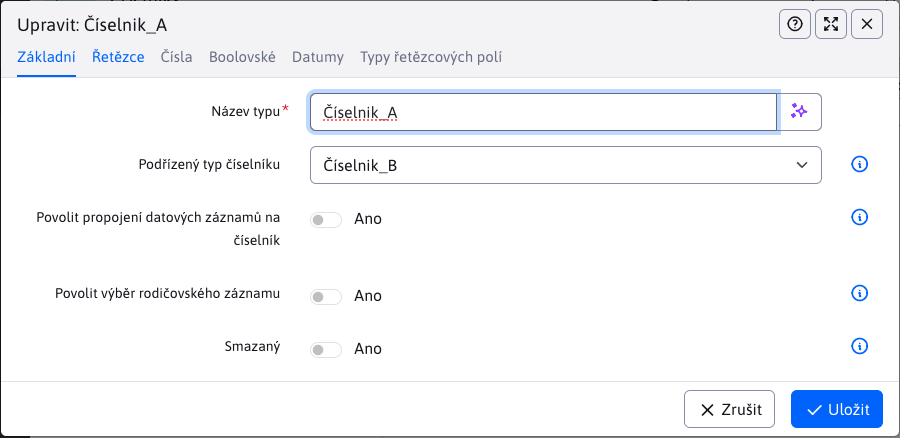

Příklad: pokud vyplníte dvě pole na kartě **Řetězce**

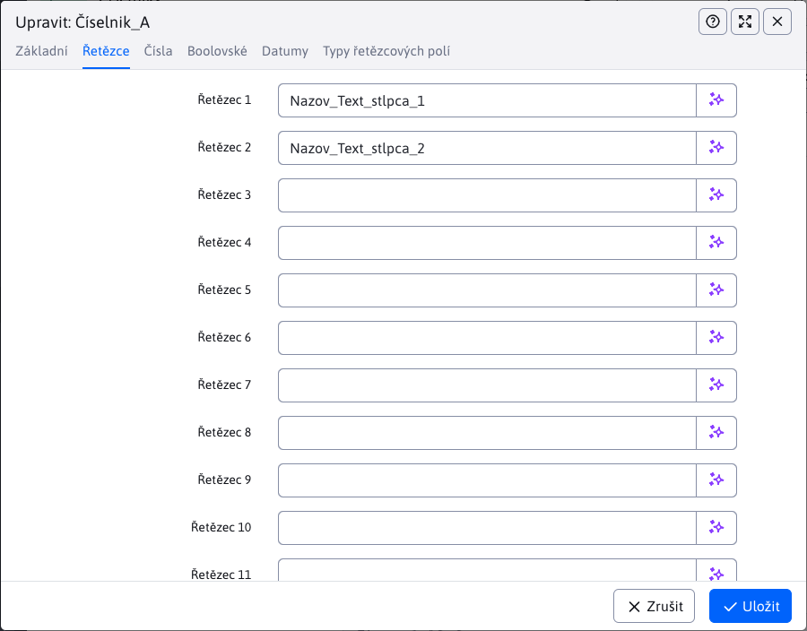

a jedno pole na kartě **Boolovské**,

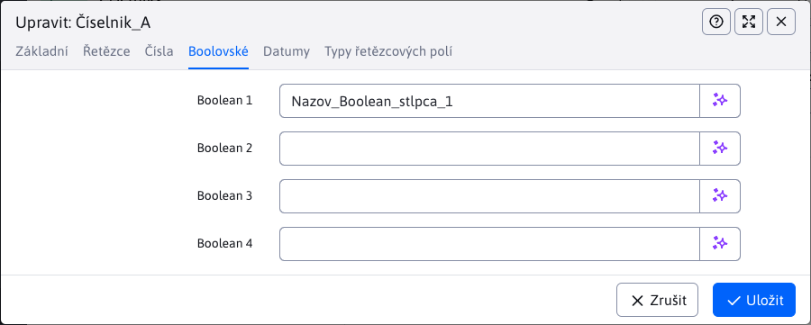

v tabulce dat daného číselníku se zobrazí dva sloupce typu řetězec a jeden sloupec typu boolean se zadanými názvy. V editoru se zobrazí odpovídající pole (viz obrázky v sekci [Seznam dat číselníků](#seznam-dat-číselníků)).

Strukturu dat si tak můžete definovat pro každý číselník zvlášť. Můžete kombinovat textová, číselná, boolovská a datová pole. Počet polí každého datového typu je omezen počtem polí na příslušné kartě.

### Karta Typy řetězcových polí

Po prvním uložení typu číselníku se zobrazí karta **Typy řetězcových polí**. Umožňuje rozšířit pojmenovaná pole z karty **Řetězce** o nastavení známá z [volitelných polí](../../../frontend/webpages/customfields/custom-fields-settings.md), například o výběrové pole, výběr více možností, automatické doplňování, propojení na jiný číselník nebo výběr obrázku, odkaz.

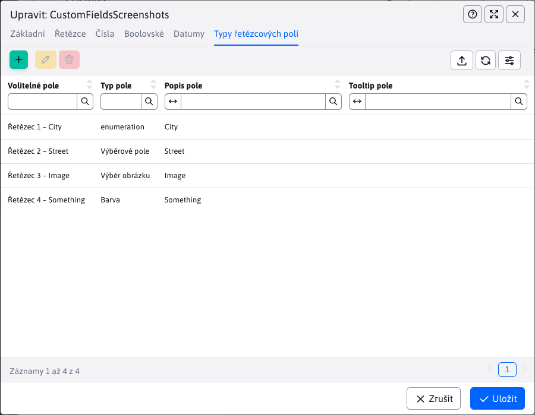

V tabulce se zobrazují pouze řetězcová pole, pro která je vytvořena konfigurace. Při jejím přidání jsou v poli **Volitelné pole** dostupná pouze pojmenovaná řetězcová pole ve formátu **Řetězec N – název**. Nabídka polí, jejich názvy a popisy vycházejí z poslední uložené verze typu číselníku. Po pojmenování nebo přejmenování řetězcového pole proto nejprve uložte typ číselníku; konfigurace se následně automaticky aktualizuje. Pokud název pole odstraníte, pole se skryje a jeho nastavení povinnosti se zruší.

Pro každé pole lze nastavit:

- typ pole a vlastnosti specifické pro daný typ, například možnosti výběrového pole,
- povinnost vyplnění,
- pomocný text zobrazený jako `tooltip`.

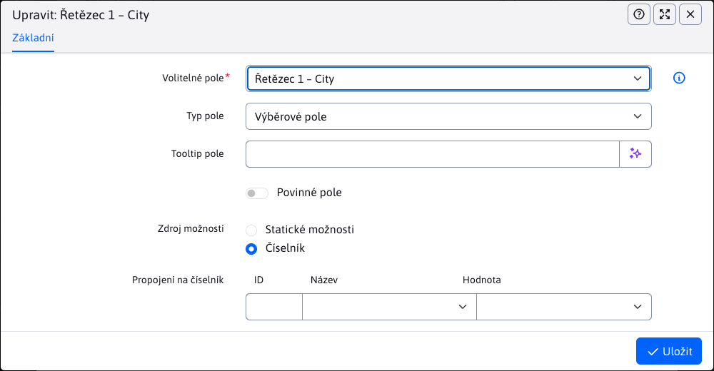

Bez specifické konfigurace se pojmenované řetězcové pole zobrazí jako běžné textové pole s maximální délkou 1024 znaků. Nepojmenovaná řetězcová pole se v datech číselníku ani v možnostech konfigurace nezobrazí.

!> **Upozornění:** číselníky zatím nejsou rozděleny podle zvolené domény, proto se nastavení volitelných polí (typy řetězcových polí) vždy ukládají do hlavní domény. V sekci [Volitelná pole](../../../frontend/webpages/customfields/custom-fields-settings.md) se tato nastavení zobrazí pouze v hlavní doméně. Doporučujeme je nastavovat a upravovat vždy na kartě **Typy řetězcových polí**.

!> **Upozornění na zpětnou kompatibilitu:** datové atributy řetězcových polí se změnily z `string1` až `string12` na `fieldA` až `fieldL`. Ve vlastních nebo starších šablonách aplikace Excel pro import dat číselníku musíte kódové názvy v hlavičce ručně upravit, například `Mesto|string1` na `Mesto|fieldA`. Stejné názvy `fieldA` až `fieldL` používejte iv integracích REST API, které zpracovávají data číselníků. Databázové sloupce `string1` až `string12` zůstávají nezměněny.

### Karta Základní

Na kartě **Základní** se nastavují tyto vlastnosti:

- Název typu - jedinečný název pro typ číselníku, nesmí být prázdný.
- Vymazaný - označuje vyřazený typ. Vypnutím této volby a uložením obnovíte typ i všechny jeho datové záznamy.
- Podřazený typ číselníku - vybraný typ se zobrazí ve stromu pod aktuálním typem. Toto nastavení automaticky nepřepojuje jejich datové záznamy.
- Povolit propojení datových záznamů na číselník - v editoru jednotlivých záznamů zpřístupní výběr propojeného číselníku. Nemění nastavení podřazeného typu.
- Povolit výběr rodičovského záznamu - jednotlivým záznamům umožní vybrat rodiče z ostatních záznamů téhož číselníku.

Volby **Povolit propojení datových záznamů na číselník** a **Povolit výběr rodičovského záznamu** nelze povolit současně. Nastavení podřazeného typu je na nich nezávislé. U každého z těchto tří polí je dostupný vysvětlující popis.

Při výběru **podřazeného typu číselníku** platí určitá omezení. Některé možnosti proto nelze zvolit (jsou označeny šedou barvou), u jiných se při pokusu o uložení zobrazí chybová zpráva.

1. Propojení číselníku na sebe sama je zakázáno. Pokud pro číselník **B** vybíráte odkaz na jiný číselník, v seznamu bude i on sám, ale tuto možnost nebude možné zvolit.

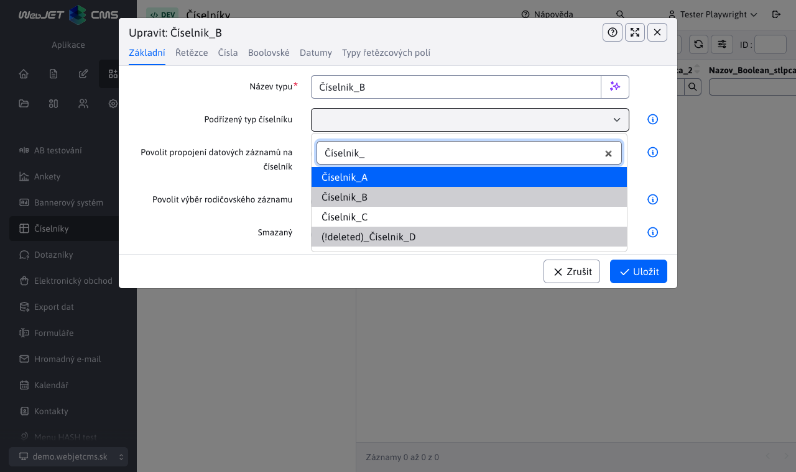

2. Kruhové propojení číselníků je zakázáno. Pokud číselník **A** odkazuje na číselník **B**, číselník **B** se nemůže přepojit zpět na číselník **A**. V nastaveních číselníku **B** sice můžete vybrat číselník **A**, ale při pokusu o uložení se zobrazí chybová zpráva.

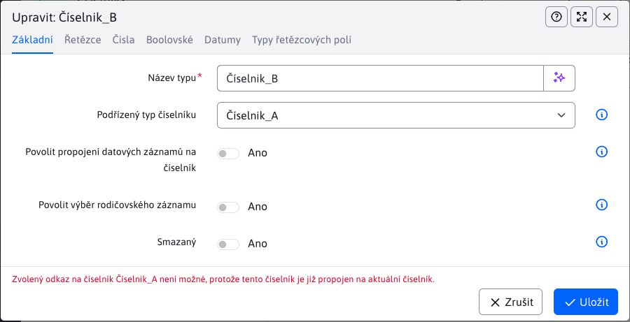

3. Nové propojení na vymazaný číselník nelze vytvořit. Pokud číselník **C** odkazuje na číselník **D**, který byl následně smazán, číselník **D** se v možnostech zobrazí s prefixem **`(!deleted)_`** a nebude jej možné vybrat. Stávající propojení číselníku **C** na číselník **D** zůstane zachováno. Můžete jej změnit, ale po změně již nebude možné znovu vybrat vymazaný číselník **D**.

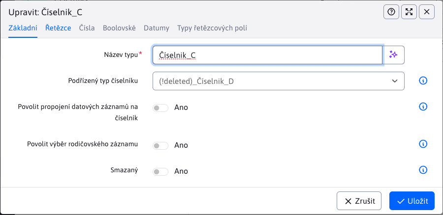

Je-li zapnuta volba **Povolit propojení datových záznamů na číselník**, jednotlivé záznamy můžete přepojovat na jiné číselníky. Platí tato omezení:

1. Propojení na číselník, do jehož záznam patří, je zakázáno. Pokud vytváříte záznam v číselníku **X**, číselník **X** se v možnostech odkazu nezobrazí.
2. Pro propojení na vymazaný číselník platí stejné podmínky jako u pole **Podřazený typ číselníku**.

Je-li zapnuta volba **Povolit výběr rodičovského záznamu**, jednotlivým záznamem můžete vybrat rodiče z ostatních záznamů téhož číselníku. Platí tato omezení:

1. Typ číselníku musí mít pojmenované pole **Řetězec 1**. Jeho hodnota se používá k identifikaci záznamu při výběru rodiče.
2. Propojení záznamu na sebe sama je zakázáno. Aktuální záznam se proto v možnostech výběru rodiče nezobrazí.

!> **Upozornění:** pokud vypnete volbu **Povolit propojení datových záznamů na číselník** nebo **Povolit výběr rodičovského záznamu** a změnu uložíte, všechna odpovídající propojení datových záznamů tohoto číselníku se odstraní. Opětovné zapnutí volby je neobnoví.

Například záznam typu **X** odkazuje na číselník **Z**. Pokud v typu **X** vypnete volbu **Povolit propojení datových záznamů na číselník** a uložíte změnu, záznam přijde o propojení na **Z**. Po opětovném zapnutí volby bude možné propojení znovu vybrat, ale původní hodnota se neobnoví.

## Seznam dat číselníků

V tabulce dat můžete upravovat záznamy vytvořených typů číselníků. Ve stromu v levém panelu vyberte číselník, který chcete spravovat. Po jeho výběru se zobrazí příslušná data. Nové záznamy vytvoříte tlačítkem **+** nad tabulkou dat. Pokud má typ číselníku některé sloupce nepojmenované, tyto sloupce ani jejich data se nezobrazí.

!> **Upozornění:** vymazané typy jsou dostupné pouze po zapnutí volby **Zobrazit vymazané typy**. Před přidáváním nebo importováním dat vymazaný typ obnovte.

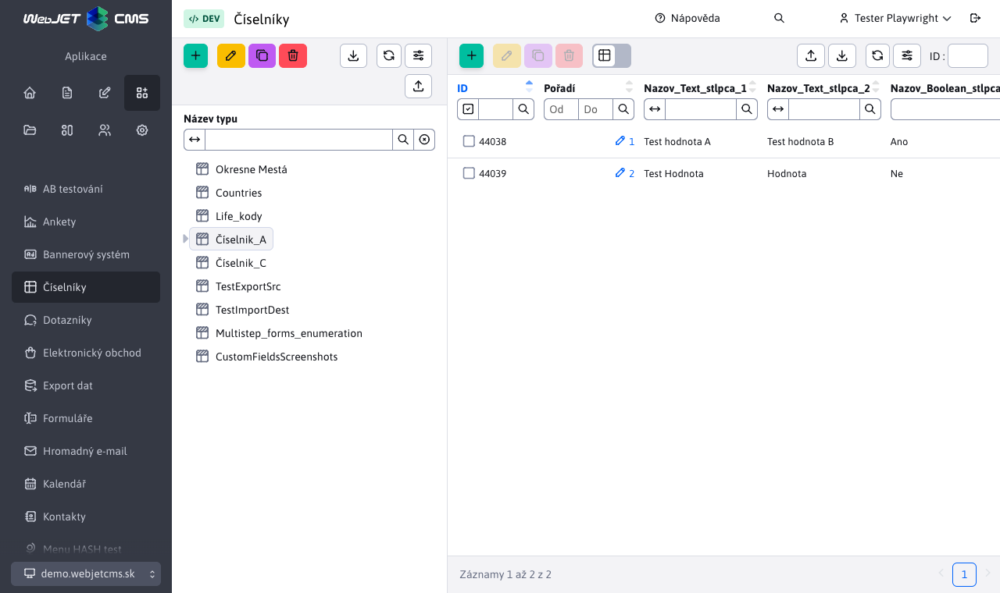

Příklad:

Při vytváření číselníku **A** jsme pojmenovali pole **Řetězec 1**, **Řetězec 2** a **Boolean 1**. Tabulka obsahuje právě tyto sloupce. Při vytváření nového záznamu se v editoru zobrazí dvě pole typu řetězec a jedno pole typu boolean s názvy zadanými při vytváření číselníku. Pokud jsme to v nastavení číselníku povolili, v editoru bude dostupné i **rodičovské propojení** nebo **propojení na číselník**.

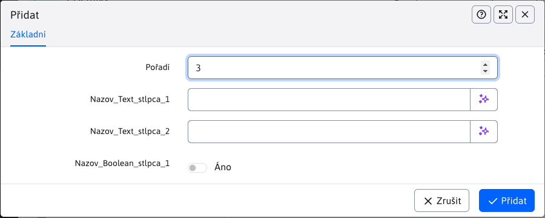

Při změně vybraného typu číselníku se mohou změnit sloupce tabulky i pole v editoru dat podle nastavení vybraného typu.

## Mazání dat

Typy číselníků ani jejich datové záznamy se při smazání standardně fyzicky neodstraní z databáze, pouze se označí jako smazané. Díky tomu zůstanou údaje dostupné pro stávající záznamy, které na ně odkazují. Například v číselníku **Barva auta** můžete smazat barvu, kterou již nechcete nabízet při vytváření nových záznamů, ale ve starších záznamech ji stále potřebujete zobrazit.

Typ číselníku můžete obnovit v uživatelském rozhraní: v nastavení stromu zapněte **Zobrazit vymazané typy**, vyberte typ s ikonou koše, otevřete jeho editor a vypněte volbu **Vymazaný**. Uložením se obnoví typ i všechny jeho datové záznamy včetně záznamů smazaných samostatně před smazáním typu. Běžná úprava aktivního typu smazaná data neobnovuje.

Při smazání typu se označí jako smazané i jeho datové záznamy. Při vypnuté volbě **Zobrazit vymazané typy** typ zmizí ze všech větví stromu, ale existující propojení z ostatních typů zůstanou uložena; v jejich editoru se zobrazují s prefixem **`(!deleted)_`**. Pokud smažete rodičovský typ, jeho podřazený typ se nesmaže: zůstane pod dalšími aktivními rodiči nebo se zobrazí na nejvyšší úrovni stromu, pokud již žádného aktivního rodiče nemá.

Při zobrazení vymazaných typů strom zachová i jejich propojení na rodiče a potomky. Po obnovení typu se opět zobrazí v běžném stromu na základě zachovaných propojení.
