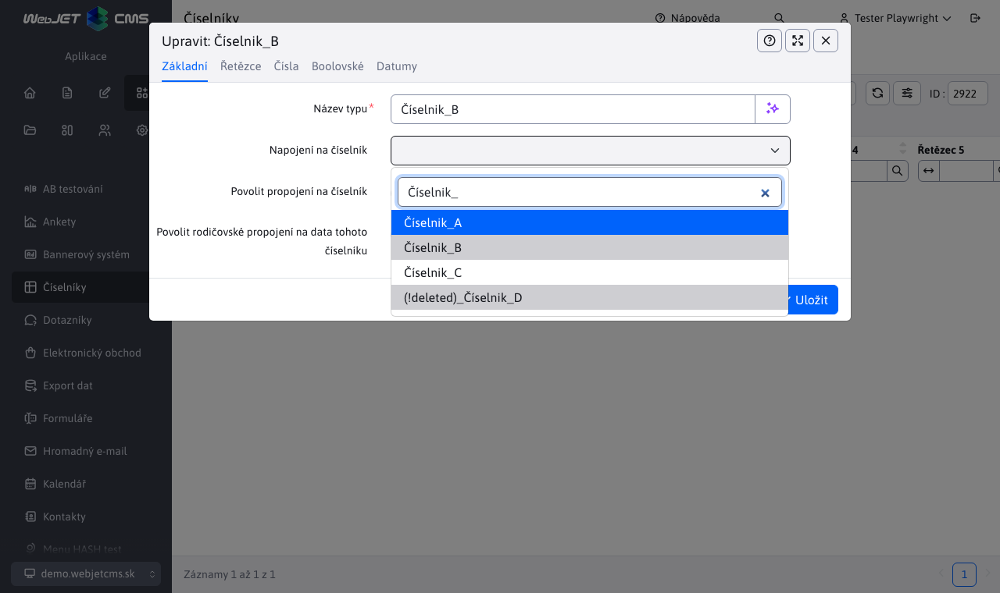

# Číselníky

Aplikace Číselníky umožňuje vytvářet/upravovat/mazat a duplikovat pojmenované typy číselníků, do kterých lze následně ukládat data těchto číselníků. Typy číselníků a data lze také exportovat a importovat pomocí souboru.

## Typy číselníků

Při vytváření nového typu číselníku je nutné zadat jedinečný název. Ostatní pole jsou nepovinná. Všimněte si karet **Řetězy** / **Čísla** / **Boolean** / **Data** které obsahují několik číslovaných polí. Tato pole slouží k definování formátu dat číselníku. Pokud zadáte název pole, vygenerují se z číselníkových dat pole s názvem, který odpovídá zadanému textu a typu karty.

Příklad: pokud na kartě vyplníte 2 pole. **Řetězy**

a jedno pole na kartě **Boolean**,

pak se v datech daného číselníku zobrazí 2 sloupce/ pole typu string a 1 sloupec/ pole typu boolean se zadanými názvy (viz obrázek v části [Seznam údajů o číselníku](#seznam-údajů-o-číselníku)).

To znamená, že můžete definovat formát dat číselníku pro každý číselník zvlášť. Jak napovídají názvy karet, můžete kombinovat textová, číselná, logická pole nebo pole s datem. Jejich počet je pro každý typ omezen počtem polí na jednotlivých kartách.

### Základní karta

Na kartě "Základní" se nastavují vlastnosti:
- Název typu - jedinečný název typu číselníku, nesmí být prázdný.
- Propojit s číselníkem - vyberte ze všech číselníků pro propojení číselníku.
- Povolit propojení s číselníkem - povolí propojení s jiným číselníkem (stejně jako v případě typu číselníku).
- Povolit nadřazený odkaz na data tohoto číselníku - určuje, zda bude v datech tohoto číselníku povolen výběr nadřazeného odkazu.

Pro data nelze mít současně povolen "odkaz na vytáčení" a "nadřazený odkaz".

**Odkaz na číselník** má určitá omezení, a proto některé možnosti buď nelze vybrat (jsou označeny šedě), nebo se při jejich výběru zobrazí chybové hlášení.

1. Propojení číselníku se sebou samým je zakázáno. V případě číselníku **B** vyberete odkaz na jiný číselník, bude v samotném seznamu, ale tuto možnost nebude možné vybrat.

2. Kruhové propojení číselníků je zakázáno. Pokud vytáčíte **A** vybere odkaz na číselník **B**, takže číselník **B** nelze propojit zpět na číselník **A**. Možnost výběru číselníku **A** bude pro vytáčení **B** ačkoli je viditelný a lze jej vybrat, při pokusu o uložení se zobrazí chybové hlášení.

3. Odkaz na již smazaný číselník. Může se stát, že číselník **C** je spojen s číselníkem **D**, který byl následně vymazán. V tomto případě se zobrazí smazaný číselník **D** v možnostech s předponou **`(!deleted)_`**. Tato předpona dá jasně najevo, že číselník byl již smazán, a tuto možnost nebude možné vybrat. Číselník však **C** který byl propojen před smazáním číselníku **D** zachovává tento odkaz. Tento odkaz bude možné změnit, ale jakmile bude změněn, nebude možné se na smazaný číselník znovu odkazovat.

**Povolit propojení s číselníkem** pokud je povoleno, bude možné jednotlivé údaje číselníku propojit s číselníky. I v tomto případě existují určitá omezení.

1. Propojení s číselníky, z nichž data vycházejí, je zakázáno. Pokud data vytvořená pod číselníkem X mají povoleno propojení s číselníkem, možnost číselníku X se ani nezobrazí.

2. Odkaz na již smazaný číselník. Tento případ má stejné podmínky jako **Odkaz na číselník** pro typ číselníku.

**Povolení nadřazeného odkazu na data tohoto číselníku** pokud je povoleno, budou si jednotlivé údaje číselníku moci vybrat nadřazený údaj z ostatních údajů pod stejným číselníkem. I v tomto případě existují určitá omezení.

1. V tomto případě musí být splněna jedna podmínka. Aby bylo možné použít nadřazený odkaz, musí mít typ číselníku definovanou volbu pro **Řetěz 1**. Důvodem je, že hodnota ve vygenerovaném sloupci **Řetěz 1** se použije jako identifikátor pro výběr odkazu na nadřazený prvek.

2. Propojení číselníku se sebou samým je zakázáno. Při výběru nadřazeného odkazu na sebe sama nebudou údaje číselníku mezi možnostmi viditelné.

**Varování:** pokud je zrušeno oprávnění "odkaz na číselník" nebo "nadřazený odkaz", budou odstraněny všechny odkazy, které byly vytvořeny na data tohoto číselníku, a to i v případě, že je toto oprávnění znovu uděleno.

Jako příklad uveďme situaci, kdy vytvoříme typ číselníku s X a tento typ číselníku umožňuje "odkaz na číselník". Pod tímto typem číselníku vytvoříme záznam, který má povoleno propojení s číselníkem a bude odkazovat na číselník Z. Pokud poté zrušíme povolení "propojení na číselník" pro typ číselníku X, záznam tohoto číselníku, který se propojil s číselníkem Z, toto propojení trvale ztratí. Pokud bychom "propojení na číselník" opět povolili, volba by se u záznamu objevila, ale předchozí volba na číselník Z by se vynulovala.

## Seznam údajů o číselníku

Položka Data číselníku umožňuje upravovat data vytvořených typů číselníků. Je třeba vybrat číselník, který chcete spravovat, z nabídky v záhlaví stránky. Po výběru konkrétního číselníku se zobrazí jeho odpovídající údaje. Pokud má typ číselníku některé sloupce nepojmenované, tyto sloupce a jejich údaje se nezobrazí.

**Varování:** v nabídce jsou pouze číselníky, které nebyly odstraněny.

Příklad:

Při vytváření číselníku **A** jsme vyplnili pole **Řetěz 1**, **Řetěz 2** a **Logická 1**. Vidíme, že tabulka má přesně ty sloupce, které jsme definovali v číselníku. Pokud vytvoříme nový záznam (nová data) pro číselník, vygenerují se nám v editoru 2 pole typu string a 1 pole typu boolean. Názvy těchto polí budou stejné, jaké jsme zadali při vytváření číselníku. Samozřejmě, pokud jsme to při vytváření číselníku povolili, můžeme mít v editoru např. **připojení rodičů** nebo **odkaz na číselník**.

Při změně vybraného typu číselníku lze změnit celou tabulku i editor dat číselníku.

## Vymazání dat

Ve výchozím nastavení se při odstranění záznamu číselníku nebo datového typu tento záznam fyzicky z databáze neodstraní, ale označí se jako odstraněný. Je to z důvodu ochrany před chybami při vyhledávání starých dat. Například pokud se používá číselník Barva vozu a my již nechceme, aby se barva vybírala pro nové záznamy, ale zároveň je třeba, aby se barva zobrazovala ve starých záznamech. Technicky je možné obnovit smazaný záznam přímo v databázi nastavením atributu `hidden`, ale uživatelské rozhraní to v současné době neumožňuje.
